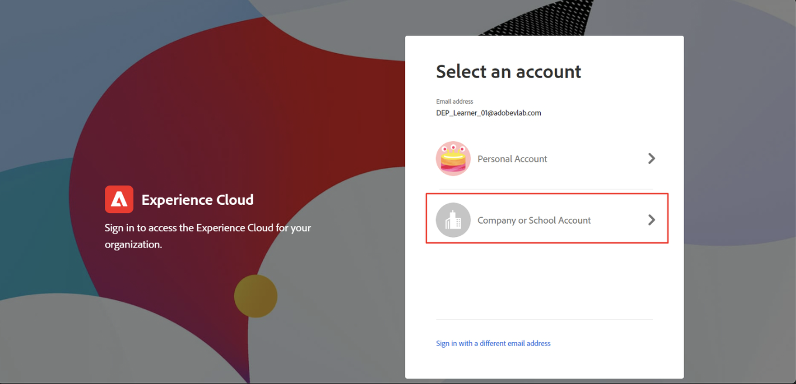

# Login e navegação

## Fazer logon via interface do usuário

1. Navegue até [https://experience.adobe.com](https://experience.adobe.com/) no seu navegador.
1. Faça logon usando a Adobe ID que tem acesso de desenvolvedor à sua sandbox — a mesma que você usou para concluir a [Instalação do Developer Console](../../sandbox-setup/developer-console-setup.md).
1. Na tela **Selecionar uma conta**, escolha a **Conta da Empresa ou da Escola**.

## Iniciar o Experience Platform

Clique no ícone Experience Platform no painel acesso rápido para acessar a sandbox de bootcamp

>[!NOTE]
>
>Talvez você não veja essa tela e seja iniciado diretamente na Experience Platform.  Se isso ocorrer, pule esta etapa.

