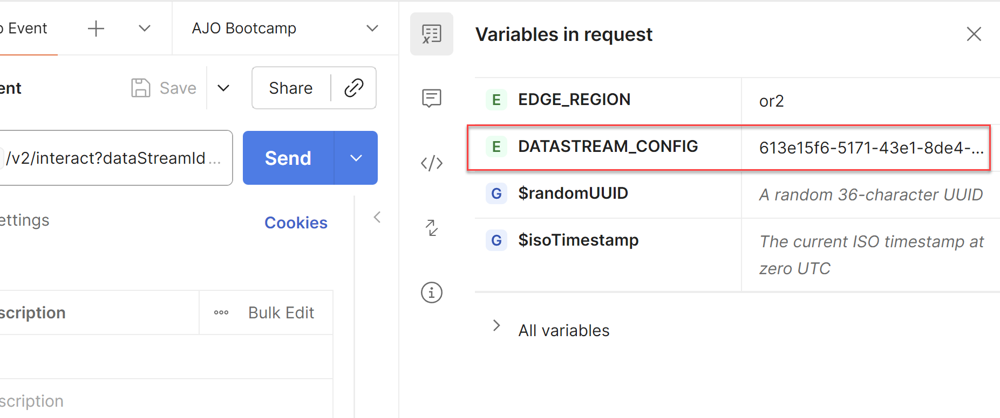
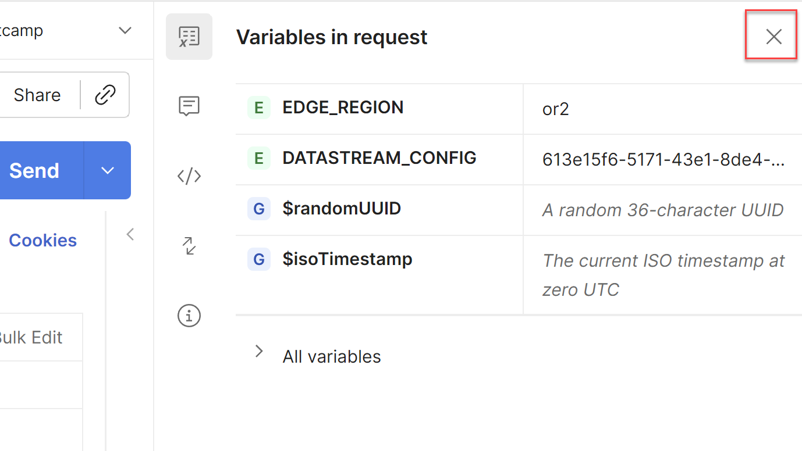

# Enviar um evento da Web do Edge

## Objetivo de aprendizado

Envie um evento da Web simulado para a Adobe Edge Network usando a API.

Para simular uma página da Web que está sendo carregada e enviada para o Edge do AEP, você envia uma chamada do Postman para o fluxo de dados criado.

Envia em um evento sem um token OAuth.  Certifique-se de ter o Postman aberto no computador para executar esse laboratório.

>[!NOTE]
>
>Como você não está transmitindo um token autenticado, não recupera nenhum atributo.

## Expectativas do laboratório

1. Evento de experiência para acessar o Edge
1. Configuração da sequência de dados
1. Configuração de sequência de dados para usar o serviço do AEP
   1. Público-alvo do Edge a ser executado
   2. Enviar evento para o hub
1. Resposta do Postman para incluir o público-alvo da Edge (mas sem atributos)
1. Armazenar perfis para receber eventos e adicionar um fragmento de perfil de evento
1. Repositório de Identidades para adicionar um relacionamento
1. Conjunto de dados para receber dados e armazenar no Data Lake

## Atualizar variável de ambiente do Postman

Antes de executar a solicitação de API, é necessário adicionar a ID do fluxo de dados ao ambiente de variável do Postman. Comece reunindo os seguintes valores:

### Coletar a ID do fluxo de dados

1. Você já deve ter a **ID da sequência de dados**

>[!NOTE]
>
>**Se você perdeu a ID da sequência de dados**
>
>1. No painel à esquerda, clique em **Fluxos de dados** (no cabeçalho Coleção de dados)
>2. Selecione sua sequência de dados e copie o valor de **ID da sequência de dados**
>
>

### Navegue até a chamada

1. **Barra Lateral Esquerda do Postman** -> `Collections`
1. **Coleção** -> `AJO Bootcamp (Labs)`
1. **Pasta** -> `Profile & Journey Labs`
1. **Solicitação de API** -> `Create Web Event`

### Atualizar variável DATASTREAM\_CONFIG

1. Clique em **Variáveis na solicitação** no canto superior direito

   

2. Atualize o **DATASTREAM_CONFIG** **Value** com a **ID de sequência de dados** da primeira etapa da página.

   Variável 

3. **Salvar** sua atualização (ctrl+s ou command+s)
4. Clique em &#39;**X**&#39; no canto superior direito da barra lateral do ambiente para fechá-la

   

5. A solicitação **Criar Evento da Web** está pronta para ser enviada, pois todas as variáveis agora estão azuis e têm um valor no ambiente.

## Executar a API

Execute sua solicitação clicando no botão **Enviar**.

A resposta é semelhante a esta:

O que você vê na resposta são estas coisas centrais:

- Uma resposta 200 OK significa que os dados foram enviados e aceitos com êxito pelo Edge Network

## Recapitulação

O evento foi enviado e aceito com sucesso pela Edge Network
