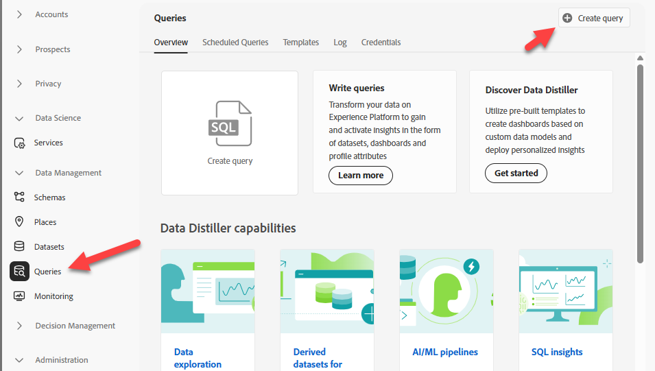

# Validar evento no Data Lake

## Objetivo de aprendizado

Verifique se o evento da Web foi gravado no Experience Platform Data Lake.

## Validar evento

>[!NOTE]
>
>Por fim, os dados aparecerão no Data Lake.  **Isso pode levar até 60 minutos**.  Sabemos que o conjunto de dados está ativado para o perfil e, portanto, o evento criará um fragmento de perfil.
>
>Você pode localizar e consultar o conjunto de dados da Web.

1. Ir para **Consultas** e **Criar Consulta**

   

2. Copiar este SQL e colá-lo em sua query

   ```sql
   SELECT identityMap['email'][0].id, * FROM dep_web
   where identityMap['email'][0].id = 'henry.creel@emailsim.io'
   ```

3. **Executar** Consulta

>[!NOTE]
>
>**Lembre-se**: os dados acabarão aparecendo no Data Lake.  **Isso pode levar até 60 minutos**.
>
>Não é necessário aguardar até que ele seja exibido. Fique à vontade para voltar a essa etapa e verificar mais tarde.


## Recapitulação

O registro do evento aparece no conjunto de dados apropriado.
