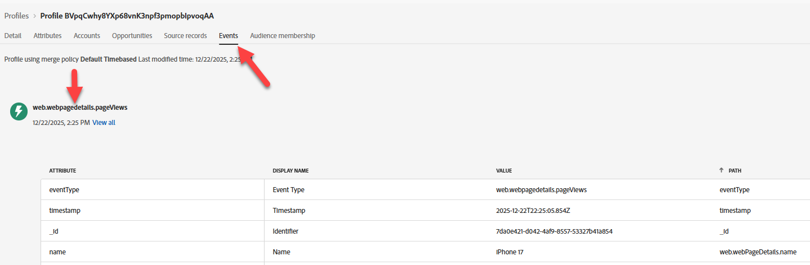

# Validar perfil no hub

## Objetivo de aprendizado

Verifique se o evento resultou em uma atualização de perfil e qualificação de segmento no Perfil em tempo real no Hub.

## Pesquisar o perfil no hub

Na Adobe Experience Platform, procure o perfil que você acabou de enviar a partir do evento que acabou de enviar para a Edge Network.

1. Navegue até **Cliente** -> **Perfis** -> **Procurar** para realizar a pesquisa usando estas informações:
   - **Política de mesclagem** -> `Default Timebased`
   - **Namespace de Identidade** -> `Email`
   - **Valor de Identidade** -> `henry.creel@emailsim.io`
1. Clique em **Exibir** para pesquisar o perfil


## Verifique o perfil do hub

1. Clique na **ID do Perfil** para abrir o perfil
1. Clique primeiro na guia **Atributos** e depois no botão de opção **Hub** para ver o **Perfil de Hub**


## Validar eventos

1. Clique em **Eventos** na navegação superior para ver o evento que acabou de enviar



## Validar segmentos

### Via JSON

1. Clique no cabeçalho **Atributos** e exiba **JSON**


2. Localizar **segmentMembership**.  Deve ficar assim (suas IDs serão diferentes)

```json
  "segmentMembership": {
    "ups": {
      "ce0b8386-ef2a-4244-8ad0-1a72d6494181": {
        "status": "realized",
        "lastQualificationTime": "2025-12-15T23:11:49Z"
      },
      "8ce516fe-920a-4f9d-b92b-0403890a8491": {
        "status": "realized",
        "lastQualificationTime": "2025-12-12T15:01:01Z"
      }
    }
```

>[!NOTE]
>
>**Como ler segmentMembership?**
>
>[https://experienceleague.adobe.com/en/docs/experience-platform/xdm/field-groups/profile/segmentation](https://experienceleague.adobe.com/en/docs/experience-platform/xdm/field-groups/profile/segmentation)
>
>**ups:** esta é a chave de mapa para diferentes tipos de públicos suportados pelo AEP.  A chave ups contém públicos-alvo criados pelo Construtor de regras.  Outros públicos-alvo estarão contidos em outras chaves (por exemplo, AAM).
>
>**lastQualificationTime** Um carimbo de data/hora da última vez que esse perfil se qualificou para o segmento
>
>**status**
>
>*realizado*: o perfil se qualifica para o segmento.
>*encerrado*: o perfil está saindo do segmento como parte da solicitação atual.
>
>

### Via IU

1. Uma maneira mais fácil de validar o Perfil qualificado para os Públicos é observar a guia **Associação de público-alvo** (você deve ver pelo menos isso):
   - dep: Qualquer transmissão de evento (dentro de uma hora)
   - dep: Qualquer Edge de evento (em uma hora)


>[!NOTE]
>
>**Por que nenhum público-alvo em lote?**
>
>Você não deve ver **dep: qualquer lote de eventos (dentro do dia)** qualificado para, pois transmitimos dados e a avaliação em lote acontece uma vez por dia.

## Recapitulação

Existe um perfil no Hub que está qualificado para o público-alvo esperado.
