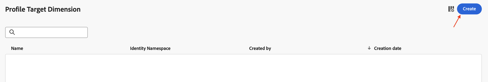

# Dimension de destino do perfil

## Objetivo

No próximo conjunto de etapas, você navegará pela interface do usuário para visualizar o Esquema e configurar a Identidade. Em seguida, você configurará o Dimension de direcionamento de perfil, que é o tipo de entidade ao qual a campanha está direcionando e reconciliando com o Perfil do AEP para entrega.

## Por que isso é importante

O Dimension de direcionamento de perfil é usado para informar à Adobe Journey Optimizer como os dados entre o Perfil do cliente em tempo real e a Loja relacional podem ser unidos. Os ingredientes dessa configuração são os seguintes:

- Um esquema relacional
- Um único campo do esquema relacional
- Um namespace de identidade associado a esse campo

>[!CAUTION]
>
>Sem essa configuração em vigor, nenhuma leitura ou compartilhamento de públicos pode acontecer, e nenhuma mensagem pode ser enviada de Campanhas orquestradas

## Rotular a identidade

1. Clique no ícone **Aplicativos** e selecione **Journey Optimizer**

   

2. Clique em **Esquemas** no menu Gerenciamento de Dados e verifique se a guia **Procurar** está selecionada.
3. Pesquisar o esquema chamado `dep-rel: Customer Account`

   

4. Abra o esquema clicando no seu nome e depois clique no campo **customer\_id**

   

5. No painel direito, localize a caixa de seleção denominada **Identidade**, **marque a caixa** e escolha o namespace de identidade denominado **customerID**

   

6. Clique no botão **Salvar** para salvar seu esquema. Uma mensagem de confirmação é exibida
7. Clique no botão **Cancelar** ou em **Esquemas** no painel esquerdo para sair da interface do esquema

>[!CAUTION]
>
>Se você não salvar o esquema após adicionar o rótulo de identidade, o próximo conjunto de etapas de configuração não funcionará

>[!NOTE]
>
>Depois de Salvar, leva alguns minutos (menos de 5 minutos) para ser exibido na lista suspensa Dimension de direcionamento de perfil na próxima etapa.

## Criar o Dimension de direcionamento de perfil

1. Clique em **Configurações** em **Administração**

   

2. Selecione **Dimension de Destino do Perfil** e clique em **Gerenciar**

   

3. O painel Dimension de Direcionamento de Perfil é aberto. Clique em **Criar**

   

4. Selecione o esquema `dep-rel: Customer Account` no menu suspenso.

   >[!NOTE]
   >
   >Pode levar alguns minutos para que o esquema apareça nesta tela após marcar a identidade. Atualize a página e repita as duas etapas anteriores até que o schema seja exibido.

   

5. Para o **Valor de identidade**, selecione `/customer_id`

   

   >[!NOTE]
   >
   >Um esquema relacional pode ter muitos campos rotulados com identidades, portanto, é uma caixa de listagem.

6. Clique no botão **Salvar** para criar o Dimension de Destino de Perfil. Você verá o registro aparecer.

>[!NOTE]
>
>O nome do registro criado é uma concatenação do nome de esquema *(dep-rel: Customer Account)* e do campo rotulado com a identidade *(customer\_id)*

>[!TIP]
>
>Parabéns! Isso conclui a etapa de criação de Dimension do Profile Target no laboratório.

## Recapitulação

Agora você viu como é fácil navegar pelo Esquema, marcar um atributo como uma Identidade e criar o Dimension de direcionamento de perfil.

Você pode ler mais [aqui](https://experienceleague.adobe.com/pt-br/docs/journey-optimizer/using/campaigns/orchestrated-campaigns/data-configuration/target-dimension), se estiver interessado.
