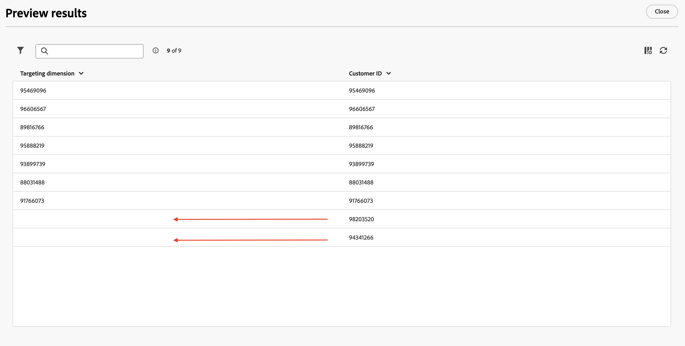
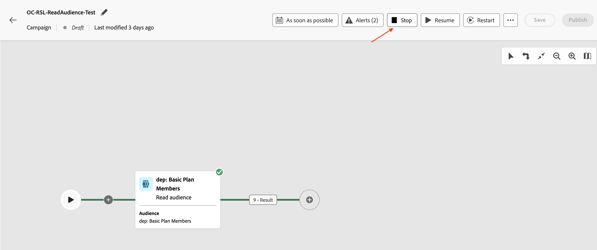
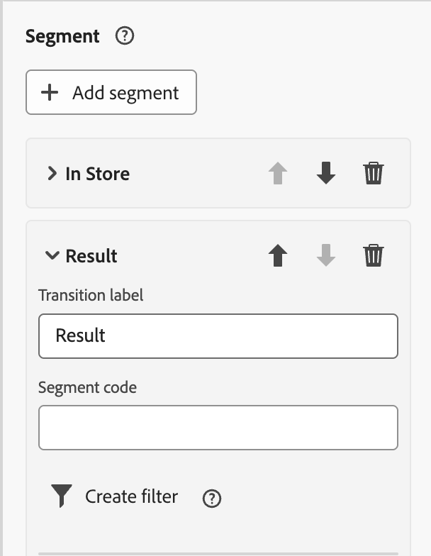
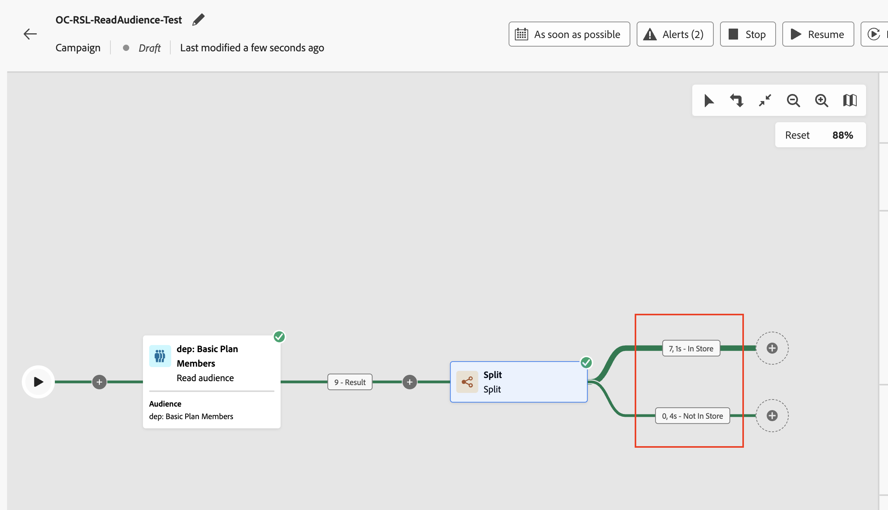

# Ler um público-alvo

## Objetivo

No próximo conjunto de etapas, você criará uma campanha para ler um público-alvo do AEP e usá-lo junto com o Dimension do Profile Target criado anteriormente. Use a atividade Split para dividir os dados com base em uma condição. Por fim, teste a campanha para entender como esses públicos-alvo funcionam quando usados com o esquema relacional.

## Público-alvo de leitura

Este laboratório aborda o uso da atividade Read audience em conjunto com o esquema Relacional para enriquecimento.

O Orchestrated Campaign usa o schema relacional para todas as atividades. Ao usar a atividade Read audience, que lê o público-alvo do AEP, uma Entidade correspondente (Target Dimension) deve ser configurada para reconciliar o público-alvo com o Dimension do Campaign Target.

## Criar uma campanha

1. No painel lateral esquerdo, clique em **Campanhas**

&#x200B;2. Clique em **Criar campanha**

&#x200B;3. Selecione a **Orquestração - Marketing** e clique em **Confirmar**

&#x200B;4. Forneça os detalhes da campanha da seguinte maneira e clique no **botão Salvar**
   - Nome: **OC-RSL-ReadAudience-Test**
   - Descrição: **Teste de público-alvo de leitura RSL**

&#x200B;5. Aguardar a mensagem de confirmação

## Adicionar atividade Ler público

1. Clique no(a) **+** dentro da tela para abrir o menu de opções e selecione **Ler público** nas **Atividades de direcionamento**

&#x200B;2. No painel de detalhes **Ler público-alvo**, clique no ícone Pesquisar para **Público-alvo**

&#x200B;3. Selecione o público-alvo **dep: Membros Básicos do Plano** com Contagem de Perfis de **9** e clique em **Adicionar público-alvo**

&#x200B;4. Clique no menu suspenso da **Entidade** e selecione o `dep-rel: Customer Account - customer_id` Dimension de Destino da Campanha

>[!NOTE]
>
>Outros atributos também podem ser extraídos do Perfil do AEP para uso na tela usando o botão **Adicionar atributo**. Mas para esse laboratório, atributos extras não são necessários, então essa etapa é ignorada.

## Testar a campanha

1. As configurações para a atividade **Ler Público** estão preenchidas. Clique em **Iniciar** para executar a campanha no **Modo de teste**

>[!NOTE]
>
>Isso leva alguns minutos para ser executado.
>
>O modo de teste permite que a execução da campanha verifique e monitore seu comportamento junto com os resultados de cada atividade. As atividades são executadas sequencialmente até o final da tela.

&#x200B;2. A execução do teste é iniciada e os resultados são exibidos quando concluídos. Clique no nó **Resultado** e, em seguida, Visualize os resultados para ver os resultados da execução

&#x200B;3. Observe que **2** (de 9) perfis do **Público-alvo de leitura** não têm uma **Dimensão de destino** correspondente do esquema relacional (isto é, eles existem no repositório de perfis, mas não no repositório relacional). E como a Campanha Orquestrada funciona no esquema Relacional, os `customer_id` (**2**) sem correspondência do **Público-alvo de leitura** são descartados e apenas os *correspondentes*, **7** neste caso, podem ser usados em atividades subsequentes que usam os **dados relacionais** na campanha

>[!NOTE]
>
>As etapas a seguir usam os dados relacionais para confirmar a instrução acima de `customer_id` sem correspondência sendo descartada.

&#x200B;4. Clique em **Parar** para parar o **Modo de teste** da campanha

&#x200B;5. Clique em **+** no final do fluxo e adicione **Split** das **Atividades de direcionamento**

&#x200B;6. No painel de detalhes da atividade **Split**, expanda a primeira divisão chamada **Subset**

&#x200B;7. Renomeie-o para &quot;**No Repositório**&quot; e clique em **Criar filtro** para definir a condição de filtro

&#x200B;8. No painel **Criar filtro** r, clique em **Adicionar condição**

&#x200B;9. Como nenhum outro atributo foi extraído do Perfil do AEP, o único atributo de Perfil do AEP disponível aqui é `Customer ID`. No entanto, as colunas do armazenamento relacional correspondente à dimensão de Destino correspondente estão disponíveis para configurar a condição de filtro. Expanda a **Dimensão de Direcionamento** clicando em **>**

&#x200B;10. Selecione `Source` na lista e clique em **Confirmar**

&#x200B;11. Os valores distintos da coluna Source estão disponíveis na lista suspensa. Para a **Condição personalizada**, selecione **&quot;Na Loja&quot;** na lista suspensa e clique em **Confirmar** para sair

&#x200B;12. De volta ao painel de detalhes da atividade **Split**, as configurações da primeira Split são concluídas. Clique em **Adicionar segmento** à segunda divisão

Um novo segmento com o nome **Result** foi criado

&#x200B;13. Renomeie &quot;**Result**&quot; para &quot;**Not In Store**&quot; e clique em **Criar filtro** para definir a condição de filtro

&#x200B;14. No painel **Criar filtro**, clique em **Adicionar condição**. Siga a mesma abordagem acima, expanda a **Dimensão de direcionamento** clicando em **>**, selecione `Source` na lista e clique em **Confirmar**

&#x200B;15. Para a **Condição personalizada**, selecione **&quot;Na Loja&quot;** na lista suspensa e, para o operador, selecione &quot;**não é igual a**&quot;. Clique em **Confirmar** para sair

&#x200B;16. De volta ao painel de detalhes da atividade **Split**, as configurações das duas Divisões estão concluídas. Clique em **Iniciar** para executar a campanha no **Modo de teste**

&#x200B;17. A execução do teste começa e os resultados são exibidos após a conclusão. Como apenas **7** dimensão de Destino correspondente foi encontrada no esquema Relacional, a mesma contagem também é observada após as operações Split (**7** e **0**)

&#x200B;18. Clique em cada caixa de resultados e **Visualizar resultados** para exibir os resultados

&#x200B;19. Clique em **Parar** para parar o **Modo de teste** da campanha

>[!NOTE]
>
>Enquanto o público de Leitura mostrava **9** perfis. Como criamos um filtro no Source e o campo Source existe no armazenamento relacional, tivemos que ingressar do armazenamento de perfil ao armazenamento relacional para verificá-lo. Quando foi unido ao esquema Relacional, por meio do Dimension do Target do Campaign, somente um total de **7** perfis correspondeu. Estas **7** IDs do cliente correspondentes estão disponíveis para uso nas atividades a seguir que tentam usar dados relacionais. Todas as **7** IDs do cliente tiveram `Source` definido como **&quot;Na Loja&quot;**, o que foi evidente pelos fluxos de Divisão.
>
>Portanto, manter a consistência dos dados é essencial ao usar os perfis do AEP juntamente com seus equivalentes relacionais para enriquecimento.

>[!TIP]
>
>Parabéns, isso conclui o laboratório sobre o uso da atividade Ler público com esquema relacional.

## Recapitulação

Agora você viu como é fácil criar uma campanha e executar uma atividade Ler público junto com o Dimension do Direcionamento de perfil para aproveitar o esquema relacional. Você usou a atividade Split para dividir o público com base em uma condição. Por fim, o modo de teste ajudou a entender que é importante ter a consistência de dados entre o Perfil e o esquema Relacional.

Você pode ler mais [aqui](https://experienceleague.adobe.com/pt-br/docs/journey-optimizer/using/campaigns/orchestrated-campaigns/design-campaigns/read-audience), se estiver interessado.
