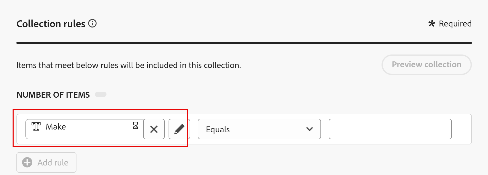

# Criar coleção de ofertas

## Objetivo

Agora que suas ofertas foram criadas, elas precisam ser organizadas em uma coleção. Uma coleção tem um ou mais itens de oferta, e um item de oferta pode estar em mais de uma coleção.

## Criar a coleção de ofertas do iPhone

1. Se necessário, expanda **Decisão** no painel esquerdo e clique em **Catálogos**. Você verá as quatro ofertas criadas na seção anterior.
2. Clique em **Coleções** à esquerda do nome da oferta

3. Clique na **Criar coleção** azul para criar a nova coleção.
4. Nomeie a coleção **iPhone 17 Collection**
5. Na seção &#39;Regras de coleção&#39;, clique na caixa de texto que contém o texto **_Clique para criar um item de decisão_**. Depois de clicado, as opções para criar a regra serão exibidas.

6. Clique no botão **Selecionar atributo** e navegue pelo esquema do item de oferta clicando em **Dispositivo > Criar**. Clique em **Salvar** e você verá que o atributo &quot;Criar&quot; agora está na regra de decisão.

>[!NOTE]
>
>Observe que as opções disponíveis para você são os mesmos campos configuráveis usados ao criar os itens de oferta. Como uma coleção é um agrupamento de itens de oferta, faz sentido que as regras para agrupá-los dependam de seus atributos.

7. Deixe o operador &quot;Equals&quot; no lugar e insira o texto **iPhone** no campo de valor e veja que o número de itens muda para 4, indicando que todos os itens de oferta atendem a esse critério

>[!NOTE]
>
>Você também pode clicar no botão **Visualizar Coleção** e ver os itens de oferta que atendem aos critérios.

8. Com todos os quatro itens de oferta selecionados, clique no botão azul **Criar**. Isso leva você a uma página que mostra sua coleção recém-criada.

>[!NOTE]
>
>Uma coleção é mais do que apenas um meio de organização. Nas etapas seguintes, você verá que, no Decisioning, aplicamos a lógica de seleção a uma coleção de ofertas. Pensando em uma implementação de porte empresarial, não é difícil imaginar quantas ofertas serão criadas ao longo dos anos de uso. A fim de determinar quais ofertas uma estratégia de seleção deve ser aplicada para trazer à tona o quão importante é o gerenciamento adequado da coleção.
>
>Nesse caso, uma coleção apenas com &quot;iPhone&quot; como critério traria muitas ofertas depois de alguns anos de lançamentos do iPhone. Poderíamos ter usado critérios adicionais como &quot;Criar igual a 17&quot; ou usado Tags do AEP para marcar ofertas para uma campanha específica. Mas para simplificar, estamos usando esta lógica simples para criar uma coleção.

## Recapitulação

Agora você criou uma coleção de ofertas que agrupa os itens de oferta criados anteriormente. Você adicionou todas as ofertas do iPhone 17 em uma coleção e definiu uma regra com base nos atributos da oferta (como device make) para que somente as ofertas relevantes pertençam a essa coleção.
