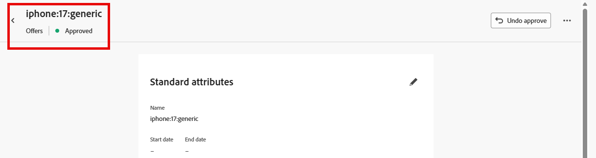

# Criar itens de oferta

## Objetivo

Nesta seção, você criará os itens de oferta reais que a Experiência baseada em código (CBE) retornará ao cliente solicitante. Alguns itens da oferta terão requisitos de qualificação e limite de frequência, enquanto outros não.

## Visão geral do cenário

No entanto, antes de criar os itens de oferta, veja alguns lembretes rápidos sobre nosso cenário. Primeiro, há três níveis do iPhone 17 em nosso cenário: Ultra, Pro e Base. Você cria quatro ofertas totais, uma para cada camada, além de uma oferta de fallback genérica que o sistema de recebimento pode usar para exibir informações gerais sobre o iPhone 17 em todas as camadas.

Em segundo lugar, somente os clientes com uma ID de plano 2 ou 3 estão qualificados para os telefones das camadas Ultra e Pro.

Em seguida, a empresa solicitou que cada oferta seja exibida apenas três vezes por dia, antes que o próximo telefone de nível inferior seja apresentado.

Por fim, tudo sendo igual, Connection 5G preferiria vender o nível Ultra, seguido pelo Pro, e depois o modelo base. Dessa forma, você vê essas prioridades aparecerem à medida que atribui uma pontuação de prioridade a cada item de oferta.

## Criar item de oferta padrão/de fallback

O primeiro item de oferta mais fácil que você criar é a oferta substituta, que qualquer pessoa pode exibir por um período ilimitado.

1. Se necessário, expanda **Decisão** no painel esquerdo e clique em **Catálogos**
2. Uma página de ofertas vazia é exibida:

&#x200B;3. Clique no botão azul **Criar item**. Isso abre a página &quot;Criar item de oferta&quot;.
&#x200B;4. No campo &#39;Offer name&#39;, digite o texto **iphone:17\:generic**. Digite uma descrição se desejar.

>[!NOTE]
>
>A convenção de nomenclatura separada por dois-pontos, totalmente em minúsculas, é apenas um de nossos designs que pode servir como um modelo a ser seguido para um cliente real. Na prática, você pode desenvolver uma estratégia de nomenclatura diferente para seus itens de oferta. Certifique-se de que ele esteja documentado e consistente antes de criar itens de oferta. Isso garantirá que os itens de oferta sejam fáceis de encontrar e agrupados em coleções. Mais informações sobre isso depois.

&#x200B;5. Como esse é o item de oferta de prioridade mais baixa/padrão, deixe a Prioridade padrão como 1.

>[!NOTE]
>
>Na Decisão, quanto menor o número, menor a prioridade. Por exemplo, um item de oferta com prioridade 100 é mostrado antes de um item de oferta com prioridade 1

&#x200B;6. Expanda o item **Dispositivo** na área &#39;Atributos personalizados&#39; e insira as seguintes informações nas caixas de texto:
   - Camada: **Genérica**
   - Modelo: **17**
   - Marca: **iPhone**

Esses são os valores de texto reais que descrevem a oferta e o que pode ser usado nos critérios de classificação, classificação e qualificação. Eles também são os valores de texto que podem ser retornados para o dispositivo solicitante.

>[!NOTE]
>
>A área Dispositivo expandida é o mesmo objeto principal &quot;Dispositivo&quot; criado quando o esquema &quot;Itens de oferta personalizados - Experience Decisioning&quot; foi atualizado com atributos personalizados na seção anterior. Os campos Camada, Modelo e Criar são os atributos individuais que foram adicionados:
>
>

>[!WARNING]
>
>A seção anterior mencionou a necessidade de ter muito cuidado ao adicionar atributos personalizados ao esquema &quot;Itens de oferta personalizados - Decisão da experiência&quot; gerado pelo sistema. Cada nó personalizado adicional será exibido como um campo possível para cada item de oferta que estiver avançando. A criação de atributos desnecessários ou específicos da campanha sobrecarregará a interface de criação do item de oferta e poderá causar confusão.

&#x200B;7. Clique no botão azul **Avançar** no canto superior direito para seguir para a próxima etapa.
&#x200B;8. Essa oferta deve estar disponível para todos/Todos os visitantes e não ter limite de frequência, portanto, não há necessidade de fazer alterações nas seções &quot;Qualificação&quot; ou &quot;Limite&quot;. Clique no botão azul **Avançar** novamente para prosseguir para a última etapa.
&#x200B;9. Na etapa &quot;Revisar&quot;, verifique se todos os dados estão corretos:

&#x200B;10. Faça as alterações necessárias. Quando estiver pronto, clique no botão azul **Salvar**.
&#x200B;11. Depois de salvo, um botão branco &quot;Aprovar&quot; é exibido onde o botão &quot;Salvar&quot; costumava estar. Clique no botão branco **Aprovar** para aprovar esse item de oferta. Você verá um indicador verde &quot;Aprovado&quot; abaixo do título do item de oferta:

>[!NOTE]
>
>Na prática, e com ofertas mais complexas, um processo de aprovação adequado deve estar em vigor para garantir que os itens da oferta tenham sido criados corretamente. Para economizar tempo nesse laboratório, basta aprovar cada item de oferta criado.

&#x200B;12. Clique na **seta para a esquerda** ao lado do título do item de oferta para retornar à página &#39;Ofertas&#39; e você verá sua oferta iphone:17\:generic listada.

## Criar item de oferta de modelo base

Agora que o item de oferta genérico foi criado, você pode criar o item de oferta de prioridade seguinte para o modelo base do iPhone 17.

1. Clique no botão azul **Criar Item** novamente e nomeie a oferta **iphone:17\:base**
2. Como este é o próximo item de oferta de prioridade mais baixa, aumente o campo **Prioridade** para **2**
3. Expanda a área **Dispositivo** e forneça aos campos estes valores:
   - Camada: **Base**
   - Modelo: **17**
   - Marca: **iPhone**

Quando terminar, o item de oferta ficará assim (a caixa vermelha é adicionada para garantir que a prioridade esteja correta):

Quando tudo estiver correto, clique no botão azul **Avançar** para prosseguir para a próxima etapa.

&#x200B;4. Esse item de oferta deve estar disponível para todos, portanto, não há requisito de qualificação; no entanto, ele deve ser limitado a 3 impressões por dia. Clique no botão &#39;**+ Criar limite&#39;**.
&#x200B;5. Na nova regra de limite, altere o **Escolher evento de limite** para **Impressão.**
&#x200B;6. Altere a **Contagem de eventos de limite** para **3**. Depois de concluída, sua regra de limitação tem esta aparência:

Depois de corrigido, clique no botão azul **Criar** para salvar a regra de limitação.

>[!NOTE]
>
>Observe como criar uma regra de limite adicional. Na prática, talvez você queira adicionar mais de uma regra. Nesse caso, poderíamos ter adicionado uma regra para limitar isso se um evento específico fosse visto, como um evento de compra. Esse laboratório mantém a simplicidade com uma única regra de limitação.
>
>
> [!NOTE]
>
>Os &quot;dias&quot; mencionados nas regras de limite de frequência se referem aos dias no fuso horário GMT.  O limite de frequência com dias na lógica é redefinido à meia-noite, GMT.

&#x200B;7. Clique em **Avançar** para prosseguir para a etapa de revisão.
&#x200B;8. Verifique se tudo aparece conforme o esperado e clique no botão **Salvar**. Depois de salvo, clique em **Aprovar.**
&#x200B;9. Depois de aprovado, clique na seta à esquerda ao lado do título e retorne à página de ofertas. Agora você vê duas ofertas, cada uma com a prioridade apropriada.

## Criar itens de oferta de modelo de camada superior

Agora que as ofertas do modelo genérico e do modelo base foram criadas, é possível migrar para os itens de oferta dos modelos pro e ultra. Esses itens de oferta também precisam incluir um elemento de qualificação, pois somente os membros com um determinado nível de plano devem ver essas ofertas.

1. Seguindo as mesmas etapas e padrões de nomenclatura descritos nas seções acima, crie uma nova oferta chamada **iphone:17\:pro** e defina sua prioridade como **3.**
2. Defina o atributo **Tier** como **Pro** e os outros atributos personalizados conforme você fez nas outras ofertas.
3. Na etapa &quot;Qualificação&quot;, selecione o botão de opção **Por regra**.
4. O painel esquerdo mostra apenas uma regra de decisão, a criada anteriormente chamada &quot;Planos de camada superior&quot;. Clique no ícone **+** ao lado dessa regra para adicioná-lo à tela.
5. Como mencionado anteriormente, a empresa declarou que as ofertas não substitutas devem ter um limite de frequência de 3 exibições (ou impressões) por dia. Siga as etapas da seção anterior para criar uma regra de limitação para 3 impressões por dia. Quando terminar, sua página ficará assim:

&#x200B;6. Depois de verificar que tudo está correto, clique em **Avançar**. A configuração do item de oferta final é semelhante a:

&#x200B;7. Quando tudo estiver correto, **Salve** e **Aprove** o item de oferta.
&#x200B;8. Retorne à página de ofertas e verifique se as 3 ofertas estão lá e se cada uma tem a prioridade adequada.
&#x200B;9. Crie o item de oferta final e nomeie-o como **iphone:17\:ultra,** dê a ele uma prioridade **4,** e defina os outros atributos personalizados com os mesmos valores que as outras ofertas.
&#x200B;10. Assim como no último item de oferta, defina a qualificação para a regra de decisão &quot;Planos de nível superior&quot; e defina um limite de frequência de 3 impressões por dia. Quando terminar, seu item de oferta ficará assim:

&#x200B;11. Depois de verificar se todas as configurações estão corretas, salve e aprove este item de oferta. Agora você vê todos os quatro itens de oferta, cada um com uma prioridade exclusiva.

>[!NOTE]
>
>As instruções para esse laboratório são enfáticas para garantir que as prioridades sejam diferentes para cada item de oferta. Nesse caso de uso simples, é importante, mas não há nada na interface do usuário que force você a dar a cada item de oferta uma prioridade exclusiva. Com o tempo, você provavelmente terá vários itens de oferta com a mesma prioridade. Você verá por que isso é importante entender em seções posteriores.

## Recapitulação

Você definiu várias ofertas para os diferentes níveis do iPhone 17, incluindo uma oferta de fallback genérica e ofertas específicas por nível (base, pro e ultra). Você também aprovou todos os quatro itens de oferta com as prioridades corretas, qualificação e configurações de limite de impressão para que estejam prontos para uso em seu pacote de decisão.
