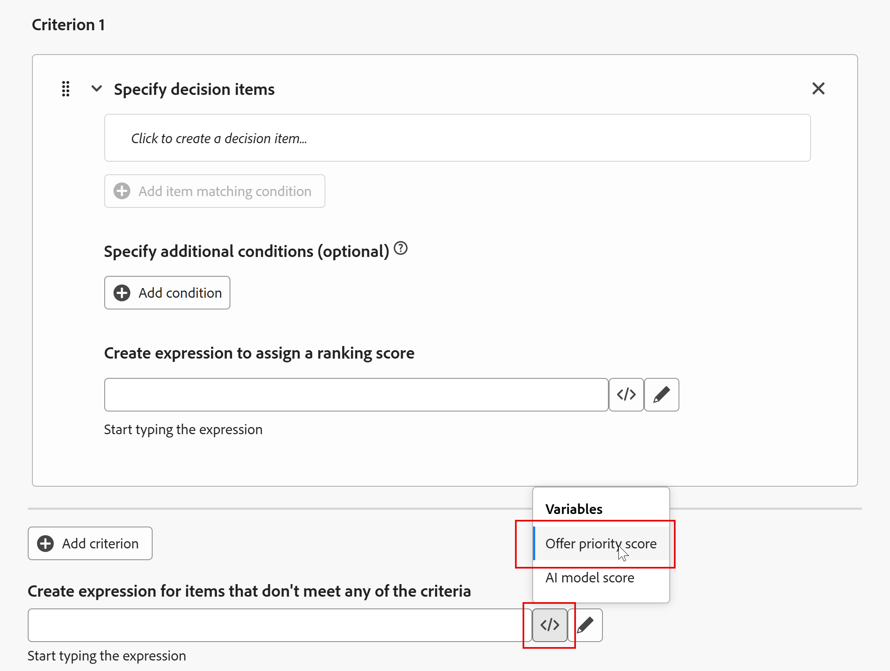
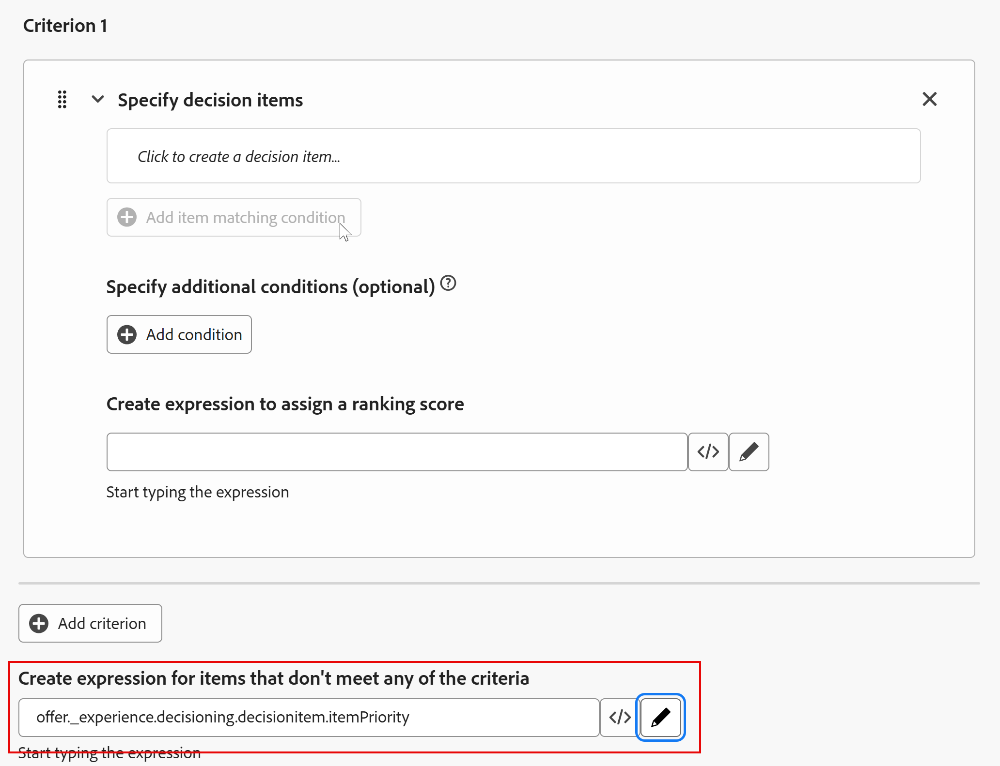

# Criar fórmula de classificação

## Objetivo

Agora que todos os itens de oferta foram criados, priorizados, tiveram a qualificação aplicada e organizadas em uma coleção, podemos voltar nossa atenção para determinar como eles serão classificados para um determinado perfil. Isso é feito criando uma fórmula de classificação.

Uma fórmula de classificação aumenta dinamicamente as priorizações de oferta específicas para que &quot;subam para o topo&quot;, com base nos critérios do perfil que interage com a propriedade da Web/Dispositivo móvel ou com o próprio Evento de experiência.

Neste cenário de laboratório, vamos fingir que a equipe de marketing de pesquisa para Connection 5G mostrou que aqueles com menos de 39 anos seriam atraídos para os níveis Ultra ou Pro e aqueles 40-59 seriam atraídos para os níveis base e pro. E como a Connection 5G preferiria vender telefones de nível superior, tudo sendo igual, o modelo ultra seria apresentado primeiro para aqueles com menos de 39 anos, com o modelo pro sendo apresentado primeiro para aqueles 40-59. Esta seção mostrará como criar uma fórmula de classificação para atender a esses requisitos de negócios.

## Criar uma fórmula de classificação e uma expressão padrão

1. Se necessário, expanda **Decisão** no painel esquerdo e clique em **Configuração de estratégia**. Você chega à página &quot;Regras de decisão&quot; e vê a Regra de decisão &quot;Planos de camada superior&quot;, criada anteriormente e usada como requisitos de qualificação para os itens de oferta telefônica de camada superior.
2. Clique em **Fórmulas de classificação** no menu &#39;Métodos de classificação&#39;. Isso abre uma página vazia, pois você ainda não tem nenhuma fórmula de classificação.

   

3. Clique no botão azul **Criar fórmula** para começar a criar uma nova fórmula de classificação
4. Nomeie a fórmula de classificação **Fórmula de Classificação do iPhone 17**

   >[!NOTE]
   >
   >Quando um evento de experiência é enviado para a Coleção de dados da Edge com os parâmetros necessários para solicitar uma oferta de um pacote do Decisioning ativo, todas as ofertas nesse pacote são avaliadas usando a fórmula de classificação. Cada oferta manterá sua prioridade original ou terá sua prioridade ajustada dinamicamente com base no perfil que acionou o Evento de experiência.

5. Role até a parte inferior da seção &quot;Critérios&quot;, clique no ícone **\&lt;/>** da caixa de texto na parte inferior e selecione a variável **Pontuação de prioridade da oferta**.

A expressão padrão agora é definida desta forma:

>[!NOTE]
>
>Essa caixa de texto inferior é a expressão padrão aplicada a qualquer item de oferta que não atenda a nenhum critério de ajuste de prioridade. Nesse caso, essa é simplesmente a prioridade atribuída à oferta quando ela foi criada. Se nenhuma pontuação de prioridade padrão for fornecida para a coleção em que essa fórmula de classificação será executada, atribua uma pontuação padrão

## Criar regras de ajuste de prioridade

Agora que há uma expressão padrão, você pode começar a adicionar regras que ajustam dinamicamente a prioridade com base na idade do usuário.

Uma maneira de pensar sobre as regras de ajuste de prioridade é tratá-las como instruções if/then padrão que se aplicam somente a determinadas ofertas. Se o teste for verdadeiro, ajuste a prioridade para ofertas que atendem a um determinado critério. A interface do usuário os organiza em uma ordem ligeiramente diferente, como mostrado nesta captura de tela.

>[!NOTE]
>
>O &quot;if&quot; é opcional porque é possível aplicar uma regra de ajuste de prioridade onde uma oferta atende a um critério específico sem uma declaração condicional primeiro. Expandindo nosso exemplo neste guia, imagine que tínhamos várias ofertas com um atributo de sistema operacional de telefone (Android vs. iOS). Pode-se aumentar a prioridade de todas as ofertas do iPhone em que o sistema operacional preferido do perfil é o iOS. Não há &quot;se&quot;. Basta &quot;ajustar a pontuação, onde atributo de oferta = atributo de perfil&quot;. Abaixo está uma imagem semelhante à imagem acima que descreve essa ideia sem uma declaração condicional.
>
>

## Criar critério 1: regra de ajuste para menores de 39 anos

1. Comece criando a regra de classificação para o item de oferta da Camada Ultra. Clique na primeira caixa de texto na seção **Critério 1** e clique no botão **Selecionar atributo** quando ele aparecer.

   

2. Quando a caixa de diálogo &#39;Selecionar um atributo&#39; se abrir, clique em **Nome da oferta**. Depois de selecionado, clique em **Salvar.**

   >[!NOTE]
   >
   >O &quot;atributo de decisão&quot; refere-se aos elementos do item de oferta. Como é aqui que você descreve a quais itens de oferta os critérios serão aplicados, as únicas opções disponíveis são os atributos do item de oferta.
   >

3. Deixe o operador definido como &#39;Equals&#39; e, na caixa de texto restante, digite o nome do item de oferta da camada ulterior, que é **iphone:17\:ultra**. Depois de inserir o texto, a interface do usuário atualiza e reflete que a condição correspondente foi aceita.
4. Clique em **+Adicionar condição** e clique na **nova caixa de texto que aparece** (ela tem o texto &#39;*Clique para criar um item de decisão...*&#39; nele
5. Clique na opção agora disponível **Selecionar atributo**&#x200B;**.**
6. Quando a caixa de diálogo &#39;Selecionar um atributo&#39; for aberta, clique em **Atributos do perfil > Pessoa** (provavelmente será necessário rolar para baixo) **> Ano de Nascimento**. Depois de selecionado, clique em **Salvar.**

   >[!NOTE]
   >
   > &quot;Atributos de perfil&quot; refere-se ao usuário ou perfil que enviou o evento de experiência, e &quot;Dados de contexto&quot; refere-se a elementos no próprio evento de experiência, como URL, nome de página ou outros atributos da carga do evento de experiência.

7. Altere o operador para **Greater than** e insira o ano de nascimento **1986** (a interface coloca uma vírgula no ano, o que é esperado). Depois de inserir, a interface é atualizada para refletir que a condição foi aceita. Como o caso de uso comercial é oferecer o nível Ultra a qualquer pessoa com menos de 40 anos, a prioridade é ajustada para qualquer pessoa nascida após 1986.

   >[!NOTE]
   >
   >Como mencionado anteriormente, a interface do usuário indica que essas condições adicionais são &quot;opcionais&quot;. Isso é verdade porque talvez seja desejável ajustar dinamicamente a prioridade em um conjunto de itens de oferta sem critérios adicionais. Pode ser que os mesmos itens de oferta possam ser usados em uma coleção diferente e classificados com um conjunto diferente de regras de classificação. Como esse laboratório usa apenas um único conjunto de itens de oferta, condições adicionais são usadas para ajustar a prioridade.

8. A prioridade original para o item de oferta da Camada Ultra é 4. Para aumentar a prioridade, multiplique por 100. Para fazer isso, clique no ícone **\&lt;/>** ao lado da última caixa de texto e selecione a variável **Offer priority score**. Adicione um **\*100** após o texto inserido automaticamente. Esta expressão multiplica a prioridade original (4) por 100 e atribui a ela uma nova prioridade de 400.

   Agora, sua regra deve ter esta aparência:

>[!NOTE]
>
>Por que multiplicar por 100? A ideia é que se você quer garantir que suas prioridades sejam ajustadas bem acima das outras prioridades, e 100 é apenas uma forma de fazer cálculos simples para que isso aconteça. Fórmulas de classificação podem ser complicadas, como você verá na próxima seção, portanto, manter a matemática simples é útil.
>
>Além disso, enquanto usamos multiplicação para aumentar a pontuação de prioridade, outras expressões matemáticas poderiam ter sido usadas para diminuir a pontuação de prioridade. De modo geral, no entanto, é mais fácil fazer as ofertas desejadas &quot;flutuarem para o topo&quot; do que fazer ofertas que você não deseja &quot;afundar para o fundo&quot;.

## Criar critério 2: regra de ajuste para os 40-59

1. Logo abaixo da regra de ajuste que você acabou de criar, clique no botão **+ Adicionar critério**.
2. Crie uma condição correspondente para onde o **Offer name** NÃO seja igual a **iphone:17\:ultra**.

   >[!WARNING]
   >
   >Essa regra se aplica a todos os outros itens de oferta. Mais detalhes sobre por que você está mais longe nesta página, mas tenha muito cuidado ao usar esse tipo de lógica na prática, pois ela se aplicaria a todas as ofertas da coleção que não têm esse valor. No nosso caso, tudo bem, mas pode não ser em outros casos de uso.

3. Adicione a condição de que esta regra se aplique a qualquer pessoa com um ano de nascimento maior que **1966** (qualquer pessoa com menos de 60 anos).
4. Assim como na regra anterior, multiplique a pontuação de prioridade padrão do item de oferta por 100. Quando concluída, sua regra de &quot;Critério 2&quot; terá esta aparência:

>[!NOTE]
>
>O uso de fórmulas de classificação e regras de qualificação juntos pode parecer complexo, mas esta é a ideia principal:
>
>- **Fórmulas de classificação** ajustam dinamicamente as pontuações de prioridade e, portanto, a ordem das ofertas.
>- **Regras de elegibilidade** (como regras de decisão e limites de frequência) removem ofertas da lista ordenada se o usuário não tiver permissão para vê-las.
>
>Veja como as ofertas serão ordenadas com base nesses exemplos e na fórmula de classificação que você acabou de criar:
>
>**Ano de Nascimento = 1990**
>
>- Ultra Prioridade torna-se **400**
>- Pro = **3**, Base = **2**, Genérico = **1**
>  Resultado: o Ultra é exibido primeiro (até 3 vezes), depois Pro, Base e, por fim, Generic.
>
>**Ano de Nascimento = 1970**
>
>- A ultra prioridade permanece em **4**
>- Pro torna-se **300**, Base = **200** e Genérico = **100**
>  Resultado: Pro é exibido primeiro (3 vezes), depois Base e depois Genérico. O Ultra é solicitado por último porque sua prioridade (4) é menor que Genérico (100).
>
>Quando a elegibilidade for aplicada por meio de regras de decisão e limite de frequência,
>
>- Os usuários nascidos em 1990 com uma **ID de plano = 1** terão as ofertas Ultra e Pro removidas, mesmo que sejam as mais altas. O usuário só vê as ofertas Base e Generic porque os níveis Ultra e Pro têm uma condição adicional: somente os usuários com **IDs de plano 2 ou 3** podem visualizá-las.
>- Como a oferta Genérica não tem regras de limite de frequência, o usuário do ano de nascimento **1970** nunca verá a oferta Ultra, pois sua pontuação de prioridade é menor do que a pontuação aumentada do Genérico.

&#x200B;5. Com todas as regras e a pontuação de prioridade padrão em vigor, role de volta para a parte superior e clique no botão azul **Criar** no canto superior direito.

>[!TIP]
>
>Você será levado de volta à página &#39;Configuração da estratégia&#39; e verá a única Fórmula de Classificação que acabou de criar.

>[!NOTE]
>
>O que acontece se duas ofertas resultarem na mesma prioridade? As ofertas com a mesma pontuação de prioridade são escolhidas aleatoriamente para retornar ao sistema solicitante.

## Recapitulação

Nesta página, você criou uma fórmula de classificação que determina como os itens de oferta são ordenados dinamicamente para cada perfil. Você também definiu uma expressão padrão (a pontuação de prioridade original) e adicionou regras de ajuste de prioridade que aumentam as prioridades de oferta com base nos critérios de perfil (como idade). Essa lógica de classificação garante que as ofertas relevantes (como níveis Ultra ou Pro para faixas etárias específicas) cheguem ao topo quando avaliadas.
