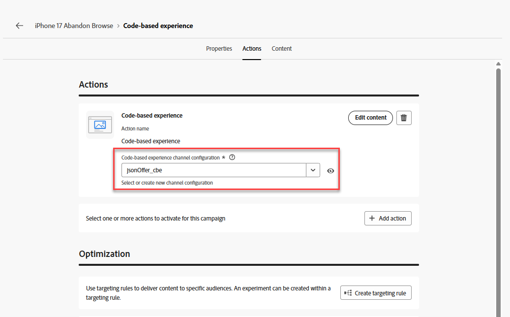
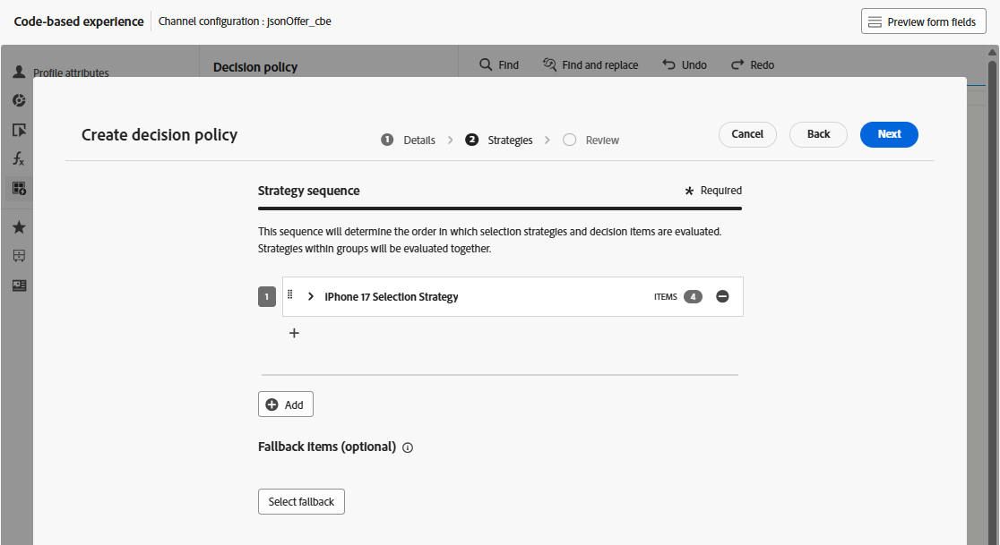
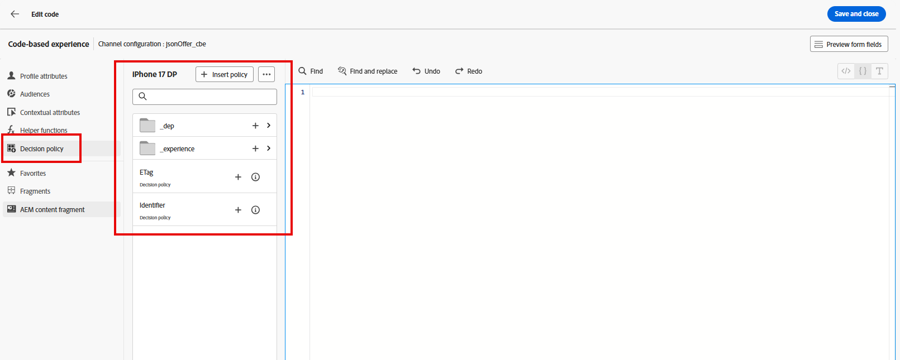
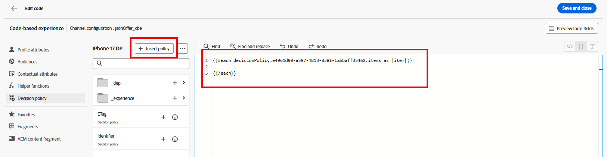

# Criar a Jornada

## Nomeie e defina critérios de entrada

1. Se necessário, expanda o item de menu **Jornada management** no painel esquerdo e clique em **Jornada**. Você chega na página da Jornada.
2. Clique no botão azul **Criar Jornada**.
3. Quando a sobreposição &quot;Criar uma Jornada&quot; aparecer, selecione **Criar do zero** e clique em **Confirmar**
4. No painel direito, nomeie a Jornada como **iPhone 17 Abandonar Navegação** e clique no botão azul **Salvar** para começar a adicionar ações à tela de Jornada.
5. Arraste o evento **Qualificação do público-alvo** para a tela.
6. No painel direito, clique no ícone de **Lápis** para selecionar o público-alvo deste evento.
7. Selecione o público-alvo **dep: Interested in iPhone 17**.
8. Verifique se o menu suspenso **Namespace** está definido como **customerID.** Neste ponto, sua Jornada terá esta aparência:

   

9. Quando todos parecerem corretos, clique no botão azul **Salvar** para salvar seu progresso.

>[!NOTE]
>
>O público-alvo &quot;dep: Interested in iPhone 17&quot; é um público-alvo de transmissão em que os critérios de entrada estão visualizando a página de visão geral fictícia Connection 5G iPhone 17 3 vezes no mesmo dia. Como muitas páginas de visão geral de produtos, a página de visão geral do iPhone 17 da Connection 5G é uma página dinâmica com vários elementos que são atualizados sem exigir o recarregamento da página. É possível comparar os diferentes níveis do iPhone 17 e seus recursos nesta única página. Dessa forma, se alguém visualizar esta página 3 vezes no mesmo dia, provavelmente terá interesse no iPhone 17. No entanto, como nem todos os elementos da página são marcados e medidos, a Connection 5G usará a idade dos usuários autenticados para determinar o nível do telefone a ser exibido para eles enquanto interagem com diferentes pontos de contato da marca Connection 5G.


## Configurar o CBE e a política de decisão

1. Expanda a opção **Ações** à esquerda da tela, arraste o elemento **Ação** para a tela e conecte-o ao primeiro nó.
2. Quando a sobreposição &#39;Selecionar tipo de ação&#39; for exibida, selecione a ação **Experiência baseada em código** e clique no botão azul **Adicionar**.
3. Nas propriedades &#39;Action\:Code-based experience&#39; agora visíveis, clique no botão **Configurar Ação**.

   

4. Altere a lista suspensa **Configuração baseada em código** para o cubo **jsonOffer\_cbe** que você criou na última seção.

   

5. Clique no botão **Editar conteúdo** logo acima do menu suspenso &#39;Configuração baseada em código&#39;.
6. Na tela resultante do Editor de experiência Code-base, clique no botão **Editar código**. A tela resultante é onde você adiciona o JSON retornado às solicitações do Evento de experiência

   

7. No lado esquerdo do editor de código, clique no item de menu **Política de decisão**, seguido por um clique no botão **Adicionar política de decisão** no novo menu.

   

   >[!NOTE]
   >
   >Se uma estratégia de seleção é onde você vincula uma coleção de ofertas a um método de classificação (e aplica elegibilidade no nível da estratégia), uma política de decisão é onde você vincula uma estratégia de seleção a um delivery específico de um canal.

8. Nomeie esta política de decisão como **iPhone 17 DP** e deixe o Número de itens definido como 1.

   >[!NOTE]
   >
   >Até o momento, você configurou as ofertas e como solicitá-las, mas não configurou quantas serão retornadas. É aqui que você configura quantas ofertas devem ser retornadas.

9. Clique no botão azul **Avançar**. É aqui que você adiciona a estratégia de seleção. Clique no botão **+Adicionar** (talvez seja necessário rolar para baixo para vê-lo) e escolha **Estratégia de seleção**.
10. Marque a caixa ao lado da única estratégia de seleção que você deve ter (**Estratégia de seleção do iPhone 17**) e clique em **Salvar**. Quando terminar, você verá o seguinte:



>[!NOTE]
>
>Observe como você pode adicionar várias estratégias de seleção ou apenas adicionar os próprios itens de decisão. Quando você usaria estratégias de seleção múltipla? Imagine que você tenha uma grade de recomendações 4 X 4 em uma de suas propriedades digitais. Preencha todos eles com 16 ofertas. Você pode ter essas ofertas distribuídas em algumas coleções ou talvez as duas primeiras linhas exijam uma estratégia de seleção, enquanto as duas últimas linhas precisam de uma estratégia diferente. Na tela anterior, você teria escolhido 16 e usado essa tela para adicionar quantas estratégias ou ofertas de seleção forem necessárias para atingir 16.
>
>A oferta substituta é opcional porque só seria aplicável se os usuários finais pudessem ser (ou se tornarem) inelegíveis para qualquer uma das ofertas. No nosso caso, nossa estratégia de seleção era para todos os visitantes e as únicas pessoas que atingiriam o nó CBE eram aquelas que entraram na Jornada. Ser autenticado é um requisito para a entrada da Jornada (o namespace definido na Jornada é aquele que eles só teriam se estivessem autenticados). Também criamos uma oferta substituta em nossa fórmula de Classificação, portanto, em nosso caso, não há necessidade de definir essa oferta substituta.

&#x200B;11. Clique no botão azul **Avançar** para revisar a política de decisão.


&#x200B;12. Quando tudo estiver correto, clique no botão azul **Criar**. Depois de criada, você retornará à página do editor de expressão.
&#x200B;13. Você deve ver uma tela semelhante à mostrada abaixo; caso contrário, clique em **Política de decisão** novamente e você verá sua política de decisão aparecer.



&#x200B;14. Clique no botão **+ Inserir política** e você verá um loop ForEach aparecer no editor de código:

Loop 

>[!NOTE]
>
>Por que um loop for each? No nosso caso, estamos apenas retornando uma única oferta. No entanto, considere as etapas anteriores, em que poderíamos retornar várias ofertas. Ao considerar a funcionalidade, o mecanismo de loop aqui faz sentido.

&#x200B;15. Adicione JSON válido dentro dos limites do loop para retornar a marca, o modelo e a camada do telefone que deve ser oferecida ao usuário final. Como o limite de frequência também está em vigor, um trackingToken precisa ser adicionado à resposta. Mais informações sobre isso posteriormente nas instruções. Para economizar tempo, basta copiar e colar essas linhas de código no editor de código no loop Para cada:

```javascript
{
     "make":"",
     "model":"",
     "tier":"",
     "trackingToken":""
 },
```


>[!NOTE]
>
>Lembre-se de que você adicionou atributos ao esquema XDM da oferta padrão, especificamente, a marca, o modelo e a camada. Em seguida, você preencheu esses atributos quando as ofertas foram criadas. Agora você adiciona esses atributos como variáveis que são preenchidas com valores da oferta selecionada. O campo trackingToken é um valor gerado pelo sistema usado para rastrear cliques e impressões.

&#x200B;16. Coloque o cursor entre o **&quot;** do nó &#39;make&#39;. Insira a marca da oferta navegando no menu de política de decisão para o nó **\_dep > Dispositivo > Criar**.  Clique no ícone **+** no elemento **Make** e você o verá preencher o editor.


&#x200B;17. Adicione os atributos **model** e **tier** de maneira semelhante.
&#x200B;18. Clique em **Política de decisão** na navegação de atributos para retornar ao nível raiz.
&#x200B;19. Preencha o atributo trackingToken navegando até o valor do Token de Rastreamento pelo caminho **\_experience > decisioning > decisionitem > Token de Rastreamento**.
&#x200B;20. Finalmente, coloque todo o pedaço de código em um conjunto de colchetes (**\[]**). O código JSON final deve ter esta aparência:


>[!WARNING]
>
>Certifique-se de incluir os colchetes &quot;\[ ]&quot; em todo o item de decisão. Confuso? Consulte a etapa #20 novamente.


&#x200B;21. Quando tudo aparecer na captura de tela acima, clique em **Salvar e fechar** no canto superior direito para salvar seu código. Você retornará à página Experiência baseada em código.
&#x200B;22. Clique no ícone de seta para trás **\&lt;** ao lado do nome da Jornada e você retornará à tela.


&#x200B;23. Clique no botão azul **Salvar** para salvar o nó da ação CBE. Agora a Jornada tem esta aparência:


&#x200B;24. Com a Jornada concluída, clique no botão azul **Publicar** no canto superior direito e **Publicar** novamente quando a caixa de confirmação for exibida. Depois de um ou dois momentos, você verá que sua Jornada está ativa agora!


>[!TIP]
>
>Sua Jornada agora está pronta para atender às ofertas JSON para este pacote de decisão!

>[!NOTE]
>
>Por que um nó de espera foi criado automaticamente depois que o CBE foi colocado na tela? Lembre-se de que um CBE é um canal de entrada. Diferentemente de uma notificação por email ou por push enviada proativamente para o usuário final, um CBE é enviado por push ao Edge e aguarda que o usuário final acesse a propriedade digital e solicite uma oferta. A duração da espera é definida por esse nó de espera. Por padrão, está definido para 3 dias, mas é configurável. Esse laboratório o deixa com 3 dias, mas em um cenário real, é provável que você queira estendê-lo por mais tempo, pois ao decorrer do tempo de espera, a Jornada desse usuário avança para o nó final e o CBE é removido da loja de perfis do Edge desse usuário.
>
>Isso também destaca uma importante consideração de arquitetura e tempo. Quando o CBE desse usuário é enviado para a loja de perfis da Edge? Quando o usuário avança para esse nó, ou seja, depois de se qualificar para o segmento. Isso significa que estará em qualquer lugar entre alguns segundos a vários minutos depois que o usuário visualizar a terceira página antes da execução da segmentação por transmissão, o usuário for colocado nesse segmento, entrar na jornada e avançar para o nó do CBE e, em seguida, esse CBE for projetado para o Edge desse usuário.  Em uma organização de teste com pouquíssimos dados e demandas de processamento, todo o processo leva apenas alguns segundos ou minutos. Para uma organização maior com throughput muito mais alto, planeje em pelo menos 15 minutos com potencial de até 2 horas.


## Recapitulação

Nesta página, você configurou um canal de experiência baseada em código (CBE) que permite que sistemas externos solicitem decisões de oferta por meio de um canal de entrada no estilo da API. Essa configuração incluiu especificar os parâmetros de superfície/local que os sistemas cliente enviarão e escolher o formato de saída JSON.
