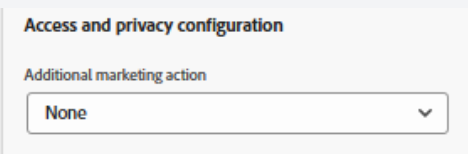
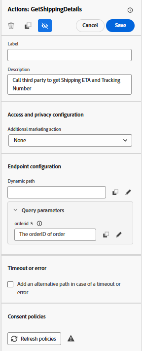
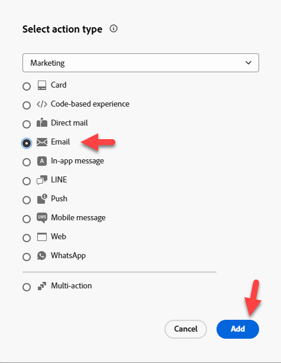

# Criar jornada

## Objetivo de aprendizado

Crie uma jornada unitária que comece com o evento Pedido enviado configurado, obtenha o ETA de um serviço externo e envie um email.

## Criar jornada

Vá para **Jornada** e clique em **Criar Jornada - Criar do zero**


## Propriedades da jornada

1. Atualize as Propriedades da Jornada no painel direito com o seguinte:
   - **Nome**: `Order Shipped Journey`
   - **Descrição**: `Notify customer that order has shipped. Include shipping details.`
   - **Marcas**: `Default`
   - **métricas de Jornada**: *deixe em branco*

     >[!NOTE]
     >
     >**Lista Suspensa Vazia?**
     >
     >Não se preocupe e siga em frente. A primeira jornada criada em uma caixa de areia precisa &quot;preparar a bomba&quot;.  Depois que publicarmos a jornada, este menu suspenso terá opções para escolher.

   - **Permitir reentrada**: `checked`

   - **Período de espera de reentrada:** `5 minutes`

   - **Rótulos de acesso**: *deixar em branco*

   - **Fuso Horário**: `Your Local timezone`

   - **Usar fuso horário do perfil em esperas e condições**: `NOT checked`

   - **Data de Início/Término**: *deixe em branco*

   - **Tempo limite ou erro**: `30`

   - **Regras de limitação:** *deixar em branco*

   - **Prioridade**: `0`


2. Se tudo estiver bem, clique no botão **Salvar**


## Tela da jornada

### Adicionar um evento unitário

No painel esquerdo, no **menu Eventos**, arraste e solte o evento **orderShipped** na tela conforme mostrado abaixo


### Adicionar uma ação personalizada

1. Se o painel esquerdo expandir o **menu Ações** e arrastar e soltar na tela a ação que você criou chamada **GetShippingDetails** após o evento orderShipped

   

2. No painel direito, na lista suspensa Configuração de acesso e privacidade —> Ação de marketing, verifique se o valor está definido como **Nenhum**

   

3. No menu Configuração de ponto de extremidade —> Parâmetros de consulta, clique no **ícone de lápis** ao lado de orderid

   

4. No modal exibido, expanda **Contexto** -> **ordemEnviada** -> **Pedido**, selecione **ID do Pedido (orderID)** e clique em **OK**

   

5. De volta ao painel direito, verifique se a opção Tempo limite ou erro está **desmarcada** e clique no **botão Salvar**




### Adicionar ação de email

1. No menu Ações, arraste e solte a ação **Ação** na tela após a ação GetShippingDetails

   

2. Selecione **Email** para a ação de marketing e **Adicionar**.

   

3. No painel direito, clique em **Configurar ação**

   

4. defina a **Configuração do canal de email** como `Profile-Email` e clique em **Editar Conteúdo**


### Adicionar conteúdo do corpo do email

Para conteúdo, você vai manter as coisas simples. Como estúpido simples.

1. Atualize a linha de Assunto para `Order Shipped` e clique no **botão Editar corpo do email**

   

2. Na barra superior, clique no bloco de conteúdo **Design do Zero**

   

3. Na barra esquerda, sob o contêiner Estrutura, arraste e solte a **Coluna 1:1** sobre a tela

   

4. Em seguida, no contêiner de Conteúdo, arraste e solte o componente **Texto** na sua **Coluna 1:1**

   

5. Clique no componente de Texto e **exclua o texto atual** e clique no ícone **Adicionar Personalization**

   

6. No painel esquerdo, clique na pasta **Atributos Contextuais** e navegue pelo **Journey Orchestration** -> **Ações** e selecione **GetShippingDetails**

   

7. No corpo principal do email agora **copie e cole** o JSON abaixo no **editor** do Personalization

   ```json
   {{profile.person.name.firstName}}, your order has shipped
   ETA: 
   Tracking Number: 
   ```

8. Adicione os campos de personalização da seguinte maneira (**clique no sinal de mais &#39;+&#39; ao lado do campo no painel esquerdo**):
   - **ETA:** `eta`
   - **Número de Acompanhamento:** `tracking_number`

   

   >[!NOTE]
   >
   >Clique no **+ símbolo** para adicionar atributos de personalização do painel à tela.  Ele os colocará onde o cursor está, para garantir que você esteja &quot;alinhado&quot; adequadamente

   >[!NOTE]
   >
   >Seu email usará uma combinação de atributos de contexto (ETA e número de rastreamento) e atributos de perfil (nome). Se quiser adicionar outros atributos de perfil, clique na guia Atributos de perfil e selecione qualquer item que desejar visualizar.
   >
   >

9. Na parte inferior da tela, clique no botão **Validar** e verifique se não há erros

   

10. Se tudo estiver bem, clique no **botão Salvar** na parte superior direita
11. Em seguida, clique no botão **Salvar** novamente na parte superior direita e clique na **\&lt;- seta para a esquerda** na parte superior esquerda


12. Finalmente, clique no **\&lt; ícone Voltar** na parte superior esquerda para voltar à Tela de Jornada


>[!TIP]
>
>E clique novamente no botão **Voltar**... Brincadeira! Este é o último botão Voltar... nesta seção 😜


### Substituir parâmetros de email

De volta à tela principal da Jornada, no nó Email, verifique se você pode ver os campos somente leitura (talvez seja necessário clicar no ícone **Mostrar campos somente leitura**)


1. Role para baixo até **Parâmetros de email** e clique no ícone **Habilitar substituição de parâmetro**

   

2. Clique na caixa de texto vazia e, em seguida, no painel à esquerda, detalhe o **Contexto** -> **orderShipped** -> **\_dep** e clique no campo **personalEmail**.  Clique no **botão OK**

   

   >[!WARNING]
   >
   >É perigoso evitar usá-lo, a menos que seja necessário em uma configuração de produção.  Isso substituirá o local padrão que o Jornada procura no perfil para executar mensagens.


3. Clique no **botão Salvar** na parte superior direita e clique na **seta para trás** \&lt;- na parte superior esquerda para **fechar** a Jornada


## Recapitulação

Uma jornada publicada capaz de responder ao acionador de evento Pedido enviado. Obtenha o ETA de um serviço externo e envie um email.
