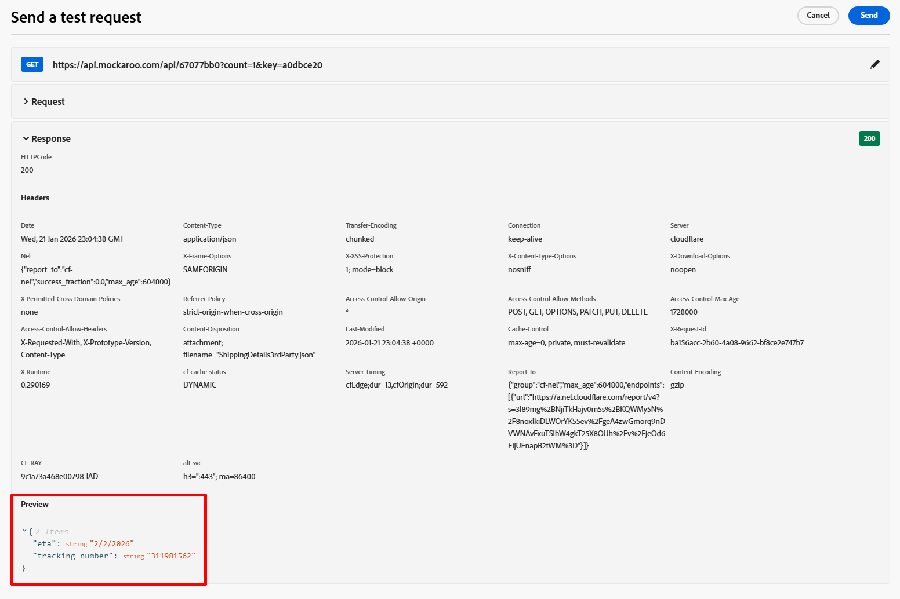

# Configurar ação personalizada

## Objetivo de aprendizado

Crie uma ação personalizada que define como a jornada se comunicará com um ponto de extremidade ou serviço externo para obter um ETA de quando o pacote chegará.

## Navegar para ações

No painel esquerdo, no menu Administração, clique em **Configurações** e, no bloco Ações, clique no botão **Gerenciar**


## Configurar a ação

### Nome da ação e detalhes

1. No canto superior direito, clique no botão **Criar ação**


2. No painel de configuração exibido, atualize os seguintes valores básicos, conforme mostrado abaixo:
   - **Nome**: `GetShippingDetails`
   - **Descrição**: `Call third party to get Shipping ETA and Tracking Number`
   - **Tipo de ação**: `Custom`
   - **Canal**: `Email`
   - **Ação de marketing necessária**: `Email Targeting`


### Detalhes do ponto de extremidade

Na área Configuração do endpoint, forneça os seguintes detalhes:

- **URL do Ponto de Extremidade**: `https://api.mockaroo.com/api/67077bb0?count=1&key=a0dbce20`
- **Método**: `GET`
- **Cabeçalhos:** *deixar como estão*
- **Parâmetros de consulta:**
  - **Nome**: `orderid`
  - **Tipo**: `variable`

>[!NOTE]
>
>Uma variável permite que passemos um valor durante uma jornada e não um valor estático para todas as jornadas

- **Tipo de Autenticação**: `No Authentication`


### Detalhes da carga da resposta

Agora é necessário fornecer uma amostra de carga para que a ação saiba como a carga de resposta deve ser.

1. Na área Cargas, clique no **ícone de Lápis** para abrir a tela Configuração de campo


2. **Copiar e colar** a carga abaixo na caixa Carga

```json
{
    "eta": "11/19/2025",
    "tracking_number": "072000326"
}
```

>[!NOTE]
>
>Esta é a mesma estrutura JSON que o endpoint do Mockaroo acima deve retornar:


3. A carga da resposta será exibida. Clique no botão **Salvar**.


>[!NOTE]
>
>Você pode deixar tudo como uma sequência de caracteres, mas na vida real é desejável atualizar isso para corresponder ao tipo de dados


### Testar a ação

1. Clique no botão **Enviar solicitação de teste** no painel inferior direito para validar se você não danificou nada 😀


2. Clique na guia **Parâmetros de consulta** e atualize o valor de `orderId` para **123**


3. Clique no botão **Enviar** e, se tudo der certo, você deverá ver um código de resposta 200 e uma Pré-visualização da carga conforme mostrado abaixo...



Visualização

```json
{
  "eta": "12/26/2025",
  "tracking_number": "063112249"
}
```

>[!WARNING]
>
>Se você não visualizar uma resposta 200 ou uma Pré-visualização, não continue. Levante o ✋para obter ajuda.


4. Clique no botão **Cancelar** para voltar à tela Ação e role de volta no painel superior direito e clique no botão **Salvar**

>[!TIP]
>
>Parabéns! Sua ação personalizada está ativa, graças às habilidades de nível especializado Ctrl+C, Ctrl+V.

## Recapitulação

Uma ação personalizada reutilizável configurada no Adobe Journey Optimizer que obtém uma ID do pedido e retorna o ETA e o Número de rastreamento.
