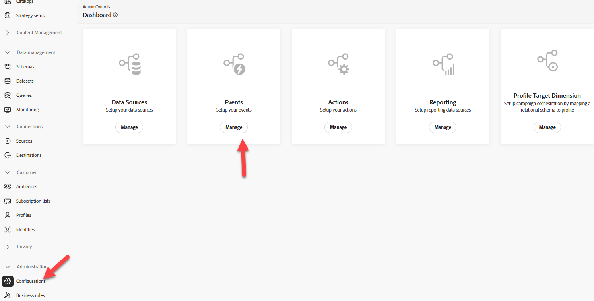
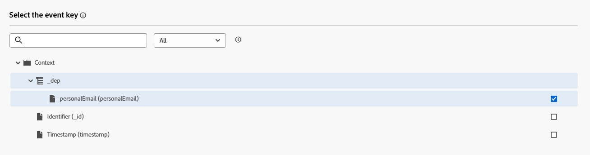

# Configurar evento

## Objetivo de aprendizado

Crie e configure um evento que acionará uma jornada do cliente quando a ação pós-compra (ordem entregue) ocorrer.

## Navegar até o Journey Optimizer

No canto superior direito do navegador, clique no **Cubo** e selecione **Journey Optimizer**

Menu 

## Configurar evento de entrega da ordem

Para criar uma Jornada que use um Evento unitário, precisamos primeiro configurar o evento.

1. No painel esquerdo, no menu Administração, clique em **Configurações** e, no bloco Eventos, clique no botão **Gerenciar**

&#x200B;2. No canto superior direito, clique no botão **Criar evento**

&#x200B;3. Atualize as configurações do evento da seguinte maneira:
   - **Nome** = `orderShipped`
   - **Tipo** = `Unitary`
   - **Tipo de ID do evento** = `Rule based`
   - **Esquema** = `dep: Orders v.1`

&#x200B;4. Na caixa de entrada `Fields`, clique no **ícone de Lápis**

&#x200B;5. Selecione os campos a seguir para adicionar ao evento e, quando terminar, clique no botão **OK**
   - `Event Type (eventType)`
   - `Order ID (orderID)`

>[!NOTE]
>
>Selecione apenas o campo ID do Pedido e não todos os campos no Pedido 😁

&#x200B;6. No `Event Id condition input`, clique no **ícone de Lápis**

&#x200B;7. **Arraste** o campo `Event Type` para a tela

&#x200B;8. Na caixa de seleção exibida, procure e verifique o valor intitulado **pedidos.remetidos.** Clique no botão **OK**.

&#x200B;9. Em seguida, atualize os dois últimos valores de Namespace e Identificador de perfil com os valores mostrados abaixo:
   - **Namespace** —> `Email`
   - **Identificador de Perfil** —> `personalEmail`

>[!NOTE]
>
>**Para que o Namespace e o Identificador de Perfil são usados?**
>
>Para qualquer jornada que use um evento, você deve especificar qual namespace de identidade e identificador de perfil associado devem ser usados para pesquisar o perfil. É importante entender que escolher uma identidade em vez de outra pode afetar como a jornada funcionará.
>
>*Exemplo Rápido:*
>
>A carga do evento é uma visualização de página que contém identidades como: ECID (identidade principal) e ID do cliente (opcional)
>
>- ECID escolhida —> é provável que seja a primeira vez que o serviço de identidade visualiza essa relação, de modo que, quando uma jornada receber esse evento, ela tentará pesquisar o perfil usando a ECID e não localizará um perfil.  Por quê? A relação ainda não existe entre a ECID e a ID do cliente, e as características do perfil provavelmente são armazenadas em relação à ID do cliente do identificador conhecido
>- ID do cliente escolhida —> essa identidade não precisa ser preenchida e provavelmente estará vazia na maioria das exibições de página.  Portanto, se essa identidade tiver sido escolhida, a única vez que uma Jornada será acionada é quando houver uma exibição de página autenticada em que a ID do cliente esteja definida.
>
>Resposta curta: não há resposta certa, apenas compensações que você precisa fazer com base no caso de uso 😃

## Configuração do evento orderShipped final

Verifique abaixo a configuração final do evento.  Se tudo estiver bem, clique no botão **Salvar**

>[!TIP]
>
>Você configurou seu primeiro evento do AJO. Você mesmo!

## Recapitulação

Um evento de entrega de ordem configurado no Adobe Journey Optimizer que pode ser usado como ponto de entrada para uma jornada
