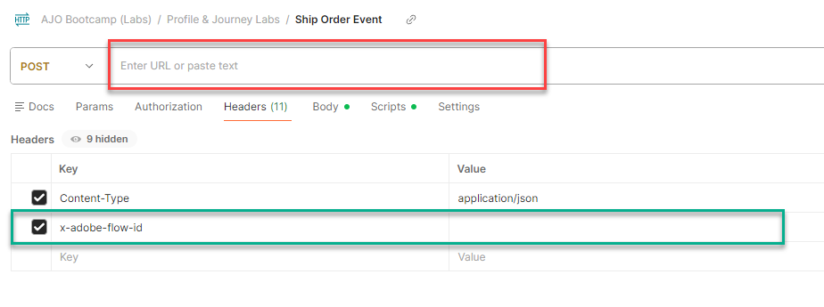

# Enviar um evento

## Objetivo de aprendizado

Enviar um evento de Pedido enviado simulado para acionar a jornada usando o Postman

## Transmissão para Hub vs. Edge

Anteriormente, enviamos um Evento para a Edge.  Há alguns casos de uso em que podemos ter um sistema de back-end que deseja transmitir em um evento, mas não precisa enviá-lo para a Edge.  Este laboratório mostra como fazer isso ao **transmitir em um evento Pedido enviado ao Hub** (também conhecido como servidor para servidor, por exemplo, Commerce Server para AEP sinalizando que um pedido foi enviado).

## O evento de validação não está no perfil

1. Vá para seus **Perfis** e procure o Perfil.
   - **Namespace de identidade** -> `email`
   - **Valor de identidade** -> `henry.creel@emailsim.io`
1. Clique na guia **Eventos**.
   - Deve haver **não** `orders.shipped` eventos

## Modificar solicitação de API

Para criar a solicitação de API, é necessário preencher as seguintes partes no corpo da solicitação de API.

Comece reunindo os seguintes valores:

### Localizar ponto de extremidade de transmissão da conta

1. Navegue até **Fontes** no painel esquerdo e clique em **Contas** na navegação superior
1. Pesquise por **dep: API HTTP \[raw]**, realce a linha, copie e salve o valor do **Ponto de Extremidade de Streaming** em algum lugar que você possa referenciar mais tarde

![dep: Linha de conta [raw] da API HTTP realçada com o valor da Extremidade de Streaming](assets/send-an-event-streaming-endpoint-account-row.png "dep: API HTTP \[raw]")

### Encontrar ID de fluxo de dados

1. Clique em **dep: API HTTP \[raw]**
1. Localizar o registro de **dep: Pedidos (fluxo)** clique no link de fluxos de dados
1. No painel direito, copie e salve os valores de **ID de fluxo de dados** em algum lugar que você possa consultar mais tarde

>[!WARNING]
>
>Clique em um espaço vazio na linha.  NÃO clique nos links azuis!

### Abrir Postman

Inicie o Postman no computador e navegue até a seguinte chamada de API:

- **Barra Lateral Esquerda do Postman** —> `Collections`
- **Coleção** —> `AJO Bootcamp (Labs)`
- **Pasta** —> `Profile & Journey Labs`
- **Solicitação de API** —> `Ship Order Event`

### Criar solicitação de API final

1. Copie os valores salvos nas etapas anteriores nos locais destacados abaixo.
1. Clique em **Cabeçalhos** e cole esses valores (remova os espaços à direita):
   - **Vermelho** —> `Streaming Endpoint URL`
   - **Verde** —> `Dataflow ID`
     - O valor parece com um GUID (não começa com http)

>[!CAUTION]
>
>AINDA NÃO EXECUTAR!

## Executar a API

1. Salve sua chamada de API clicando no botão **Salvar**
1. Execute sua solicitação clicando no botão **Enviar**

Uma chamada bem-sucedida deve resultar na seguinte resposta...

## Recapitulação

Um evento de Ordem de Entrega é enviado com sucesso à plataforma
