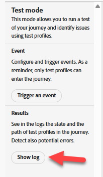

# Testar jornada

## Objetivo de aprendizado

Use as ferramentas de teste do jornada para verificar se o acionador do evento e a lógica de jornada estão configurados corretamente.

## Testar a jornada

1. Clique em **Jornadas** no painel esquerdo e na **guia Procurar** se não vir uma lista de Jornadas
2. Clique na sua **Jornada** para abri-la
3. Clique em **Alertas** e verifique se não há erros (avisos ok)


>[!NOTE]
>
>**O que é CJMMAS - 2001-200**
>
>Indica que o link para opção de não participação está ausente em uma variante de email

&#x200B;4. Clique em **Simular** e, no lado esquerdo, selecione **Modo de Teste**


>[!NOTE]
>
>Pode levar um minuto para ficar pronto. Durante esse tempo, o botão Acionar um evento não estará disponível.


&#x200B;5. Clique em **Acionar um Evento** e preencha estas propriedades:
   - **Tipo de evento**: `orders.shipped`
   - **Email Pessoal**: `henry.creel@emailsim.io`
   - **ID do pedido**: `123`
&#x200B;6. Clique em **Enviar** (observe que demora alguns segundos para responder depois de clicar em enviar)


&#x200B;> [!WARNING]
>
>Alguns alunos recebem erros e precisam enviar isso algumas vezes. Talvez seja necessário fazer isso **várias** vezes.
>
>**Às vezes** o primeiro envio fornece um erro de:
>
>**A entrada não existe (ID de referência: 3216a850-c40d-11f0-8fa5-73d1522cc9a2)**
>
>Se você receber um erro, clique em **Acionar um Evento** e **enviar** novamente.  Talvez seja necessário fazer isso **várias vezes**.


&#x200B;7. Em **Resultados** -> Clique em **Mostrar Log** no lado esquerdo



&#x200B;> [!NOTE]
>
>Alguns alunos que receberam erros às vezes recebem logs diferentes mostrando uma matriz de instâncias vazia `{"instances": []}`. Isso não é um bloqueador, vá em frente e vá para a próxima etapa.

Você deve ver algo como isso no log:

>[!NOTE]
>
>Estamos procurando os campos-chave usados: **actionsHistory**, **transitionsHistory**, **eta**, **tracking_number**, **eventType**, **personalEmail** e **orderID**.

```json
{
  "actionsHistory": {
    "8919055f-1b00-4a43-8bd6-c8af894474b2": {
      "eta": "11/27/2025",
      "tracking_number": "091204404",
      "jo_status_code": "http_200"
    }
  },
  "transitionsHistory": {
    "orderShipped (1158856989)": {
      "eventType": "orders.shipped",
      "_id": "joTestModeEvent_5abbfdcd-561d-45a7-ba42-d0640539831a",
      "_dep": {
        "personalEmail": "henry.creel@emailsim.io"
      },
      "order": {
        "orderID": "123"
      },
      "timestamp": "2025-11-17T23:30:49.576289372Z"
    }
  }
}
```


&#x200B;8. **Fechar** a **guia** do Navegador
&#x200B;9. **Fechar Modo de Teste** no canto superior direito


&#x200B;10. Clique em **Publicar** a Jornada no canto superior direito


&#x200B;11. **Feche** a **Jornada** clicando na seta \&lt;- na parte superior esquerda


Em seguida, enviaremos um evento pedido enviado real para o AEP

## Recapitulação

A jornada passou na validação de configuração e está pronta para receber eventos
