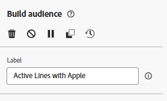

# Criar um público

## Objetivo

Nas próximas etapas, você criará o público-alvo que deseja direcionar para a campanha, que são todos os titulares de linha ativos que têm uma marca que corresponde ao telefone principal que está sendo lançado.  O objetivo é o grupo que você deseja direcionar com uma mensagem SMS incentivando-os a atualizar seus telefones.

## Adicionar atividade Criar público-alvo

1. Na tela, clique no símbolo **+** e selecione a atividade **Criar público** para adicioná-lo ao fluxo de trabalho

   

2. No painel direito, você verá as propriedades Criar público-alvo. Atualize o Rótulo para indicar o seguinte: `Active Lines with Apple`

## Selecionar targeting dimension

A próxima etapa é selecionar a **Targeting dimension** (ou seja, qual tabela você deseja consultar). Execute as seguintes etapas:

1. Clique no **ícone de pesquisa** na caixa Targeting dimension

   

2. No pop-up, procure e selecione a tabela denominada **dep-rel: Customer Line** e clique no botão **Confirm**.

>[!NOTE]
>
>Lembre-se sempre da **dimensão de direcionamento** de cada público-alvo criado. Você aprenderá o significado dela nas próximas etapas.

>[!NOTE]
>
>se você já tiver selecionado um esquema criado pela Adobe, observe que o esquema começa com -> *(caas)*. Este é apenas um namespace aplicado às tabelas no armazenamento relacional e significa Campaign as a Service :)

## Criar público

Agora que você selecionou o targeting dimension (qual esquema relacional você vai consultar), é possível começar a criar sua definição.

1. No painel direito, clique no botão **Criar Público**

   

2. Clique no botão **Adicionar condição**

## Criar condição(ões)

Agora é hora de escrever a lógica do público-alvo usando os atributos encontrados no esquema. O objetivo é encontrar todas as linhas de clientes que estão ativas e usando uma marca do Apple.

### Criar condição #1

1. Defina a condição usando as seguintes informações:
   - **Atributo**: `Active Line`
   - **Valor**: `true`

   

2. Clique no ícone **Atualizar** para exibir as contagens qualificadas na condição.

>[!TIP]
>
>Você verá um resultado de 241 se criar a condição corretamente

### Criar condição #2

1. Clique no botão **Adicionar condição** e selecione o esquema **dep-rel:** **Product \[Lookup]** clicando no ícone **>**

   ![Selecione o esquema dep-rel: Product [Lookup] clicando no ícone >](assets/build-an-audience-select-product-lookup-schema.png)

2. Procure o campo **Marca**, clique nos três pontos e selecione **Distribuição de valores**

   

3. Observe os vários valores. Você só quer `Apple` e, felizmente, ele não tem 100 grafias diferentes. Clique no **campo do Apple** para selecioná-lo e, em seguida, clique no **botão Selecionar atributo e valor** no canto superior direito.

   

   >[!NOTE]
   >
   >Este é um exemplo excelente de onde o arquiteto de dados deve ter projetado o esquema com enumerações.  Dessa forma, um profissional de marketing não precisa selecionar/digitar manualmente o valor.  Que vergonha, arquiteto de dados!

4. O campo `Make` é adicionado automaticamente com as condições mostradas abaixo.
   - **Operador:** `Equal to`
   - **Valor:** `Apple`
   - **Diferenciação de maiúsculas e minúsculas:** `Enabled`

5. Clique no **ícone calcular** e você verá 85 como o resultado.

>[!NOTE]
>
>Observe o uso do operador AND no grupo. Independentemente de você criar isso em um único grupo, como mostrado, ou em vários grupos, AND é importante, pois informa às Campanhas orquestradas que ambas as condições devem ser verdadeiras.

## Verificar contagens

1. Clique no **ícone Calcular** localizado no painel direito sob o título Perfis direcionados para obter uma estimativa exata do tamanho do público. Você vê **65** como a **contagem final**.

   

   >[!NOTE]
   >
   >Observe como cada condição individual retornou um número diferente (condição #1 —> 241 e condição #2 —> 85), mas o tamanho do público final foi o menor das duas condições.  Isso é devido a esse operador AND.

2. Se você vir a contagem final de **65**, clique no botão **Confirmar**, na parte superior direita da tela, e clique no botão **Salvar**, na parte superior direita, para salvar seu trabalho.

## Desafio

Considere por um momento que você digitou a última condição de forma que `Make` fosse igual a `apple` (em minúsculas) e você tenha deixado a opção de configuração para `Case sensitive` alternada `on`.  Isso faria com que o registro de condições fosse igual a 0.  Então você teria 241 linhas ativas e 0 onde a marca é apple.

**Qual seria o tamanho final do público neste caso?**

## Resposta

É zero. Você sabe por quê?

## Recapitulação

Você criou seu primeiro público-alvo com sucesso e agora deve ver como é fácil desenvolver e validar suas contagens na atividade Criar público-alvo.

