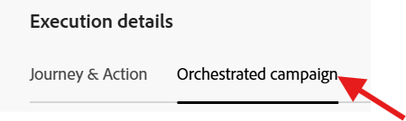
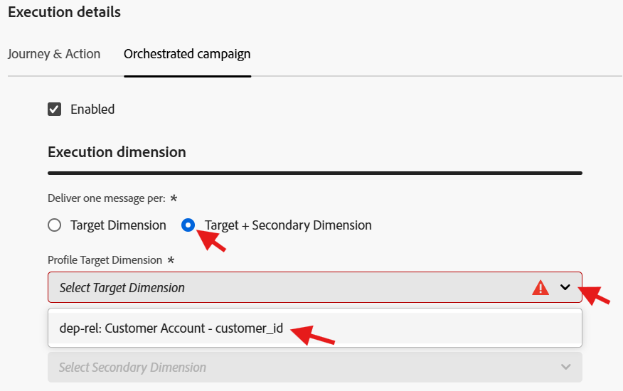
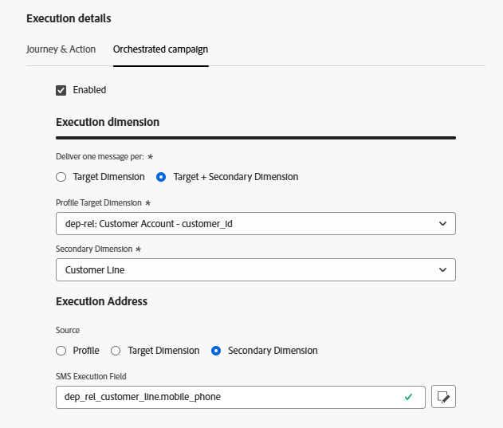

# Configurar canal de SMS

## Objetivo

No próximo conjunto de etapas, você configurará o canal SMS. Isso é necessário para que você possa enviar mensagens a detentores de linha individuais posteriormente quando estiver criando sua campanha.

## Navegar até canais

1. No Adobe Journey Optimizer, vá para o menu **Administração** -> **Canais**.
1. Selecione **Configurações de SMS** → **Credenciais da API**.
1. Clique em **Criar credencial de API**.

## Definir as credenciais da API de SMS

Você começará criando o conector de API que o AJO usará para enviar solicitações de SMS de saída.

1. Em Fornecedor de SMS, escolha **Twilio**.
1. Insira os seguintes detalhes da credencial de API, usando sua própria [conta de avaliação do Twilio](https://www.twilio.com/try-twilio):
   - **Nome:** `DEP SMS`
   - **SID da conta:** encontrado no painel do Console do Twilio
   - **Token de Autenticação:** encontrado no painel do Console do Twilio (clique em **Exibir** para revelá-lo)
1. Clique em **Enviar** para registrar a credencial de API

>[!NOTE]
>
>Você precisará de uma conta de avaliação gratuita do Twilio com um número de telefone verificado antes de iniciar esta etapa. Cadastre-se em [twilio.com/try-twilio](https://www.twilio.com/try-twilio) e localize seu SID de Conta e o Token de Autenticação no painel do Console do Twilio.

## Criar configuração de canal SMS

Agora, você mapeará essa credencial de API para uma configuração de canal que o jornada e as campanhas possam usar.

1. Navegue até **Canais** → **Configurações gerais** → **Configurações de canal**.

   

2. Clique em **Criar configuração de canal**.

   

3. Preencha as Configurações do canal SMS com os seguintes valores:
   - **Nome:** `Relational-SMS-Multi-Entity`
   - **Canal:** `Mobile Message`
   - **Ação de marketing:** `SMS Targeting`

>[!NOTE]
>
>Se você receber um erro informando que o usuário não tem permissão, ignore-o e continue.

## Configurações de SMS

Ao selecionar Canal como Mensagem para dispositivo móvel, uma nova seção chamada Configurações de SMS é exibida. Preencha-o com os seguintes detalhes:

- **Tipo de mensagem móvel:** `Marketing`
- **Configuração da mensagem móvel:** `DEP SMS`
- **Número do remetente:** `01234567890`
- **Subdomínio:** `leave blank`
- **Número de recusa:** `leave blank`

## Detalhes da execução

1. Em Detalhes da execução, clique na guia **Campanha orquestrada**

   

2. Verifique se a caixa de seleção **Habilitado** está marcada

   

3. Em seguida, na subseção **Execution dimension**, verifique se os itens a seguir estão configurados da seguinte maneira:
   - **Entregar uma mensagem por:** `Target + Secondary Dimension`
   - **Dimension de Destino do Perfil:** `dep-rel: Customer Account - customer_id`
   - **Dimension Secundário:** `Customer Line`

   

   

   >[!NOTE]
   >
   >Isso informa ao Orchestrated Campaigns que, ao enviar mensagens, ele deve fornecer uma mensagem por registro que corresponde ao Dimension do Target de perfil.

4. No cabeçalho Endereço de Execução, selecione o botão de opção para **Dimension Secundário** e clique no botão de edição no **Campo de Execução do SMS**

   

5. Na janela pop-up, clique no esquema **dep-rel: Customer Line** e selecione **Celular**.

   

   

6. Confirme as correspondências da seção de Detalhes da execução final abaixo

## Enviar e revisar

1. Você pode clicar no botão **Enviar** para concluir a configuração e ver uma mensagem de sucesso ser exibida

   

2. Na página de inventário das configurações de canal, verifique se o status é exibido como **Ativo** antes de continuar

   

   >[!CAUTION]
   >
   >Aguarde até que o status se torne **Ativo**, caso contrário, as etapas futuras do laboratório falharão para você

3. Quando o status se torna Ativo, você está concluído!

>[!TIP]
>
>🚀 Booyah! Seu canal de SMS agora está ativo e pronto para ação!

## Recapitulação

Agora você viu como configurar um canal SMS com êxito.  Observe que este é um SMS com base em API, portanto, dependendo do seu provedor, ele pode usar métodos alternativos de autenticação.

Você pode ler mais [aqui](https://experienceleague.adobe.com/en/docs/journey-optimizer/using/channels/sms/configure-sms/sms-configuration), se estiver interessado.
