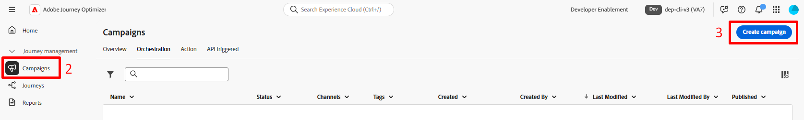

# Criar uma campanha orquestrada

## Objetivo

No próximo conjunto de etapas, você cria o shell de uma Campanha orquestrada (sem atividades) que é o ponto de partida para qualquer campanha.

## Navegar até campanhas

1. Primeiro, verifique se você está no aplicativo Adobe Journey Optimizer selecionando o aplicativo na gaveta de aplicativos no canto superior direito do navegador

2. No painel de navegação esquerdo, selecione **Campanhas**
3. Em seguida, clique no botão **Criar campanha** no canto superior direito

4. No modal exibido, selecione **Orquestração - Marketing** e clique em **Confirmar**

## Configurações da campanha

1. Preencha os metadados da campanha necessários com as seguintes informações:
   - **Nome** —> `Flagship Phone Launch`
   - **Descrição** —> *deixar em branco*
   - **Política de mesclagem** —> `Default Timebased`
   - **Marcas** —> *deixe em branco*

Quando terminar, sua tela deverá ficar parecida com a exibida abaixo.

2. Clique no botão **Salvar** para continuar.

## Noções básicas sobre programação

Você deve chegar imediatamente à tela de workflow após criar a campanha.  Observe que no canto superior direito há uma opção de agendamento para a frequência com que esse fluxo de trabalho deve ser executado para sua campanha.

O padrão é sempre definido como **Assim que possível**. Para este exercício, usaremos o padrão, mas há muitas outras opções disponíveis para você.

## Recapitulação

Agora você viu como criar uma Campanha orquestrada e as opções gerais disponíveis para você no que diz respeito à programação.
