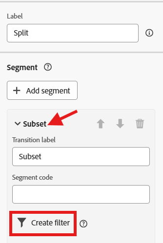

# Filtrar as linhas

## Objetivo

No próximo conjunto de etapas, você filtrará todas as linhas que realmente não têm permissão para serem direcionadas com uma mensagem SMS devido à recusa no nível da linha.  Você não pode confiar aqui no consentimento do Perfil porque este é um público alvo em nível de linha.

## Configurar atividade de divisão

1. Clique no ícone **+** na transição inferior da atividade Fork e selecione a atividade **Split** no pop-up.

&#x200B;2. No painel direito, atualize o Rótulo para informar o seguinte: `Filter out opt'd out lines`

&#x200B;3. No painel direito, expanda a seção do segmento padrão **Subconjunto** e clique no botão **Criar filtro**

&#x200B;4. Adicione uma condição para garantir que você remova todas as Linhas de Clientes que recusaram mensagens SMS e clique em **Confirmar**.

>[!NOTE]
>
>Você precisa descobrir como criar a condição, mas o resultado final corresponde à captura de tela acima.  Você conseguiu isso!

&#x200B;5. Clique no botão Salvar no canto superior direito para salvar seu trabalho.  Sua tela se parece agora...

## Adicionar a atividade de SMS

1. Na tela do fluxo de trabalho, clique no ícone **+** após a condição de divisão adicionada e selecione a **Atividade de SMS**

&#x200B;2. No painel direito, clique no botão Editar SMS para iniciar a configuração da mensagem SMS.

&#x200B;3. Na navegação superior, clique no item de menu Ações e, no menu suspenso Configuração de SMS, selecione o canal criado anteriormente.

>[!CAUTION]
>
>Oh, não 🫨!  Por que você não está obtendo nenhum resultado?  Você já não configurou seu canal de SMS?  O produto está quebrado?
>
>ABERRAÇÃO!!!!!!!!

## Momento de surtar

A transição da bifurcação atualmente tem um targeting dimension da Linha do cliente (ou seja, a qual tabela o resultado atual está relacionado na Loja relacional).  O que é exclusivo das Campanhas orquestradas é que você sempre acessa o Perfil do cliente em tempo real no momento do envio, para que as informações de entrega e rastreamento das mensagens sejam atribuídas a um perfil.  Esta associação foi pré-criada para você a partir da tabela Conta do cliente.

A configuração do canal para SMS já foi definida antecipadamente para você e atualmente parece que sim...

**A forma como você lê isso é a seguinte:**

- Enviar uma mensagem por dimensão de destino (ou seja, Conta de Cliente) no número de registros relacionados encontrados na dimensão secundária (ou seja, Linha de Cliente)
- Execute cada delivery de SMS usando o número do celular encontrado na dimensão secundária (ou seja, Linha do cliente)

Essa capacidade exclusiva de enviar muitas mensagens para um perfil é um dos recursos principais do Orchestrated Campaigns, que o torna diferente do Jornada.

Então como você faz isso funcionar?  Adicionar uma dimensão de alteração 😀

## Adicionar dimensão de alteração

1. Clique no botão Voltar na tela de edição do SMS

&#x200B;2. Na tela do fluxo de trabalho, clique no ícone **+** **3&rbrace; entre as atividades de Filtro e SMS e selecione** Alterar Dimensão **.**

&#x200B;3. Na direita, atualize a dimensão de alteração com as seguintes informações:
   - **Rótulo:** `Convert Line to Account`
   - **Nova dimensão de destino:**`dep-rel: Customer Account`

&#x200B;4. Clique no botão **Salvar**, na parte superior direita da tela, para salvar seu trabalho. Quando terminar, seu fluxo de trabalho agora ficará assim...

## Configuração de mensagem SMS

Agora que você corrigiu o fluxo de trabalho, reconfigure o SMS.

1. Clique na atividade de SMS na tela de fluxo de trabalho e, em seguida, no painel à esquerda, clique no botão **Editar SMS**

>[!NOTE]
>
>Esta tela demora um pouco para carregar.  Sei que é irritante, acredite que está sendo consertado

&#x200B;2. Na navegação superior, clique no item de menu **Ações** e, no menu suspenso Configuração de SMS, selecione o canal criado anteriormente.

>[!TIP]
>
>Sinta-se bem, não é 😮‍💨

## Recapitulação

Você conseguiu vencer essa e, espero, aprendeu duas coisas muito importantes:

1. O targeting dimension dos resultados finais deve corresponder à configuração de canal que você deseja usar
1. A atividade Change dimension provavelmente se tornará sua melhor amiga para garantir que isso aconteça
