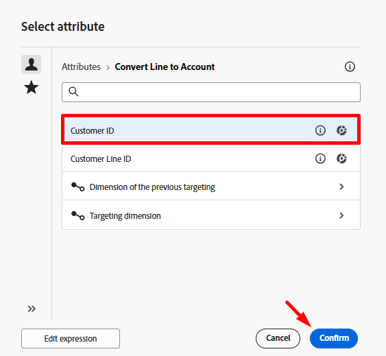
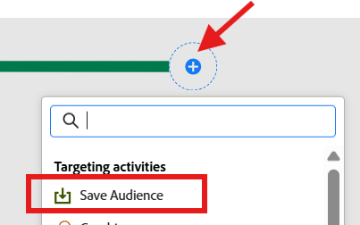

# Salvar o público

## Objetivo

No próximo conjunto de etapas, você salvará o público-alvo criado no Portal de público-alvo para que outras soluções da Adobe Experience Platform e seus aplicativos possam aproveitá-lo para seus próprios casos de uso.

## Alterar a dimensão

1. Na tela do fluxo de trabalho, clique na ramificação **+** **ícone** em **Salvar público** e, na lista de atividades, selecione a atividade **Alterar dimensão**

2. Atualize as propriedades da dimensão de alteração conforme descrito abaixo:
   - **Rótulo:** `Convert Line to Account`
   - **Nova dimensão de destino:** `dep-rel: Customer Account`

>[!NOTE]
>
>**Por que você está fazendo esta pergunta?**  Lembre-se de que para ingressar no Perfil do cliente em tempo real (que é onde você salva públicos-alvo) é necessário usar o Mapeamento de direcionamento de perfil configurado, que somente ingressa do esquema dep-rel: Conta de cliente.

3. Quando terminar, sua tela ficará assim.  Salve o trabalho!

## Desduplicar o resultado

1. Clique no ícone **+** **3} após a atividade Change Dimension e, na lista de atividades, selecione a atividade** Deduplication ****

2. Atualizar o rótulo da atividade de Eliminação de Duplicatas para `Dedup customer id`

3. Agora clique no botão **+ Adicionar atributo** e selecione o campo do esquema intitulado **ID do cliente**

4. Nas configurações de Desduplicação, verifique se você tem o seguinte conjunto:
   - **Duplicatas a serem mantidas:** `1`
   - **Método de desduplicação:** `Random selection`

>[!NOTE]
>
>As outras opções de desduplicação permitem especificar sua própria lógica personalizada.  Na maioria das vezes, se precisar desduplicar, você o fará usando a chave primária da tabela.

5. Quando terminar, sua tela ficará assim. Clique no botão **Salvar** no canto superior direito antes de continuar.

## Adicionar atividade Salvar público-alvo

1. Clique no ícone **+** após a atividade Desduplicação e selecione a atividade **Salvar público-alvo**

2. No painel direito, defina as propriedades da atividade como a seguir:
   - **Rótulo do público-alvo**: `Apple Upgrade Eligible Customer Accounts`
   - **Campo de mapeamento de perfil**: `dep-rel: Customer Account - customer id`

>[!NOTE]
>
>O &quot;Campo de mapeamento de perfil&quot; é o que você configurou anteriormente para que a Loja Relacional possa se associar ao Perfil do cliente em tempo real.  O perfil foi modelado como um nível de Conta do cliente, portanto, você deseja salvar o público-alvo na mesma conta.  Daí a necessidade da dimensão de alteração e da desduplicação.

## Mapeamentos de campo de público

Por padrão, a chave primária da targeting dimension (ou seja, ID de cliente) é adicionada ao público-alvo como um campo. Você pode ver isso se olhar para a direita e expandir o campo.  Duas observações:

- **Campo de público-alvo do Source** —> refere-se ao campo proveniente do esquema relacional
- **Campo de público-alvo** —> o nome do campo que será criado como parte do salvamento do público-alvo

>[!NOTE]
>
>Observe quão terrivelmente o Campo de público-alvo é nomeado como `Dep_rel_customer_account_Customer_id`.  Você deve sempre alterar isso para algo mais legível para um profissional de marketing, sem desculpas.

## Corrigir campo de público padrão

1. Renomeie o campo de público-alvo padrão como **Customer\_ID** conforme mostrado abaixo:

>[!TIP]
>
>Agora você tem um nome de campo legível humano 🎉

2. Clique no botão **Iniciar** para executar o fluxo de trabalho. Agora, seu fluxo de trabalho fica assim, e você vê as contagens da seguinte maneira:
   - Criar audiência: `65`
   - Converter Linha em Conta: `65`
   - Excluir duplicatas da ID do cliente: `46`

>[!NOTE]
>
>A atividade Save audience só criará o público-alvo quando o fluxo de trabalho for publicado, não quando ele for simplesmente iniciado. Quando o público-alvo for criado, ele incluirá todos os atributos adicionados a ele e ingressará no Perfil do cliente em tempo real durante a próxima execução diária programada da tarefa do serviço de segmentação.

>[!CAUTION]
>
>NÃO PUBLIQUE SEU FLUXO DE TRABALHO!

## Desafio

O que acontece se você não desduplicar antes de salvar o público-alvo?  O público-alvo armazenará todos os 65 registros ou somente os 46?

## Resposta

O público armazenará todos os 65 registros, mas uma atividade de leitura de público os desduplicará na importação com base na condição de associação 😁

## Recapitulação

Agora você deve ter uma boa compreensão de como a opção Salvar público-alvo funciona e por que a desduplicação é importante.  Lembre-se de que você sempre precisa ter o Target Mapping do perfil definido, pois os dados da Loja relacional precisam saber como ingressar no Perfil do cliente em tempo real.  O Mapeamento de Destino de Perfil é a condição de junção 🙂
