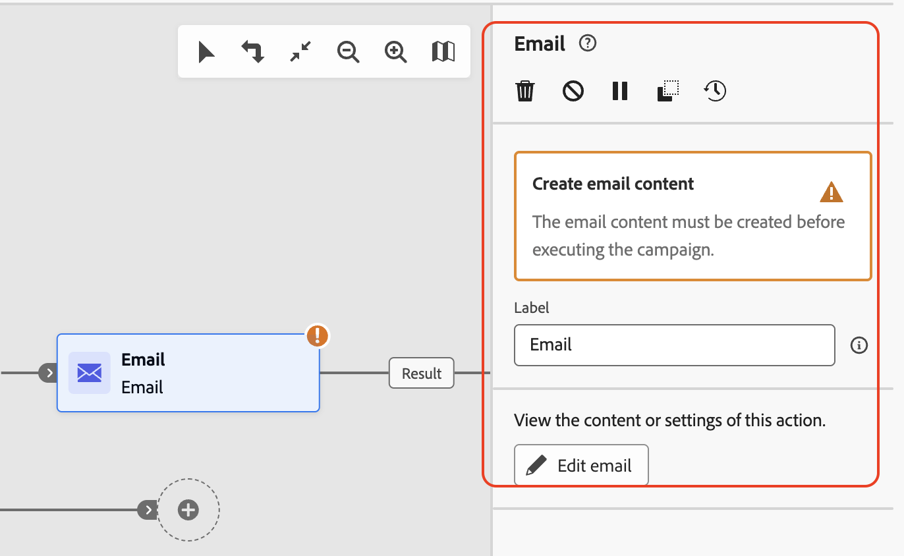
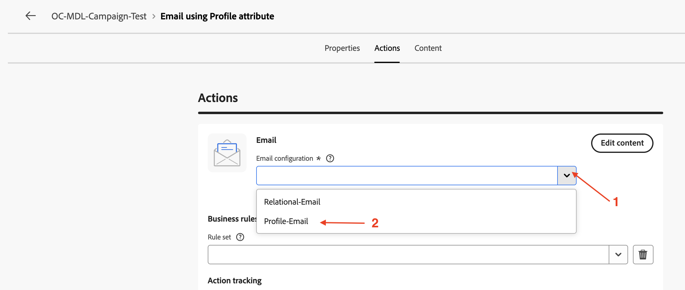
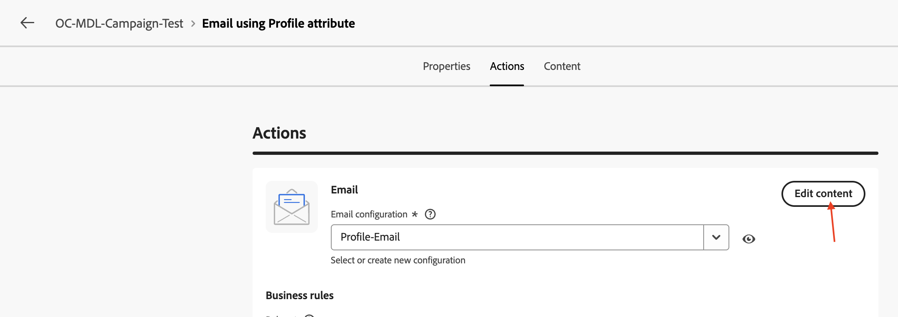
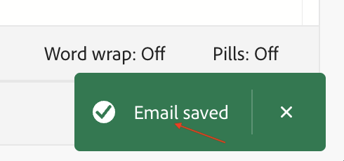
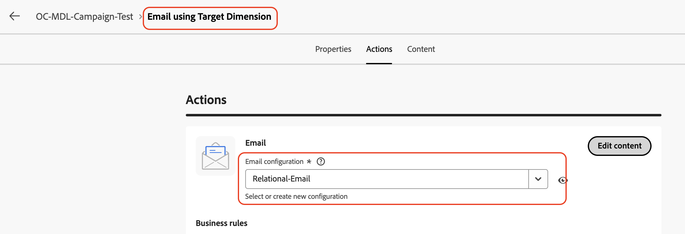

# Adicionar atividades de email

## Objetivo

No próximo conjunto de etapas, você aproveitará a campanha para adicionar duas atividades de email às duas ramificações de atividades de bifurcação. Você configurará as duas atividades de Email para usar os canais de Email, criados anteriormente. Por fim, você também adicionará a configuração básica de email (assunto e corpo) a cada uma dessas atividades de email.

>[!CAUTION]
>
>Antes de continuar, você deve garantir que ambas as configurações de canal de email apareçam ativas em seus status.
>
>

## Adicionar atividade de email da ramificação superior

1. Clique no **+** do fluxo superior e selecione **Email** das **Atividades de canal**

   

   O painel de detalhes do **Email** é aberto

   

2. Renomeie o rótulo para **Email usando o atributo de Perfil** para a atividade **Email** e clique em **Editar email**. Observe que a criação do corpo do email é somente para fins de teste

   

3. Selecione a guia **Ações** e, na lista suspensa, selecione a configuração de canal **Perfil-Email**

   

4. Em seguida, clique em **Editar conteúdo** para adicionar conteúdo de teste

   

5. Forneça uma **Linha de Assunto** (&quot;Oferta de Atualização para membros do plano Básico&quot;) e clique no botão **Editar corpo do email**

   

6. Há muitas opções, para este teste, escolha **Codificar sua própria opção** do HTML

   

7. No **Designer de email**, insira uma linha de teste &quot;Oferta de atualização disponível!&quot; logo antes das tags `</body></html>` conforme mostrado e clique em **Salvar**

   

8. Aguarde a mensagem de confirmação aparecer no canto inferior direito

   

9. Clique na **seta para a esquerda** ao lado de **Designer de email** para sair

   

10. Uma caixa de diálogo de confirmação aparece, clique no botão **Salvar e fechar**

11. Revise as propriedades e ações de Email, incluindo o texto adicionado ao corpo do Email. Clique na **seta para a esquerda** para voltar para a tela de campanha

## Adicionar atividade de email da ramificação inferior

De volta à tela da campanha, clique no **+** do fluxo inferior e selecione **Email** nas **Atividades do canal**. Siga as mesmas etapas descritas acima (Etapas 2 a 11), exceto para o seguinte:

- Renomeie o rótulo para **Email usando o Dimension de Destino** para a atividade **Email**
- Nas configurações de Email, escolha a configuração do canal de email **Relational-Email**

## Recapitulação

Agora você viu como configurar as atividades de Email com os canais de Email. Cada atividade foi configurada com um assunto e um corpo de email muito básicos. Toda a campanha será testada em seguida.
