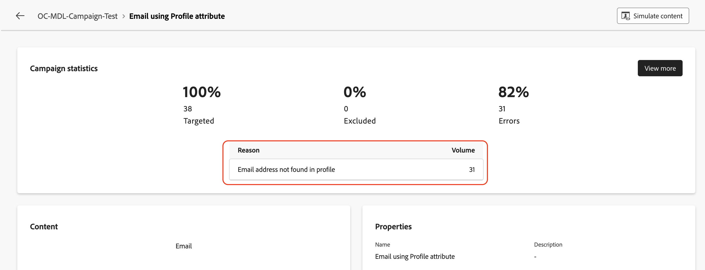
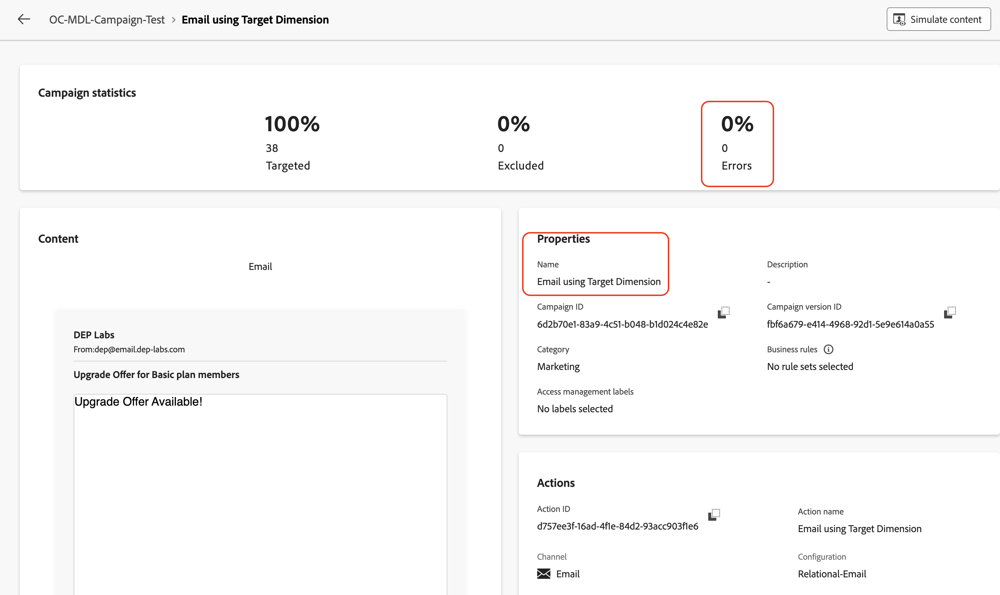

# Testar a campanha

## Objetivo

No próximo conjunto de etapas, você executará a campanha no modo de teste para confirmar as funções da campanha, conforme esperado, antes de publicá-la. Nesse caso, o modo de teste não envia emails, mas ajuda a verificar todo o fluxo e identificar problemas antecipadamente.

## Iniciar o fluxo de trabalho

1. Após configurar os dois fluxos de email, a Campanha é semelhante à seguinte. Clique no botão **Iniciar** para executar a campanha no **Modo de teste**

>[!NOTE]
>
>Conforme mencionado no laboratório anterior, o modo Test permite validar a execução da campanha e os resultados das várias atividades. Cada atividade é executada sequencialmente até que o fim do fluxo seja atingido.

&#x200B;2. A execução do teste de todas as atividades da campanha é iniciada, verifique os resultados

## Relatório de email #1

1. Para testar a entrega de email, clique na atividade **Enviar email usando o atributo de perfil** e, no painel direito, clique em **Executar teste**

&#x200B;2. Aguarde a mensagem de confirmação e clique em **Exibir relatório** para ver os detalhes do teste de email

&#x200B;3. A página Email report é apresentada com as estatísticas da campanha e o status da execução. O teste de Email é uma verificação da atividade para garantir que não haja erros e não envie emails. Normalmente, leva aproximadamente \~**5** minutos para ser concluído.

>[!NOTE]
>
>Talvez seja necessário atualizar a página algumas vezes para ver o resultado final do teste.

&#x200B;4. Quando o teste de Email estiver concluído, os resultados serão apresentados. Há alguma porcentagem de erros; clique em **Exibir mais** para saber o motivo.

&#x200B;5. Os estados de motivo `Email address not found in profile`

>[!NOTE]
>
>Como o **Endereço de entrega** configurado para a atividade Email, o **Email usando o atributo Perfil**, foi configurado para usar o atributo Perfil `personalEmail.address`, ele criou uma dependência no **Perfil do AEP**.
>
>Das **38** IDs de clientes qualificados do esquema relacional, o sistema encontrou apenas **7** Perfis correspondentes do AEP. Para os **31** restantes, os Perfis do AEP não existiam, o que resultou na mensagem de erro `Email address not found in profile`.
>
>É importante lembrar que os dados no datalake e no armazenamento relacional são mantidos **consistentes** ao usar os atributos do Perfil do AEP em campanhas orquestradas.

## Relatório de email #2

1. Repita o mesmo processo para a atividade **Email usando Dimension de Destino**

&#x200B;2. Aguarde a mensagem de confirmação e clique em **Exibir relatório** para ver os detalhes do teste de email

&#x200B;3. Quando o teste de Email estiver concluído, os resultados serão apresentados. Nesse caso, não haverá erros

>[!NOTE]
>
>Como o **Endereço de entrega** da atividade de email **Email usando Dimension de Destino** foi configurado para usar o `dep_rel_customer_account.email`, do esquema Relacional, não havia dependência nos Perfis AEP ou em seus atributos.
>
>Descobriu-se que todas as **38** IDs de clientes qualificadas tinham emails correspondentes no repositório Relacional e podiam ser direcionadas com êxito sem erros.

## Interromper o fluxo de trabalho

Clique no botão **Parar** para parar o **Modo de teste** da campanha

>[!TIP]
>
>Ambas as configurações de canal de email foram testadas na mesma campanha, e foram observadas diferenças entre o uso de um atributo de perfil do AEP e o uso do Target Dimension na configuração do canal de email.
>
>Parabéns, isso conclui o laboratório de Entrega de mensagens.

## Recapitulação

Agora você viu como testar a campanha criada para entender o fluxo e o comportamento. Aqui, as nuances de usar as diferentes configurações para a configuração do canal de email eram bem compreendidas durante a execução do fluxo de teste.

Você pode ler mais sobre o modo de teste de campanha [aqui](https://experienceleague.adobe.com/en/docs/journey-optimizer/using/campaigns/orchestrated-campaigns/launch/start-monitor-campaigns), se estiver interessado.
