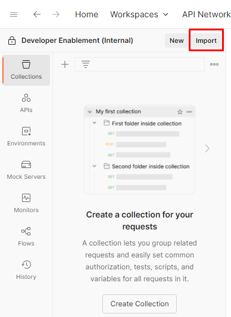
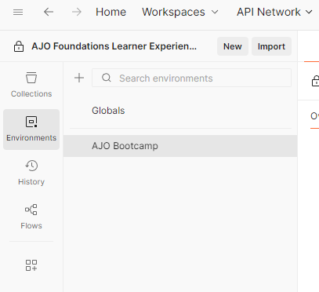
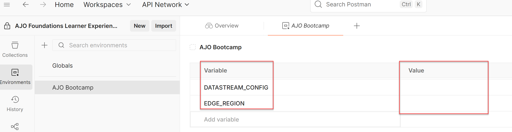
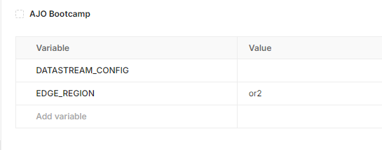

# Importar arquivo de ambiente

## Objetivo

Nesta página, você importará o arquivo de ambiente do Postman.  Esse arquivo contém diversas variáveis globais que serão utilizadas em várias chamadas de API feitas durante outros laboratórios por toda a inicialização.

## Importar arquivo de ambiente

1. Baixe o arquivo **AJO Bootcamp.postman\_environment.json**:

Baixar arquivo — [AJO Bootcamp.postman_environment.json](assets/ajo-bootcamp.postman_environment.json)

&#x200B;2. Inicie o Postman no computador local.
&#x200B;3. Se necessário, alterne para o Workspace que você está usando nesses laboratórios (se você estiver usando um Workspace) e clique no botão **Importar**.

&#x200B;4. Cole a URL local do arquivo **AJO Bootcamp.postman\_environment.json** na caixa de texto modal de importação ou solte-a na caixa de diálogo de importação.  Isso deve acionar uma importação automática

&#x200B;5. Depois de importado, valide se o ambiente existe clicando na guia **Ambientes** na barra lateral esquerda. Você pode ver que o ambiente AJO Bootcamp agora está disponível para você.

## Definir variáveis de ambiente

O Postman foi projetado para testar e interagir com APIs. No entanto, estamos usando-o para simular ocorrências do AEP Web SDK de um navegador ou para chamadas de coleta de dados em tempo real do lado do servidor. Embora essas ainda sejam chamadas de API no sentido mais estrito do termo, não são chamadas de API típicas que exigem coisas como tokens de autorização no cabeçalho. As variáveis de ambiente nesses laboratórios são usadas principalmente para variáveis em caminhos de URL (com uma sendo usada em um cabeçalho).

1. Se necessário, clique na guia **Ambientes** na barra lateral esquerda do Postman
2. Clique no arquivo de ambiente **AJO Bootcamp**. Você vê alguns valores que precisam ser preenchidos

&#x200B;3. Ignore o valor DATASTREAM\_CONFIG por enquanto. Você criará uma configuração de sequência de dados em um laboratório posterior.
&#x200B;4. Atualize o campo **EDGE\_REGION** com o código de região que está mais próximo de onde você está fisicamente localizado para esta inicialização, usando a tabela abaixo como pesquisa.

| **Região** | **Código da Região** |
| ---------- | --------------- |
| Oeste dos EUA | ou2 |
| Leste dos EUA | va6 |
| Europa | irl1 |
| Austrália | aus3 |
| Japão | jpn3 |
| Ásia | spg3 |

Quando terminar, o arquivo de ambiente deverá ser semelhante a:

&#x200B;5. Agora é necessário salvar as variáveis de ambiente; no entanto, não há um botão Salvar na interface do Postman. Use as teclas de atalho do Windows ou do Mac para salvar (ctrl+s no Windows, por exemplo). Você sabe que as alterações foram salvas ao visualizar uma mensagem **Alterações salvas** no lado inferior direito da interface do usuário do Postman:

>[!TIP]
>
>Parabéns! Você concluiu o arquivo de ambiente do Postman
