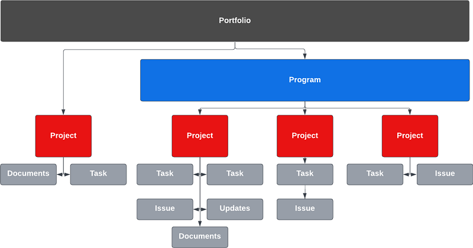
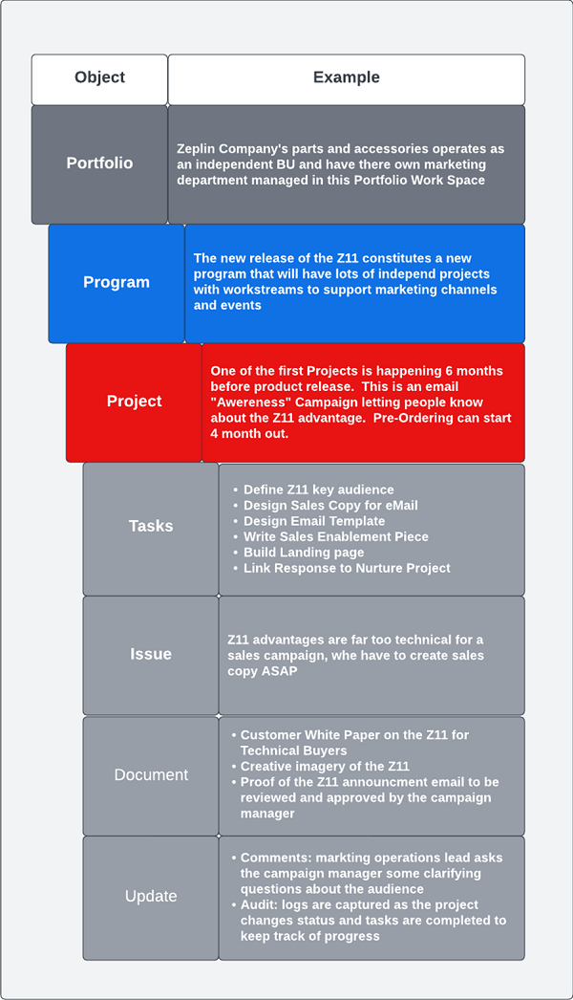

# Visão geral {#overview}

## Obter um tempo de comercialização mais rápido com a cadeia de fornecimento de campanha otimizada {#achieving-faster-time-to-market-with-optimized-campaign-supply-chain}

O trabalho de marketing continua crescendo com novos canais e mais maneiras de personalizar comunicações todos os dias. As equipes de marketing precisam de maneiras de continuar a automatizar e a evoluir para atender às demandas de marketing em constante mudança no mundo.

**&quot;O ROI sempre foi o verdadeiro objetivo. A receita é grande, mas não a qualquer custo - especialmente hoje.&quot; - OCM, Setor dos Serviços Empresariais**

As organizações que estão alcançando um ROI mais alto e, ao mesmo tempo, crescendo suas receitas, estão fazendo isso simplificando seu processo de desenvolvimento de campanha, otimizando sua velocidade de execução de campanha e melhorando a supervisão em toda a função de marketing.

Se sua organização deseja atingir objetivos semelhantes descritos abaixo, este documento será útil para você:

* Dimensione as operações da campanha para oferecer suporte a equipes de marketing multifuncionais
* Mais rápido para o mercado com o processo simplificado de solicitação de campanha
* Estabeleça um sistema de registro para aumentar a visibilidade entre os participantes da campanha
* Revisar e aprovar ativos da campanha (imagens, cópia de email)

As equipes operacionais da campanha precisam de sistemas que lhes permitam planejar e executar campanhas de marketing de maneira eficiente e eficaz. Seja um email, webinário, evento, mídia paga, criação ou sindicalização de conteúdo, as equipes de marketing precisam de uma solução central para organizar os colaboradores da campanha, os resultados e a execução.

Ao integrar o sistema de ativação de marketing multicanal (Marketo Engage) ao planejamento de marketing e ao sistema de registro (Workfront), você pode aumentar a velocidade da campanha e fornecer melhor visibilidade às partes interessadas.

Com o Workfront Fusion, as equipes de operações de marketing podem eliminar amplamente as etapas manuais e propensas a erros envolvidas na tradução de um resumo de marketing para uma campanha. O Workfront Fusion oferece uma camada de integração pronta para uso entre o Workfront e o Marketo Engage, que permite flexibilidade e eficiência no desenvolvimento de fluxos de trabalho entre sistemas. Saiba mais sobre como configurar a integração e quais ações podem ser tomadas para automatizar os fluxos de trabalho [here](https://experienceleague.adobe.com/docs/workfront/using/adobe-workfront-fusion/fusion-apps-and-modules/marketo-modules.html){target=&quot;_blank&quot;}.

## Planejamento de campanha para execução - Casos de uso de automação {#campaign-planning-to-execution-automation-use-cases}

* Compatível com equipes de operações de marketing ao automatizar a criação de campanhas no Marketo Engage por meio de solicitações de entrada no Workfront
* Compartilhe rascunhos de emails e landing pages criadas no Marketo Engage para o Workfront para obter a revisão final e a aprovação de participantes multifuncionais
* Compartilhe os resultados da campanha do Marketo Engage para o Workfront para democratizar o acesso às métricas de campanha

Abaixo você pode ver um diagrama de workflow do processo de desenvolvimento da campanha no caso de uma solicitação de explosão de email. Além disso, você pode ver como o Workfront Fusion pode desempenhar uma função entre o Workfront e o Marketo Engage para impulsionar o fluxo de trabalho e a automação de processos no ciclo de desenvolvimento da campanha.

Anote as diferentes fases no processo de desenvolvimento da campanha.

1. Entrada e criação: a solicitação da campanha é feita e os ativos da campanha são montados de forma programática.

1. Prova e aprovação: depois que a campanha é montada, é hora de os participantes revisarem e assinarem ativos da campanha, como emails e landing pages.

1. Relatório e auditoria: compartilhe os resultados da campanha com o Workfront para oferecer maior visibilidade a participantes multifuncionais.

>[!NOTE]
>
>No exemplo acima, a Workfront está gerenciando e planejando os esforços de trabalho durante todo o ciclo de vida do Programa Marketo Engage. Dito isso, a flexibilidade da Workfront pode se estender para gerenciar todos os esforços da sua equipe de marketing. Isso inclui marketing baseado em conta, cadeias de fornecimento de conteúdo de marketing, gerenciamento de agências, gerenciamento de campanhas digitais e sociais e programas de capacitação de vendas.

## Noções básicas sobre a representação das iniciativas de marketing no Workfront {#understanding-how-marketing-initiatives-are-represented-in-workfront}

O Adobe Workfront permite que as organizações gerenciem o trabalho para conduzir uma execução mais eficiente. No Workfront, há uma hierarquia de objetos que fornece uma estrutura para planejamento, gerenciamento de recursos e colaboração em várias equipes.

Entender como mapear o processo de negócios para esses objetos será importante para entender a relação entre o Workfront e o Marketo Engage.

### Hierarquia de Portfolio definida {#portfolio-hierarchy-defined}

<table> 
  <tr> 
   <td><b>Objeto</b></td>
   <td><b>Definição</b></td>
  </tr>
  <tr> 
   <td>Portfolio</td>
   <td>Você pode usar Portfolio e programas no Workfront para organizar Projetos. Ao organizar Projetos, você pode comparar Projetos semelhantes e determinar onde os recursos serão mais bem gastos.  
   (Por exemplo, um Portfolio é criado para uma unidade de negócios em uma empresa focada na venda de serviços e/ou produtos.)</td>
  </tr>
  <tr>
   <td>Programa</td>
   <td>Você pode usar os Programas Workfront para organizar os Projetos. Ao organizar Projetos, você pode comparar Projetos semelhantes e determinar onde os recursos serão mais bem gastos.  
   (por exemplo, uma estratégia de marketing com um objetivo de alto nível, como conscientizar e impulsionar a demanda de um novo lançamento de produto.)</td>
  </tr>
  <tr>
   <td>Projeto</td>
   <td>Os Projetos Workfront são uma coleção de itens de trabalho que precisam ser concluídos para atingir uma meta específica, deliverable, produto etc.  
   (por exemplo, uma tática de marketing, como uma explosão de email, uma campanha de criação, um webinar ou um evento presencial. Um único projeto também pode ser mais complexo ao abranger várias táticas, como um email, um anúncio de exibição, uma página de aterrissagem e um whitepaper para download que devem conduzir ao mesmo resultado.)</td>
  </tr>
  <tr>
   <td>Tarefa</td>
   <td>Tarefas do Workfront são itens de trabalho planejados que podem fazer parte de um Projeto ou iniciativa. As tarefas são atribuídas a usuários ou equipes para conclusão.  
   (Por exemplo, uma tarefa para criar um segmento de público-alvo ou um rascunho de email pode ser uma tarefa associada a um Projeto para desenvolver um Programa de email do Marketo Engage.)</td>
  </tr>
  <tr>
   <td>Problema</td>
   <td>Problemas são itens de trabalho não planejados no Workfront. Podem ser problemas que ocorrem durante um projeto ou solicitações que são enviadas por meio de uma fila de solicitações.  
   (Por exemplo, um problema é arquivado porque a imagem do banner de email tem as dimensões erradas.)</td>
  </tr>
  <tr>
   <td>Documento</td>
   <td>Documentos podem ser documentos tradicionais, como documentos de palavras ou apresentações. Eles também podem ser arquivos de imagem. O Workfront permite a revisão de ativos por meio de comentários e anotações em documentos e imagens, para permitir a colaboração entre equipes.  
   (por exemplo, uma imagem de cabeçalho de email que precisa ser revisada.)</td>
  </tr>
  <tr>
   <td>Atualizar</td>
   <td>Inclui comentários e logs de auditoria para acompanhar o trabalho e facilitar a colaboração no Workfront.  
   (por exemplo, Log de auditoria da nova versão da imagem.)</td>
  </tr>
  </tbody>
</table>

## Exemplo de gerenciamento de trabalho da iniciativa de marketing {#marketing-initiative-work-management-example}

Vejamos como a hierarquia de portfólio do Workfront se desenrola em um exemplo real.

A Zeplin Company está lançando uma versão atualizada de um de seus acessórios de trator de utilidade compacta chamado Z11, que supera o modelo Z10 anterior, oferecendo maior durabilidade e personalização. Com isso, eles precisam planejar, desenvolver e executar sua estratégia de marketing para impulsionar a demanda e conscientizar a nova liberação da divisão de negócios do trator. Essa estratégia de marketing precisa incluir diferentes táticas de marketing para aumentar a conscientização do cliente e o conhecimento do cliente Z10 existente.

A hierarquia abaixo mostra como a estratégia, as táticas, as tarefas e os ativos são mapeados para o Workfront para essa campanha de marketing.

## Mapeamento do Workfront para o Marketo {#mapping-workfront-to-marketo}

Com o Workfront como seu sistema upstream para planejamento de marketing e organização do projeto, é importante entender como as informações podem ser compartilhadas entre o Marketo Engage e a Workfront.

Para que esses sistemas funcionem em conjunto à medida que novas iniciativas de marketing são desenvolvidas, é importante entender como os diferentes tipos de registro no Workfront mapeiam para tipos de registro no Marketo Engage.

### Mapeamento de projetos do Workfront a programas do Marketo Engage {#mapping-workfront-projects-to-marketo-engage-programs}

Usando o Workfront Fusion como uma camada de integração, você pode mapear seus Projetos no Workfront para um Programa no Marketo Engage. Por exemplo, no caso acima, Zeplin quer sensibilizar para o novo modelo Zeplin. Com isso, eles criam um novo Programa no Workfront que abriga várias táticas de marketing que são representadas como Projetos. Uma tática é um email de conscientização que precisa ser enviado para clientes existentes do modelo Z10, informando-os sobre o novo modelo Z11. No Workfront, haveria um Projeto criado para representar essa tática de email com um conjunto de tarefas associadas a ela para criar o público, se tornar criativo para as imagens de email e montar o email no Marketo Engage. O Projeto no Workfront pode mapear para um Programa de email no Marketo Engage para que as informações possam ser sincronizadas entre os sistemas.

Abaixo você pode ver um exemplo de como um Programa pode incluir vários projetos e como esses Projetos Workfront podem mapear para Programas no Marketo Engage.

Você pode desejar iniciar uma grande iniciativa de marketing que precise que vários projetos Workfront sejam abrigados em um Programa Workfront, ou pode ter uma solicitação única para um webinário ou email que precise apenas de um único Projeto Workfront criado. Independentemente das suas necessidades, com o Workfront, Workfront Fusion e Marketo Engage, sua equipe tem a flexibilidade de integrar o processo de desenvolvimento da campanha sem interrupções, desde o planejamento até a execução.

### Mapear tarefas do Workfront para ativos do Marketo Engage {#mapping-workfront-tasks-to-marketo-engage-assets}

Ao começar a mapear o processo de desenvolvimento de campanha no Workfront, você também pode pensar em quais tarefas mapear para funcionar no Marketo Engage e como capturar informações no Workfront, ajudar a aumentar a consistência, a eficiência e a precisão na cadeia de fornecimento de desenvolvimento de campanha.

Os Projetos Workfront podem ser modelos para que seu processo possa ser claramente definido sempre que você executar uma tática de marketing específica. Por exemplo, ao executar em uma campanha de email, haverá um conjunto padrão de tarefas que precisam ser concluídas para sua organização. Essas tarefas podem envolver uma reunião inicial com as partes interessadas, obter ativos criativos, aprovar anúncios, criar o público-alvo, criar o email, tradução de email, aprovar o email e compartilhar os resultados da campanha de email com as partes interessadas.

Algumas dessas tarefas podem mapear diretamente para o trabalho a ser feito no Marketo Engage. Por exemplo, a tarefa de criação de email no Workfront pode ser personalizada para incluir campos que passarão informações para o Marketo Engage para automatizar a montagem do email. Isso pode incluir itens como linha de assunto, cópia e imagens no email.

## Próximas etapas {#next-steps}

Agora que você tem uma compreensão fundamental de como o Workfront e o Marketo Engage podem liberar novas eficiências em sua cadeia de suprimento de desenvolvimento de campanha, verifique os seguintes documentos e recursos sobre como automatizar workflows e processar entre o Marketo Engage e o Workfront usando o Workfront Fusion.

### Introdução à integração do Workfront Fusion, Workfront e Marketo Engage {#getting-started-with-workfront-fusion}

* [Tomar e criar](/help/blueprints/optimize-campaign-supply-chain-with-marketo-and-workfront/intake-and-create.md){target=&quot;_blank&quot;} - Automação de desenvolvimento de campanha com Marketo Engage e Workfront

* Prova e Aprovar (em breve)

* Relatório e auditoria (em breve)

### Gerenciando nomes de campanha do Marketo Engage e seus URLs associados {#managing-marketo-engage-campaign-names}

Padronizar suas convenções de nomenclatura para campanhas e URLs é uma base fundamental para o gerenciamento preciso do programa no Marketo Engage e ajuda a direcionar um processo mais consistente em toda a cadeia de fornecimento da campanha. Se você estiver procurando ferramentas para ajudá-lo, recomendamos verificar algumas ferramentas gratuitas de código aberto de [Serviços bem-sucedidos do Adobe](https://main--marketo-campaign-tools--dr-adobe.hlx.live/){target=&quot;_blank&quot;} que permitem criar uma abordagem consistente para criar e gerenciar campanhas do Marketo Engage e seus URLs associados.

### Recursos {#resources}

* [Workfront Fusion para Marketo Engage](https://experienceleague.adobe.com/docs/workfront/using/adobe-workfront-fusion/fusion-apps-and-modules/marketo-modules.html){target=&quot;_blank&quot;}

* [Workfront Fusion para Workfront](https://experienceleague.adobe.com/docs/workfront/using/adobe-workfront-fusion/fusion-apps-and-modules/workfront-modules.html){target=&quot;_blank&quot;}
