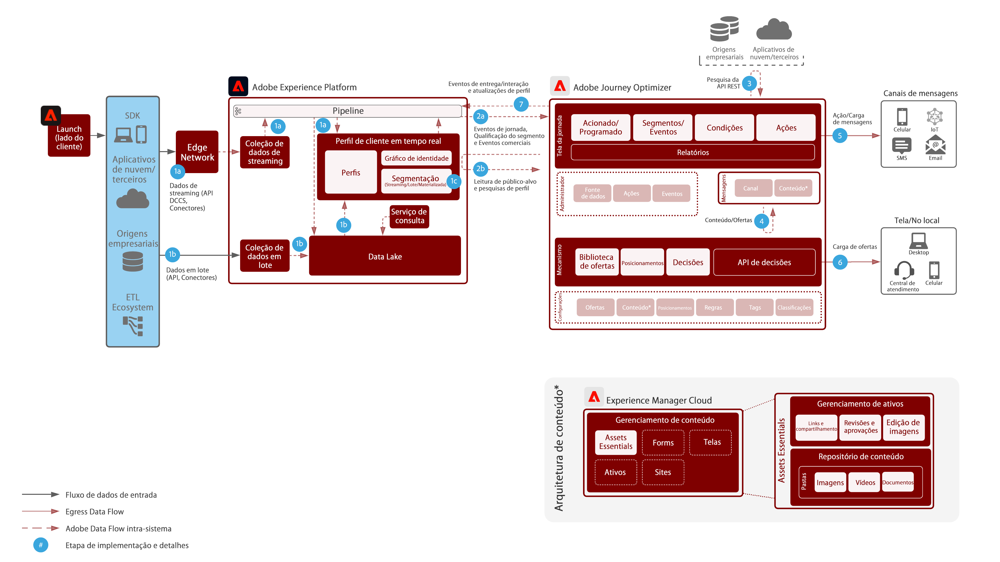
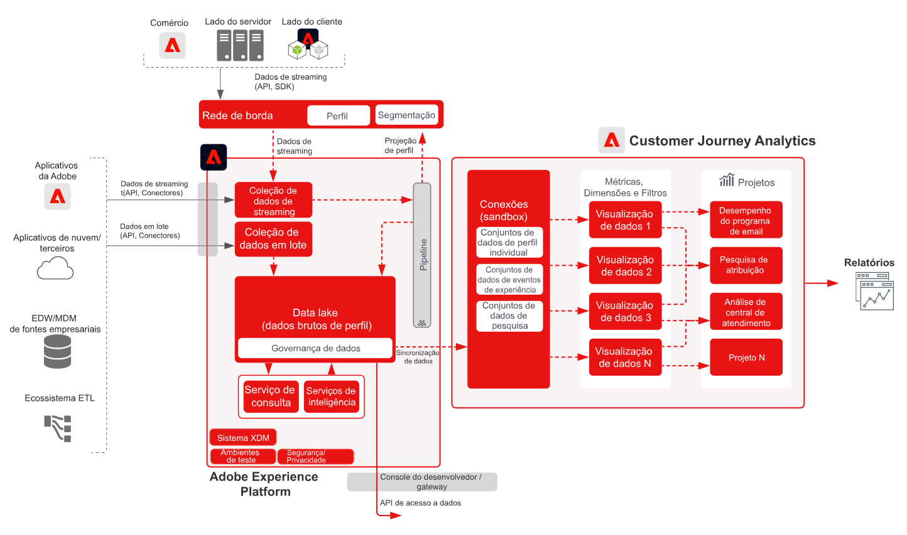

# Blueprints de experiência digital

Os blueprints de experiência digital são implementações replicáveis que atendem a estratégias e resolvem com rapidez problemas empresariais consagrados. Cada blueprint fornece uma série de artefatos que explicam o problema empresarial de alta relevância, as arquiteturas, as etapas de implementação, as considerações técnicas e os links para a documentação relevante.

## Novidades

* **[Blueprint de ativação de público-alvo e perfil para destinos corporativos](/help/blueprints/audience-activation/enterprise-destinations.md)**

   *Mantenha os perfis de clientes atualizados em todos os sistemas para capacitar suas equipes de vendas e suporte&#x200B;.*
* **[Blueprint do Hub de atividades do cliente](/help/blueprints/audience-activation/customer-activity.md)**

   *Fornece contexto para suporte e vendas assistidas por agentes.*
* **[Blueprint de análise de dados e inteligência](/help/blueprints/data-insights/analysis.md)**

   *Realiza consulta e análise exploratória dos dados no data lake.*

## Blueprints de destaque

<table style="table-layout:fixed">
<tr>
  <td>
    
    
<a href="https://experienceleague.adobe.com/docs/blueprints-learn/architecture/customer-journeys/journey-optimizer.html?lang=pt-BR"><strong>Mensagens acionadas e Experience Platform</strong></a>

    
<em>Acione mensagens e experiências usando a [!UICONTROL Platform] como hub central.</em>

  </td>
  <td>
    
    
<a href="https://experienceleague.adobe.com/docs/blueprints-learn/architecture/audience-activation/online-offline.html?lang=pt-BR"><strong>Ativação de público-alvo online/offline</strong></a>

    
<em>Forneça publicidade entre canais ativada pelo público.</em>

  </td>
  <td>
    
    
<a href="https://experienceleague.adobe.com/docs/analytics-platform/using/cja-usecases/cross-channel.html?lang=pt-BR"><strong>Análise da jornada entre canais</strong></a>

    
<em>Tenha uma única visualização consolidada do comportamento do cliente em vários canais.</em>

  </td>
</tr>
</table>

## Publicações do blog

* [[!DNL Introducing Adobe Experience Platform’s New Digital Experience Blueprints]](https://medium.com/adobetech/introducing-adobe-experience-platforms-new-digital-experience-blueprints-93a6b5f5da7c)
* [[!DNL Blueprint for Audience Activation in Adobe Experience Platform]](https://medium.com/adobetech/a-blueprint-for-audience-activation-in-adobe-experience-platform-b2b30fae90fd)
* [[!DNL Blueprint for Web Personalization using Adobe Experience Platform Real-Time Customer Profile]](https://medium.com/adobetech/blueprint-for-web-personalization-using-adobe-experience-platform-real-time-customer-profile-fef2ce7a4b2f)
* [[!DNL Blueprint for Multi-Channel Orchestration in Adobe Experience Platform]](https://medium.com/adobetech/blueprint-for-multi-channel-orchestration-in-adobe-experience-platform-c68317e94184)
