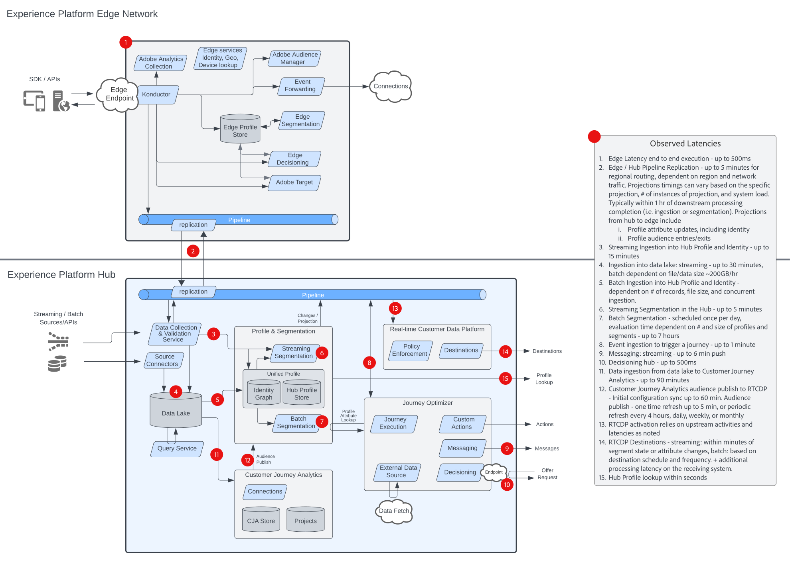

# Objetivos de negócios, casos de uso e diagramas de arquitetura da orquestração da experiência do cliente

Este site contém **Objetivos Comerciais Principais**, que descrevem o exemplo de valor comercial principal e os objetivos que podem ser alcançados com o Adobe Experience Platform e os Aplicativos. **Os padrões de caso de uso** descrevem recursos comuns de plataforma e aplicativo com abordagens de implementação repetíveis. **Casos de uso do setor** aplicam padrões a cenários de negócios específicos por vertical. **Diagramas e blueprints de arquitetura** são diagramas de referência de fluxo de dados e arquitetura visual que ilustram pontos de integração do sistema, fluxos de dados e conteúdo e sequência de operações, fornecendo uma referência técnica para o design da solução. Juntas, essas camadas conectam o valor comercial à arquitetura e às dependências da implementação.

## Principais objetivos de negócios

Resultados estratégicos que as organizações buscam alcançar por meio de iniciativas de experiência digital. Cada objetivo mapeia para padrões de casos de uso que descrevem como implementar o Adobe Experience Platform e os aplicativos.

<table>
<tr>
  <td><a href="business-objectives/overview.md#acquisition--growth"><strong>Aquisição e crescimento</strong></a></td>
  <td><a href="business-objectives/overview.md#revenue--monetization"><strong>Receita e monetização</strong></a></td>
  <td><a href="business-objectives/overview.md#cost--efficiency"><strong>Custo e eficiência</strong></a></td>
</tr>
<tr>
  <td><a href="business-objectives/overview.md#customer-experience"><strong>Experiência do cliente</strong></a></td>
  <td><a href="business-objectives/overview.md#analytics--insights"><strong>Analytics &amp; Insights</strong></a></td>
  <td><a href="business-objectives/overview.md#qualification--sales-b2b"><strong>Qualificação e vendas (B2B)</strong></a></td>
</tr>
</table>

[Exibir todos os objetivos de negócios](business-objectives/overview.md)

## Padrões de caso de uso

Abordagens de implementação repetíveis que descrevem recursos específicos, a cadeia de funções que os fornece e os aplicativos envolvidos.

<table>
<tr>
  <td><a href="use-case-patterns/overview.md#audience-building--activation"><strong>Criação e ativação de público</strong></a></td>
  <td><a href="use-case-patterns/overview.md#personalization"><strong>Personalização</strong></a></td>
  <td><a href="use-case-patterns/overview.md#campaign-management--orchestration"><strong>Orquestração e gerenciamento de campanhas</strong></a></td>
</tr>
<tr>
  <td><a href="use-case-patterns/overview.md#analysis"><strong>Análise</strong></a></td>
  <td><a href="use-case-patterns/overview.md#conversational-experience"><strong>Experiência de conversa</strong></a></td>
  <td></td>
</tr>
</table>

[Exibir todos os padrões de caso de uso](use-case-patterns/overview.md)

## Explorar por setor

Casos de uso personalizados para setores específicos, cada um mapeado para padrões de implementação e objetivos de negócios.

<table>
<tr>
  <td><a href="industry-use-cases/retail/retail-overview.md"><strong>Varejo</strong></a></td>
  <td><a href="industry-use-cases/financial-services/financial-services-overview.md"><strong>Serviços financeiros</strong></a></td>
  <td><a href="industry-use-cases/healthcare/healthcare-overview.md"><strong>Serviços de saúde</strong></a></td>
</tr>
<tr>
  <td><a href="industry-use-cases/automotive/automotive-overview.md"><strong>Automotivo</strong></a></td>
  <td><a href="industry-use-cases/travel-hospitality/travel-hospitality-overview.md"><strong>Viagens e hospitalidade</strong></a></td>
  <td><a href="industry-use-cases/telecommunications/telecommunications-overview.md"><strong>Telecomunicações</strong></a></td>
</tr>
<tr>
  <td><a href="industry-use-cases/media-entertainment/media-entertainment-overview.md"><strong>Mídia e entretenimento</strong></a></td>
  <td><a href="industry-use-cases/insurance/insurance-overview.md"><strong>Seguro</strong></a></td>
  <td><a href="industry-use-cases/b2b/b2b-overview.md"><strong>B2B</strong></a></td>
</tr>
</table>

[Ver todos os casos de uso do setor](industry-use-cases/use-case-catalog.md)

## Diagramas e blueprints de arquitetura

Diagramas de referência de arquitetura visual e fluxo de dados que ilustram os pontos de integração do sistema, os fluxos de dados e conteúdo e a sequência de operações para o Adobe Experience Platform e os aplicativos.

<table>
<tr>
  <td>
    
    

      <a href="experience-platform/guardrails.md">
    <strong>Diagrama de Arquitetura e Medidas de Proteção do Experience Platform Hub e Edge</strong>
    </a>
    

  </td>
   <td>
    
    

      <a href="experience-platform/deployment/websdk.md">
    <strong>Diagrama de Sequência do Web SDK e Edge Network</strong>
    </a>
    

  </td>
  <td>
    
    

      <a href="customer-journeys/journey-optimizer/journey-optimizer-overview.md">
    <strong>Diagrama de Visão Geral do Adobe Journey Optimizer</strong>
    </a>
    

  </td>
</tr>
</table>