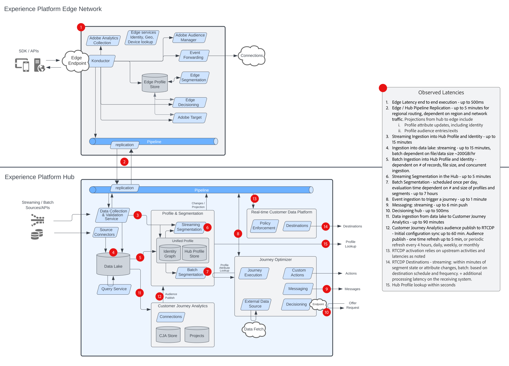

# Blueprints de orquestração de experiência do cliente

Os blueprints da orquestração de experiência do cliente (anteriormente, _experiência digital_) fornecem diagramas de arquitetura de fluxo de dados e sistema para ajudar a entender melhor como a Adobe Experience Platform e os Aplicativos são integrados e implementados. Os blueprints fornecem uma representação visual dos dados e fluxos de conteúdo do intersistema e dos componentes, sequência de operações e dependências para ajudar a informar o design e a arquitetura do caso de uso do Adobe Experience Platform e dos aplicativos.

## Blueprints populares

<table>
<tr>
  <td>
    
    

      <a href="experience-platform/guardrails.md">
    <strong>Diagrama de Arquitetura e Medidas de Proteção do Experience Platform Hub e Edge</strong>
    </a>
    

  </td>
   <td>
    
    

      <a href="experience-platform/deployment/websdk.md">
    <strong>Diagrama de Sequência do Web SDK e Edge Network</strong>
    </a>
    

  </td>
  <td>
    
    

      <a href="customer-journeys/journey-optimizer/journey-optimizer-overview.md">
    <strong>Diagrama de Visão Geral do Adobe Journey Optimizer</strong>
    </a>
    

  </td>
</tr>
</table>

