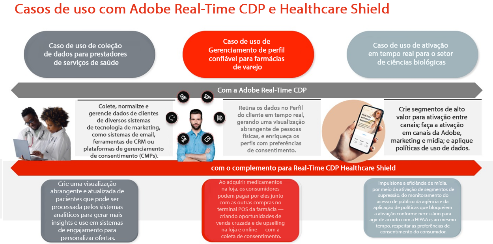
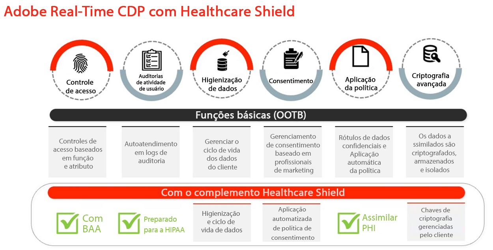
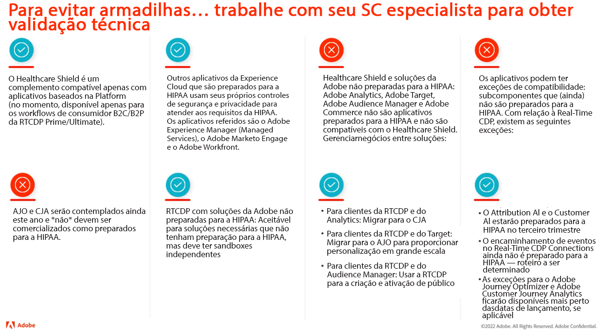
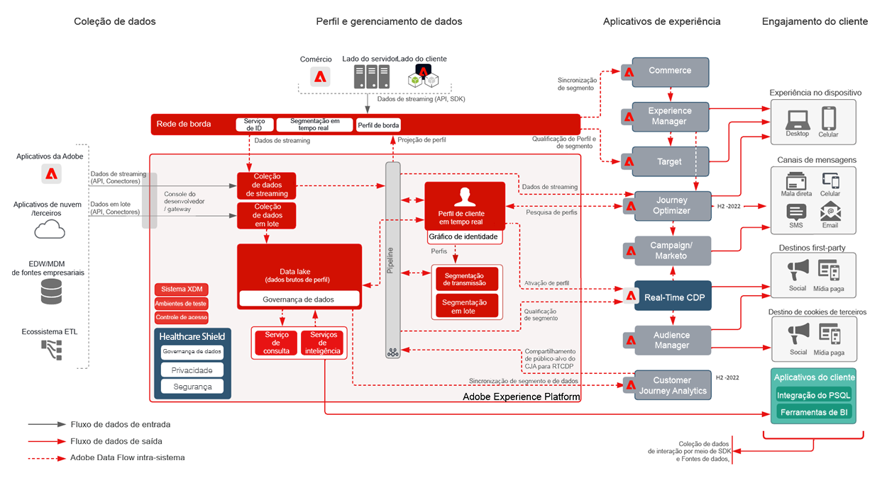
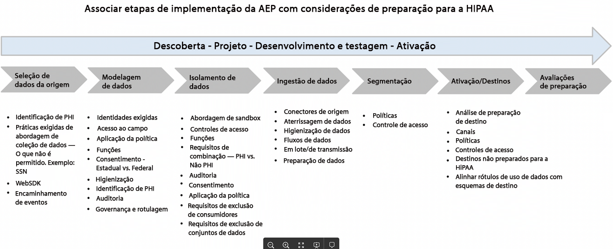
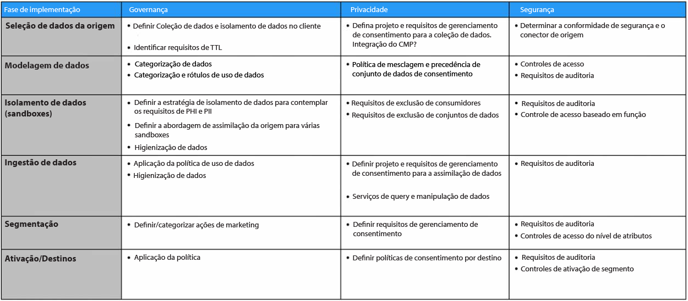

# Escudo da Saúde

O Healthcare Shield é um complemento Adobe Experience Platform para os aplicativos baseados na Adobe Experience Platform, como Real-Time CDP, Customer Journey Analytics e Adobe Journey Optimizer. Ele foi projetado para preparar esses aplicativos para HIPAA e atender aos requisitos sobre o processamento e uso de Informações de Integridade Protegidas (PHI).

## Perguntas frequentes sobre o Healthcare Shield

As perguntas frequentes a seguir fornecem respostas a perguntas comuns sobre o Healthcare Shield.

### O que é o HIPAA?

HIPAA é a Lei de Portabilidade e Responsabilidade do Seguro de Saúde. É um regulamento dos EUA que estabelece proteções importantes para os negócios. Essas proteções limitam o uso e a divulgação de informações de saúde protegidas (PHI) quando criadas, recebidas, mantidas ou transmitidas por uma entidade coberta pela HIPAA ou por empresas associadas (como clientes de Adobe) a um parceiro comercial (parceiros de tecnologia como o Adobe).

O Adobe está preparado para HIPAA como um parceiro comercial em relação às soluções de Adobe prontas para HIPAA e à conformidade com as regras de Segurança, Privacidade e Notificação de Violação do HIPAA.

### O que é um Contrato de Associação de Negócios (BAA) e por que ele é importante?

Quando uma Entidade Coberta ou um Business Associate (um cliente de Adobe) usa os serviços de um Business Associate (como o Adobe) para criar, receber, manter ou transmitir determinados tipos de dados do consumidor que sejam Dados Protegidos de Saúde (PHI) ou ePHI (versão eletrônica de PHI), a Entidade Coberta e o Business Associate são solicitados a assinar um Business Associate Agreement (BAA).

O BAA requer, por contrato, o Adobe, já que o Business Associate deve proteger adequadamente a PHI, cumprindo os requisitos das Regras de Privacidade, Segurança e Notificação de Violação do HIPAA.

Com o complemento Healthcare Shield para Real-Time CDP, o Adobe agora pode executar um BAA com clientes que licenciam esse recurso junto com o Adobe Real-Time CDP B2C e os fluxos de consumidores do Adobe Real-Time CDP B2P Edition.

### Por que o Healthcare Shield for Real-Time CDP (e os futuros aplicativos baseados em plataforma) está disponível somente nos EUA?

Como a HIPAA é uma lei norte-americana, estamos limitando a disponibilidade do Healthcare Shield para os EUA e para empresas sujeitas à HIPAA. A Adobe pretende expandir a cobertura para outras jurisdições, já que estamos dentro dos requisitos locais e estamos confiantes de que podemos alcançá-las.

### O que é o Healthcare Shield for Real-Time CDP?

O Healthcare Shield for Real-Time CDP destina-se aos clientes que são uma entidade coberta ou um Business Associate e que pretendem usar a PHI no Real-Time CDP para assimilação de dados, criação de público-alvo e ativação entre canais, bem como exigir o Adobe para executar um BAA. O Healthcare Shield é necessário para entidades cobertas com HIPAA e casos de uso necessários para a CDP em tempo real.

### Por que as perspectivas de saúde da Real-Time CDP devem comprar o Healthcare Shield?

Como complemento do Real-Time CDP, o Healthcare Shield atualiza o aplicativo para um status &quot;preparado para HIPAA&quot;. Isto significa que o aplicativo tem as salvaguardas para usar a PHI de acordo com os requisitos da HIPAA. Além disso, com o Healthcare Shield, o Adobe está disposto e capaz de autorizar o cliente a trazer certos tipos de dados pessoais confidenciais permitidos para o aplicativo pronto para HIPAA. O Adobe assina os Business Associate Agreements (BAAs) com clientes que licenciam o Healthcare Shield para um aplicativo compatível baseado na plataforma.

### Que tipos de dados estão autorizados para o Real-Time CDP com o Healthcare Shield (e quais não estão)?

Com o Healthcare Shield, as marcas podem trazer o seguinte PHI para aplicativos baseados em plataforma, como o Real-Time CDP (dados pessoais confidenciais permitidos):

* Informações financeiras de uma pessoa
* Médico
* Informações de saúde

Mas estamos especificamente excluindo dados que identificam o abuso de substâncias, saúde mental, registros genéticos de saúde ou registros de saúde de um menor, número de conta completo, números completos de cartão de crédito, identificadores governamentais (como SSN) e informações pessoais de crianças. As crianças são protegidas por qualquer lei de proteção infantil (como as informações pessoais definidas pela lei americana de privacidade infantil Children&#39;s Online Privacy Act (COPPA)).

### Com o Healthcare Shield, os clientes da Real-Time CDP podem usar qualquer tipo de PHI para criar públicos-alvo e ativá-los?

Mesmo quando um cliente pode trazer dados pessoais confidenciais permitidos para aplicativos nativos da plataforma, ele precisa entender que é o único responsável por manter-se em conformidade com todas as regulamentações aplicáveis e obter permissões, consentimentos, autorizações e autorizações apropriadas dos consumidores para usar os dados de acordo com as maneiras desejadas.

### Quais são as nuances de assimilar e ativar dados do cliente com aplicativos Adobe que não estejam prontos para HIPAA?

Um Healthcare Shield licenciado pelo cliente não pode usar, assimilar, coletar, compartilhar ou integrar dados pessoais confidenciais permitidos a qualquer aplicativo e serviço de Adobe não preparado para HIPAA.

Por exemplo, um cliente não deve ativar segmentos que contêm PHI em aplicativos como Audience Manager, Adobe Target e Adobe Analytics. Os clientes que licenciam o Healthcare Shield podem assimilar dados pessoais confidenciais ou PHI autorizado em aplicativos de Adobe prontos para HIPAA, independentemente de a fonte de dados ser considerada pronta ou não para HIPAA.

### Quais são as nuances de assimilar e ativar dados do cliente com aplicativos não-Adobe não preparados para HIPAA?

Um cliente que licencie o Healthcare Shield deve usar um bom senso para determinar onde ele ativa segmentos que contêm PHI fora dos aplicativos de Adobe. O Adobe não controla (e não é responsável por) provedores de terceiros e dados enviados por um cliente a um provedor de terceiros que pode não oferecer suporte ao processamento de dados de acordo com rótulos de uso de dados do Adobe no schema de clientes. Além disso, o Adobe não pode fornecer assistência jurídica para nossos clientes.

## Principais casos de uso do HealthCare Shield

| Casos de uso padrão da RTCDP B2C Edition | Descrição |
|-----|-----|
| Coleta de dados de fluxo | <ul><li>Modelos de dados normalizados e flexíveis utilizáveis em conexões Adobe e não Adobe<li>Esquemas de dados com base em conta e pessoa projetados para marketing B2C<li>O Tag Management e o encaminhamento de eventos coletam e distribuem dados no nível do evento em tempo real.<li> Perfis otimizados que aceleram o tempo de entrega da experiência</li></ul> |
| Gerenciamento de perfil confiável | <ul><li>Perfis unificados que contêm dados de atributo do consumidor, comportamento e preferência<li> A estrutura de governança de dados é flexível, transparente e aplicada a perfis unificados com criação de políticas e aplicação automática para evitar o mau uso dos dados. </li></ul> |
| Ativação em tempo real | <ul><li>Segmentação de arrastar e soltar projetada para profissionais de marketing B2C<li>Resolução de identidade de nível de pessoa e conta e enriquecimento de perfil para ativação entre canais<li> Experiências consistentes do cliente por meio da orquestração de público-alvo e ativação em tempo real em canais e ambientes (Adobe e não-Adobe) </li></ul> |
| Aquisição do cliente | <ul><li>Insights da conversão de usuários não autenticados em reconhecidos/autenticados<li>Incentive usuários não registrados a se registrarem para associação.<li> Aumentar e/ou recuperar assinaturas<li> Analise perfis de clientes para entender a propensão (por exemplo, . comparar segmentos de alto valor com segmentos de baixo desempenho e otimizar para aquisição)</li></ul> |
| Envolvimento do cliente | <ul><li>Ofertas do Target com base no comportamento do consumidor, recenticidade e ação de frequência para ofertas (online e offline)<li>Unifique as propriedades digitais para uma experiência conectada (por exemplo, incentive downloads de aplicativos móveis e use a ativação de segmentos em canais para conectar experiências)</li></ul> |
| Personalização em escala | <ul><li> Avaliar segmentos na borda para a mesma página em tempo real e a próxima personalização da página<li>Aumente o engajamento fornecendo experiências exclusivas e direcionadas para visitantes que abandonam uma sessão entre jornadas (por exemplo, abandonem o carrinho, repetem visitantes que não conseguem converter).<li> Unifique e conecte comportamentos offline e online para otimizar e engajar usuários</li></ul> |
| Venda cruzada/venda adicional | <ul><li>Manter clientes enquanto expande e mantém relações existentes com usuários<li>Impulsionar novos fluxos de receita com unidade de negócios/marca/oferta para o valor vitalício do cliente<li>Obtenha insights do AOV entre produtos e SKUs (por exemplo, pacotes frequentes, sensibilidade a preços)</li></ul> |
| Retenção/Fidelidade do Cliente | <ul><li> Reativar consumidores para gerar fidelidade e evitar churn do cliente<li>Preparar recomendações personalizadas de produtos para clientes de alto valor com base em preferências e propensão<li>Crie uma cadência padrão de envolvimento e ofertas especiais para consumidores fiéis<li> Vincular preferências online e offline para otimizar ofertas em canais</li></ul> |
| Colaboração de dados | <ul><li> Crie handshakes em uma interface do usuário para criar workflows de colaboração de dados.<li>(Aproveite as sobreposições de dados primários em todos os setores para informar as decisões e campanhas estratégicas de negócios.<li>Analisar silos de dados e entender a jornada holística do cliente<li> Respeitar preferências e consentimento por caso de uso</li></ul> |
| Eficiência e otimização de mídia/marketing | <ul><li> Ganhe eficiência organizacional centralizando e mantendo os canais de ativação e dados do cliente em um sistema de registro<li>Campanhas de supressão de suporte para gastos/eficiências de mídia eficazes<li> Alinhar-se às políticas de TI por meio de controle e aplicação de políticas<li>Forneça acesso aos dados conforme necessário, em tempo real, para oferecer suporte a campanhas oportunas</li></ul> |

## Capacidades técnicas relevantes

### Diferenças

| Tipo | Pronto para uso | Escudo da Saúde |
|-----|-----|-----|
| Criptografia | [Criptografia de dados no AEP](https://experienceleague.adobe.com/docs/experience-platform/landing/governance-privacy-security/encryption.html?lang=en) | [Criptografia de dados no AEP](https://experienceleague.adobe.com/docs/experience-platform/landing/governance-privacy-security/encryption.html?lang=en) + Chaves gerenciadas pelo cliente |
| Higiene de dados | **Fundamentado:** Ferramenta de autoatendimento para permitir que os clientes gerenciem o ciclo de vida dos dados. Isso inclui exclusão de dados do cliente, atualizações no nível do campo e definição da expiração de dados em conjuntos de dados para remover dados depois de expirar.<ul><li>Limite de **10.000 solicitações de exclusão** por mês<li>Limite de 2 TTLs do conjunto de dados</li></ul> | **Premium**: Estenda a capacidade/limite diário da funcionalidade de Higiene de Dados para preparar conjuntos de dados maiores em menos tempo.<ul><li>Limite de **2.000.000 solicitações de exclusão** por mês como parte do HealthCare<li>Limite de 20 TTLs do conjunto de dados</li></ul> |
| Consentimento | **Fundamento**: Consentimento e preferências granulares adicionando manualmente o consentimento e os atributos relacionados à preferência à segmentação do público-alvo. | **Premium**: Crie e imponha automaticamente políticas sobre como os dados do cliente devem ser usados com base no consentimento e nas preferências. |

### Governança

**Higiene dos dados**

* [Visão geral da higiene dos dados](https://experienceleague.adobe.com/docs/platform-learn/tutorials/data-hygiene/overview.html?lang=en)
* [Higiene dos dados no Adobe Experience Platform](https://experienceleague.adobe.com/docs/experience-platform/hygiene/home.html?lang=en)

**Aplicação da política**

* [Visão geral da governança de dados](https://experienceleague.adobe.com/docs/experience-platform/data-governance/home.html?lang=en)
* [Visão geral das políticas de uso de dados](https://experienceleague.adobe.com/docs/experience-platform/data-governance/policies/overview.html?lang=en)
* [Governança, privacidade e segurança no Adobe Experience Platform](https://experienceleague.adobe.com/docs/experience-platform/landing/governance-privacy-security/overview.html?lang=en#consent)

### Privacidade

**Consentimento**

* [Aplicação automática da política](https://experienceleague.adobe.com/docs/experience-platform/data-governance/enforcement/auto-enforcement.html?lang=en#consent-policy-evaluation)

### Segurança

**Criptografia avançada**

Links úteis:

* [Documento técnico sobre segurança da AEP](https://www.adobe.com/content/dam/cc/en/security/pdfs/AEP_SecurityOverview.pdf)

* [Criptografia de dados no Adobe Experience Platform](https://experienceleague.adobe.com/docs/experience-platform/landing/governance-privacy-security/encryption.html)

* [Funções de hash na preparação de dados](https://experienceleague.adobe.com/docs/experience-platform/data-prep/functions.html?lang=en#hashing)

* [Criptografia de dados de tags](https://experienceleague.adobe.com/docs/experience-platform/tags/api/guides/encrypting-values.html?lang=en)

**Controles de acesso**

* [Visão geral do controle de acesso baseado em atributos](https://experienceleague.adobe.com/docs/experience-platform/access-control/abac/overview.html)

**Auditorias de atividade do usuário**

* [Logs de auditoria](https://experienceleague.adobe.com/docs/experience-platform/landing/governance-privacy-security/audit-logs/overview.html)

**Criptografia aprimorada**

* [Visão geral da segurança no Adobe Experience Platform](https://www.adobe.com/content/dam/cc/en/security/pdfs/AEP_SecurityOverview.pdf)
* [Criptografar valores](https://experienceleague.adobe.com/docs/experience-platform/tags/api/guides/encrypting-values.html?lang=en)
* [Criptografia de dados no Adobe Experience Platform](https://experienceleague.adobe.com/docs/experience-platform/catalog/data-protection.html)
* [Funções de mapeamento de preparação de dados - Hash](https://experienceleague.adobe.com/docs/experience-platform/data-prep/functions.html?lang=en#hashing)

**Experience Cloud**

* [Adobe Real-time Customer Data Platform e o Healthcare Shield](https://experienceleague.adobe.com/docs/customer-data-management-voices-events/events/governance/healthcare-shield.html?lang=en)

   Cumprir a promessa de experiência, com acesso a menos dados. Neste vídeo, saiba mais sobre o Adobe Real-Time CDP e o Healthcare Shield, um complemento do Adobe Experience Platform para aplicativos baseados em Adobe Experience Platform, projetado para preparar esses aplicativos para HIPAA e atender aos requisitos da HIPAA sobre o processamento e o uso de PHI (Protected Health Data).

**Experience Platform**

* [Visão geral dos logs de auditoria](https://experienceleague.adobe.com/docs/experience-platform/landing/governance-privacy-security/audit-logs/overview.html)

   Saiba como os logs de auditoria permitem ver quem realizou quais ações na Adobe Experience Platform.

* [Visão geral da higiene de dados](https://experienceleague.adobe.com/docs/experience-platform/hygiene/home.html?lang=en)

   A Higiene de dados do Adobe Experience Platform permite gerenciar o ciclo de vida de seus dados ao atualizar ou limpar registros desatualizados ou imprecisos.

* [Aplicação Automática de Política](https://experienceleague.adobe.com/docs/experience-platform/data-governance/enforcement/auto-enforcement.html?lang=en)

   Este documento aborda como as políticas de uso de dados são aplicadas automaticamente ao ativar segmentos para destinos no Experience Platform.

* [Visão geral do controle de acesso baseado em atributos](https://experienceleague.adobe.com/docs/experience-platform/access-control/abac/overview.html)

   Saiba mais sobre o controle de acesso baseado em atributos no Adobe Experience Platform.

## HIPAA e produtos e serviços de Adobe

O Adobe continua inovando e adaptando-se para atender às necessidades de nossos clientes no setor de saúde para atender às necessidades específicas de privacidade e segurança.

Consulte [HIPAA e produtos e serviços de Adobe](https://www.adobe.com/trust/compliance/hipaa-ready.html).

## Diagrama de arquitetura de mercado de alto nível

Produtos prontos para HIPAA (e não):

**Diagrama de marketing**

[Fonte do lucidgráfico](https://lucid.app/lucidchart/8a795213-3bfa-43f3-a542-f0de56123afd/edit?invitationId=inv_d3183739-8c07-4ca2-bfd1-16d819b911a6&amp;page=0_0)

## Abordagem

Esta seção descreve as etapas de implementação e a fase de entrevista.

### Etapas de implementação

Aspectos a serem considerados em cada etapa:

Esta seção descreve algumas práticas recomendadas a serem seguidas e é dividida em três fases:

### Fase de entrevista

O processo de entrevista com as partes interessadas é fundamental para compreender os seguintes aspectos:

* Objetivo: Tipo de casos de uso - Conversão, Prospecção, Envolvimento etc.
* Desempenho: Quaisquer expectativas de meta de nível de serviço
* Fontes de dados: Web/Analytics, Offline/Online, CRM, Fidelidade etc.
* Volume de dados
* Requisitos de SLT/SLA
* Identidades - Número de identidades, tratamento de dados autenticado vs anônimo
* Formato dos dados: JSON, CSV etc.
* Qualidade dos dados, necessidade de transformações de dados
* Qualquer plano para Correspondência de segmentos (Compartilhamento) com parceiros
* Qualquer público externo a ser importado
* Criptografia: Padrão vs. Chave gerenciada pelo cliente
* Combinação de dados: é considerada uma e-PHI
* Coleta de dados de consentimento - SDK do OneTrust, Consent
* Necessidades de destino: Requisitos de controle de frequência e latência e acesso
* Controle de acesso
* Requisitos de limpeza de dados
* Requisitos da atualização de dados
* Necessidades de alertas
* Acesso à API

### Fase de projeto

Com base no processo de entrevista, a fase de design abordará o seguinte. Escusado será dizer que a documentação de design precisa ser revisada e desconectada. O documento de design pode abranger os seguintes aspectos:

* Valor dos dados:
   * Volume - Quantidade de dados assimilados
   * Timespan - Duração de tempo em que os dados assimilados devem residir
   * Fidelidade - riqueza do perfil
* Considere as medidas de proteção da AEP junto com os requisitos de SLT/SLA
* Uso de licença
* Necessidades de isolamento de dados - várias sandboxes em uma ou várias organizações
* Filtragem de dados
* Requisitos de higiene dos dados (quantidade de dados e frequência)
* Processo e metodologia para atender aos requisitos de exclusão/atualização de dados
* Necessidades de transformação de dados - upstream, preparação de dados, serviço de query
* Entender e determinar identidades primárias e outras
* [Design do esquema XDM](https://experienceleague.adobe.com/docs/experience-platform/xdm/schema/composition.html?lang=en)
* Determine o número de conjuntos de dados, perfis e não perfis
* Design da Política de Mesclagem
* Gerenciamento de dados de consentimento
* Governança: Funções, rótulos, políticas, ações de marketing e controle de acesso
* [Enriquecimento de perfil](https://experienceleague.adobe.com/docs/experience-platform/profile/guardrails.html?lang=pt-BR)
* Requisitos de design de segmentação para Edge/Streaming/Batch
* Destinos e planos de ativação esperados. Considere a HIPAA pronta somente para as necessidades de destino
* Planos para o Analytics
* Alertas
* Adicionar requisitos de acesso à API

### Fase de implementação

Depois que o documento de design for revisado e desconectado, a fase de implementação poderá começar a abordar as seguintes áreas:

* Número de sandboxes necessárias: Dev/Test/Prod
* Controle de acesso a sandboxes
* Metodologia de implantação
* Necessidades e frequência de TTL (Higiene de Dados)
* Esquema XDM e controle de acesso
* Execução do consentimento
* Governança: Funções, rótulos, políticas e ações de marketing
* Segmentação
* Conjuntos de dados e controle de acesso
* Configuração da Higiene de dados
* Configuração de destinos e controle de acesso
* Configurar alertas
* Implementar requisitos de acesso da API
* Teste de ponta a ponta com dados de modelo
