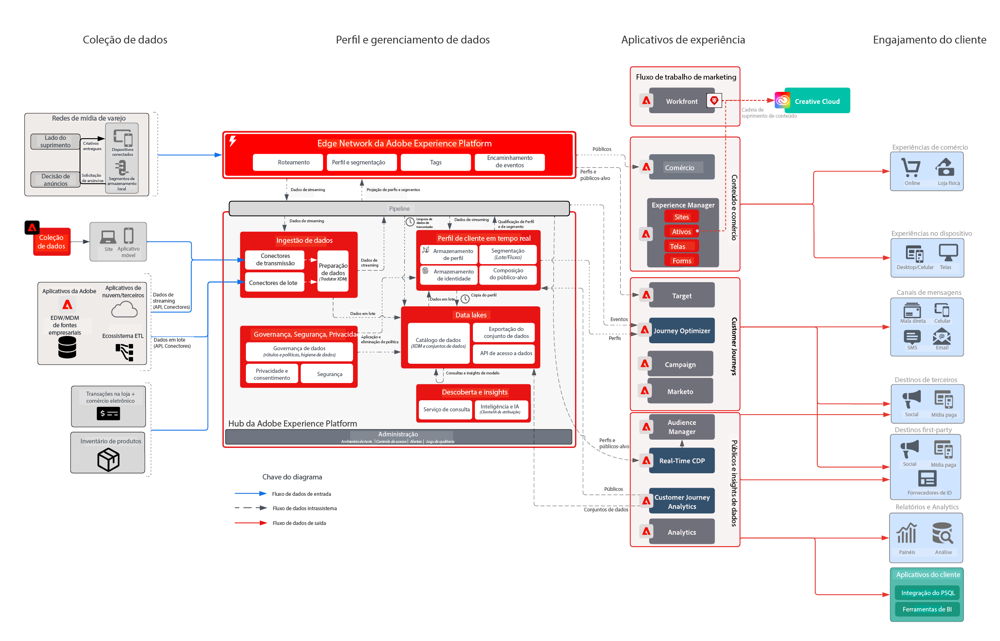

# Desafio das empresas do setor de varejo

Essa empresa baseada em experiências integrada buscou personalizar toda a jornada do cliente para aumentar a fidelidade e a venda adicional para clientes existentes e para melhorar os gastos com marketing em suas campanhas. A estratégia para atingir o objetivo é estender a capacidade digital para incluir dados offline de transações e dos clientes para impulsionar o crescimento.

## Abordagem da Adobe

* Gere um perfil de cliente unificado que inclua todos os dados online/offline relevantes que podem ser ativados em tempo real
* Orquestre as interações com o cliente na Web, em mídias e em canais de push para impulsionar o comportamento de compra pela primeira ou segunda vez.

## Valor comercial fornecido

| Metas | Táticas | Valor desbloqueado |
|---|---|---|
| **Orquestrar jornadas do cliente em tempo real **  ** Impulsionar compras repetidas de novos clientes **  ** Melhorar a eficiência do marketing e reduzir os custos de mídia**</ul> | <ul><li>Dados robustos e estratégia de identidade para alimentar um perfil abrangente em tempo real.</li><li>Transmissão de dados transacionais e do cliente em tempo real, incluindo uma carga histórica de 90 dias</li><li>Segmentação de transmissão para Advertising Networks e Adobe Target com o intuito de potencializar os gastos com mídia e os esforços de personalização.</li><li>Jornadas do cliente em tempo real por meio da Adobe Campaign com uma estratégia para medir o desempenho</li></ul> | <ul><li><strong>Real-time Customer Data Platform:</strong> Oferecimento de experiências do cliente em tempo real em mídias, emails, push e Web</li><li><strong>Fontes de dados:</strong> Dados de transmissão que abrangem as lojas de perfil deste varejista, o sistema de pedidos, o catálogo de produtos e as lojas de varejo.</li><li><strong>Ativação de mídia em tempo real:</strong> Transmissão de segmentos para Advertising Networks para atribuição e supressão de anúncios</li><li><strong>Personalização da Web em tempo real:</strong> Transmissão de segmentos ativados para o Adobe Target com o intuito de realizar a ativação na experiência online do varejista.</li><li><strong>Journey Orchestration em escala:</strong> Mensagens acionadas em tempo real enriquecidas com os dados disponíveis do cliente e ativação em tempo real em email e canais de push</li></ul> |

## Casos de uso

| Categoria | Meta | Caso de uso | Descrição |
|:----|:----|:----|:----|
| Jornadas do cliente | Aquisição | Série de Boas-vindas | Dê as boas-vindas a novos assinantes com uma introdução aos negócios, produtos e serviços |
| | | 1º programa de compra | |
| | Melhorar as vendas | Carrinho abandonado/Navegar | Recuperar possíveis compradores e aumentar as vendas |
| | | Resenha do produto/venda cruzada | Venda cruzada de mais itens com Resenhas de produtos. |
| | | Promoções do produto |  |
| | | Tempo para reordenar | Lembrete recorrente de produtos/serviços cíclicos |
| | Fidelidade à marca | Recuperar | Recupere clientes que ficaram inativos. |
| | | Lembretes de aniversário | Promova um relacionamento mais pessoal com seus clientes fazendo parte da celebração de aniversário deles! |
| Merchandising | Gerenciar inventário | De volta ao estoque | Melhorar o inventário, mostrando aos clientes que os produtos que eles queriam estão de volta ao estoque |
| | | Próxima melhor categoria | Identificar as melhores categorias/vendas para usuários |
| | | Os mais vendidos | |
| | | Lembretes de queda de preço | Mostrar aos usuários que os itens de que eles gostaram estão com um preço reduzido |
| | | Produtos similares |  |
| Personalizar | Aumentar conversão | Cupons/Ofertas | Mostrar as melhores ofertas/cupons aos clientes |
| | | Pesquisa personalizada de produtos | Melhorar a experiência de pesquisa |
| | | Recomendações do produto | Melhorar a experiência de navegação do produto |
| | | Experiência omnicanal | Alcance clientes em todos os canais |
| Medir | Entender as Jornadas do cliente | Campanha entre canais | Medir campanhas entre canais |
| | | Desempenho do segmento | Entender o desempenho e a contribuição do segmento |
| | | Relatórios de fallout | Visualizar conversões em cada estágio |
| | | Análise de coorte | Medir engajamento entre grupos de segmentos |
| | | Relatórios de click-to-brick (presença tradicional e online) | Veja como as conversões de clientes levam à experiência na loja |
| | | Atribuição | Exibir qual touchpoint/experiência tem a maior influência na conversão de compra |
| | | Insights preditivos | Saiba mais sobre as tendências dos clientes |

## Arquitetura

## Blueprints relacionados

| Caso de uso/integração  | Link |
|:----|:----|
| CJA + AEP | [Visão geral dos blueprints do Customer Journey Analytics](https://experienceleague.adobe.com/docs/blueprints-learn/architecture/customer-journey-analytics/overview.html?lang=pt-BR) |
| | [Casos de uso do Customer Journey Analytics](https://experienceleague.adobe.com/docs/analytics-platform/using/cja-usecases/cja-usecases.html?lang=pt-BR) |
| AJO + AEP | [Casos de uso do Adobe Journey Optimizer](https://experienceleague.adobe.com/docs/blueprints-learn/architecture/customer-journeys/journey-optimizer/journey-optimizer.html?lang=pt-BR) |
| | [Gestão de decisões](https://experienceleague.adobe.com/docs/blueprints-learn/architecture/customer-journeys/journey-optimizer/decision-management/decision-management-overview.html?lang=pt-BR) |
| RTCDP + AEP | [Audience Activation online/offline](https://experienceleague.adobe.com/docs/blueprints-learn/architecture/audience-activation/known-customer-audience-activation/known.html?lang=pt-BR) |
| | [Experience Platform + Ativação de aplicativo](https://experienceleague.adobe.com/docs/blueprints-learn/architecture/audience-activation/platform-and-applications.html?lang=pt-BR) |
| Marketo + AEP | [Ativação e marketing B2B](https://experienceleague.adobe.com/docs/blueprints-learn/architecture/b2b-activation/overview.html?lang=pt-BR) | |
| Target + AEP | [Caso de uso do Adobe Target – Personalização comportamental da Web/móvel](https://experienceleague.adobe.com/docs/blueprints-learn/architecture/audience-activation/web-personalization/behavioral.html?lang=en) | [Personalização da Web/Mobile com dados de clientes conhecidos](https://experienceleague.adobe.com/docs/blueprints-learn/architecture/audience-activation/web-personalization/known-personalization.html?lang=en) | |
