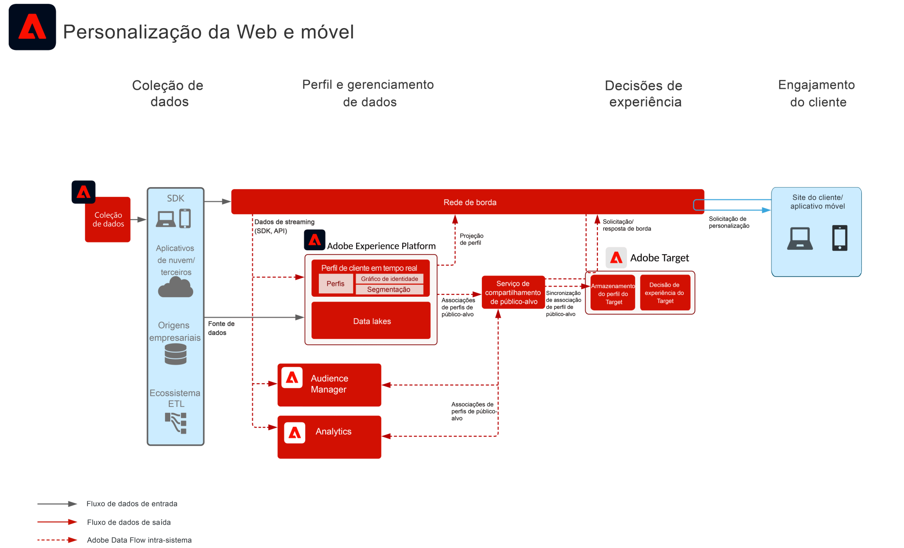

# Blueprint de personalização da Web/móvel com base comportamental

Personalize com base no comportamento online e nos dados do público-alvo.

## Casos de uso

* Aprimoramento da página de aterrissagem
* Direcionamento comportamental
* Personalização com base em visualizações anteriores de produtos/conteúdos, afinidade com produtos/conteúdos, características ambientais, dados de público-alvo de terceiros e dados demográficos

## Aplicativos

* Adobe Target
* Adobe Analytics (opcional)
* Adobe Audience Manager (opcional)
* Adobe Real-time Customer Data Platform (opcional)

## Arquitetura

## Padrões de implantação

O blueprint de personalização da Web/móvel pode ser implantado por meio das seguintes abordagens, conforme descrito abaixo.

1. Usando o [!UICONTROL SDK da Web da Platform] ou o [!UICONTROL SDK móvel da Platform] e o [!UICONTROL Edge Network]. [Consulte o blueprint do SDK da Web e Mobile da Experience Platform](../experience-platform/deployment/websdk.md)
1. Usando SDKs tradicionais específicos para aplicativos (por exemplo, AppMeasurement.js). [Consulte o Blueprint do SDK específico do aplicativo](../experience-platform/deployment/appsdk.md)

## Etapas de implantação

1. [Implemente o Adobe Target](https://experienceleague.adobe.com/docs/target/using/implement-target/implementing-target.html?lang=pt-BR) em seus aplicativos da Web ou dispositivos móveis.

### Etapas de implantação – Audience Manager ou Adobe Analytics

1. [Implemente o Adobe Audience Manager](https://experienceleague.adobe.com/docs/audience-manager/user-guide/implementation-integration-guides/implement-audience-manager.html?lang=pt-BR)
1. [Implemente o Adobe Analytics](https://experienceleague.adobe.com/docs/analytics/implementation/home.html?lang=pt-BR)
1. [Implemente o Identity Service da Experience Cloud](https://experienceleague.adobe.com/docs/id-service/using/implementation/implementation-guides.html?lang=pt-BR)

   >[!NOTE]
   >
   >Cada aplicativo deve usar a Experience Cloud ID e fazer parte da mesma organização da Experience Cloud, permitindo assim o compartilhamento de públicos-alvo entre os aplicativos.

1. [Solicite provisionamento para os serviços de Compartilhamento de pessoas e públicos-alvos (Públicos-alvo compartilhados)](https://www.adobe.com/go/audiences)
1. Crie segmentos no [Adobe Analytics](https://experienceleague.adobe.com/docs/analytics/components/segmentation/segmentation-workflow/seg-build.html?lang=pt-BR) ou no [Adobe Audience Manager](https://experienceleague.adobe.com/docs/audience-manager/user-guide/features/segments/segment-builder.html?lang=pt-BR) e [configure esses públicos-alvo para compartilhamento com a Experience Cloud](https://experienceleague.adobe.com/docs/analytics/components/segmentation/segmentation-workflow/seg-publish.html?lang=pt-BR)  (se estiver usando o Audience Manager ou o Adobe Analytics)
1. Depois que os públicos-alvo estiverem disponíveis no Adobe Target, eles podem ser usados para [experiências de direcionamento com o Adobe Target](https://experienceleague.adobe.com/docs/target/using/audiences/target.html?lang=pt-BR)

### Etapas de implementação – Real-time Customer Data Platform

1. [Crie esquemas](https://experienceleague.adobe.com/?recommended=ExperiencePlatform-D-1-2021.1.xdm&amp;lang=pt-BR) para que os dados sejam assimilados.
1. [Crie conjuntos de dados](https://experienceleague.adobe.com/docs/platform-learn/tutorials/data-ingestion/create-datasets-and-ingest-data.html?lang=pt-BR) para que os dados sejam assimilados.
1. [Configure as identidades corretas e os namespaces de identidade](https://experienceleague.adobe.com/docs/platform-learn/tutorials/identities/label-ingest-and-verify-identity-data.html?lang=pt-BR) no esquema para assegurar que os dados assimilados possam aderir a um perfil unificado.
1. [Habilite os esquemas e conjuntos de dados para o perfil](https://experienceleague.adobe.com/docs/platform-learn/tutorials/profiles/bring-data-into-the-real-time-customer-profile.html?lang=pt-BR).
1. [Assimile dados](https://experienceleague.adobe.com/?recommended=ExperiencePlatform-D-1-2020.1.dataingestion&amp;lang=pt-BR) na Experience Platform.
1. [Forneça compartilhamento de segmentos da [!UICONTROL Real-time Customer Data Platform]](https://www.adobe.com/go/audiences) entre a Experience Platform e o Audience Manager. Assim, os públicos definidos na Experience Platform podem ser compartilhados com o Audience Manager.
1. [Crie segmentos](https://experienceleague.adobe.com/docs/platform-learn/tutorials/segments/create-segments.html?lang=pt-BR) na Experience Platform. O sistema decide automaticamente se o segmento é avaliado em lote ou por transmissão.
1. [Configure destinos](https://experienceleague.adobe.com/docs/platform-learn/tutorials/destinations/create-destinations-and-activate-data.html?lang=pt-BR) para compartilhar atributos de perfil e associações de públicos-alvo com destinos desejados.

## Documentação relacionada

* [Públicos-alvo da Experience Cloud](https://experienceleague.adobe.com/docs/core-services/interface/audiences/audience-library.html?lang=pt-BR)
* [Integração do Audience Manager com o Adobe Target](https://experienceleague.adobe.com/docs/audience-manager/user-guide/implementation-integration-guides/integration-other-solutions/aam-target-integration.html?lang=pt-BR)
* [Compartilhamento de segmentos do Adobe Analytics por meio do Adobe Audience Manager](https://experienceleague.adobe.com/docs/analytics/components/segmentation/segmentation-workflow/seg-publish.html?lang=pt-BR)
* Visão geral da [[!UICONTROL Real-time Customer Data Platform]](https://experienceleague.adobe.com/docs/platform-learn/tutorials/application-services/rtcdp/understanding-the-real-time-customer-data-platform.html?lang=pt-BR)
* Descrição do produto [[!UICONTROL Real-time Customer Data Platform]](https://helpx.adobe.com/br/legal/product-descriptions/real-time-customer-data-platform.html)
* [Guias de perfil e segmentação](https://experienceleague.adobe.com/docs/experience-platform/profile/guardrails.html?lang=pt-BR)
* [Documentação de segmentação](https://experienceleague.adobe.com/docs/experience-platform/segmentation/api/streaming-segmentation.html?lang=pt-BR)
* [Documentação de destinos](https://experienceleague.adobe.com/docs/experience-platform/destinations/catalog/overview.html?lang=pt-BR)

## Publicações do blog relacionadas

* [[!DNL Blueprint for Web Personalization using Adobe Experience Platform Real-Time Customer Profile]](https://medium.com/adobetech/blueprint-for-web-personalization-using-adobe-experience-platform-real-time-customer-profile-fef2ce7a4b2f)
* [[!DNL Integrating Adobe Experience Platform Decisioning Engine with AEM Websites]](https://jaeness.medium.com/integrating-adobe-experience-platform-decisioning-engine-with-aem-websites-9c222acd12e2)
* [[!DNL Adobe Experience Platform Web SDK for Audience Management]](https://medium.com/adobetech/adobe-experience-platform-web-sdk-for-audience-management-751fa6d063bc)
* [[!DNL Implementing Adobe Experience Platform Real-Time Customer Profile through our "Customer Zero" Program]](https://medium.com/adobetech/implementing-adobe-experience-platform-real-time-customer-profile-through-our-customer-zero-32e7cd952896)
* [[!DNL How Adobe Experience Platform Can Help Customers Personalize Their Mobile Messaging in Real-Time with Journey Orchestration Service and a Mobile Messaging Vendor]](https://medium.com/adobetech/how-adobe-experience-platform-helped-a-client-personalize-their-mobile-messaging-in-real-time-with-7d634aefa098)
* [[!DNL Segmentation in Seconds: How Adobe Experience Platform Made Real-time Customer Profiles a Reality]](https://medium.com/adobetech/segmentation-in-seconds-how-adobe-experience-platform-made-real-time-customer-profiles-a-reality-a7a8552b0847)
