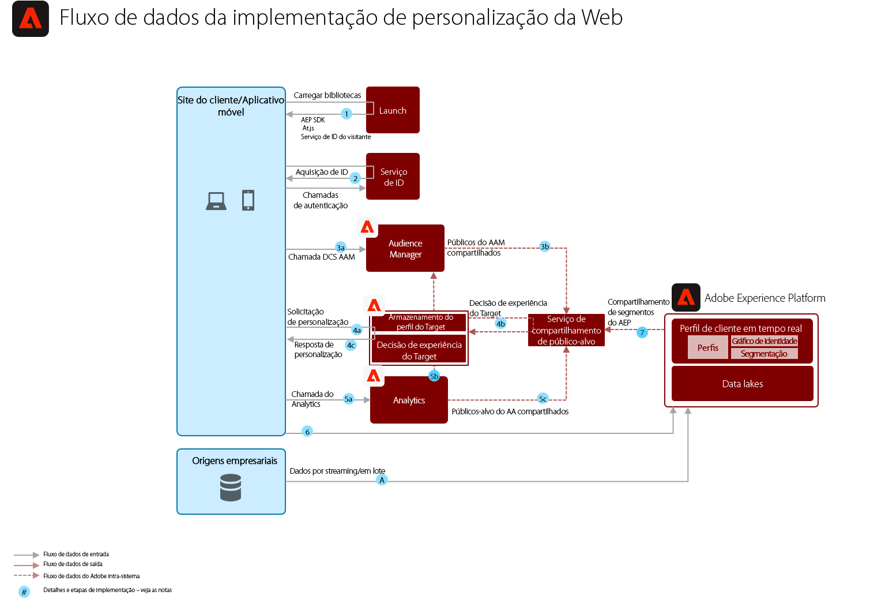

# Blueprint de personalização da Web/móvel com base comportamental

Personalize com base no comportamento online e nos dados do público-alvo.

## Casos de uso

* Aprimoramento da página de aterrissagem
* Direcionamento comportamental
* Personalização com base em visualizações anteriores de produtos/conteúdos, afinidade com produtos/conteúdos, características ambientais, dados de público-alvo de terceiros e dados demográficos

## Aplicativos

* Adobe Target
* Adobe Analytics (opcional)
* Adobe Audience Manager (opcional)

## Arquitetura

## Medidas de proteção

Por padrão, o serviço de compartilhamento de segmentos permite compartilhar no máximo 75 públicos-alvos para cada conjunto de relatórios do Adobe Analytics. Ao usar o Audience Manager, a quantidade de públicos-alvos que podem ser compartilhados é ilimitada. 

## Padrões de implementação

O blueprint de personalização da Web/móvel pode ser implementado por meio das seguintes abordagens, conforme descrito abaixo.

1. Usando o [!UICONTROL SDK da Web da Platform] ou o [!UICONTROL SDK móvel da Platform] e o [!UICONTROL Edge Network].
1. Usando SDKs tradicionais específicos para aplicativos (por exemplo, AppMeasurement.js)

### 1. Abordagem do SDK da Web/Móvel da Platform e o Edge

### 2. Abordagem do SDK específico para aplicativos

## Pré-requisitos de implementação

| Aplicativo/Serviço | Biblioteca necessária | Observações |
|---|---|---|
| Adobe Target | [!UICONTROL SDK da Web da Platform]*, at.js 0.9.1+ ou mbox.js 61+ | Preferência pela at.js, uma vez que a mbox.js não está mais sendo desenvolvida. |
| Adobe Audience Manager (opcional) | [!UICONTROL SDK da Web da Platform]* ou dil.js 5.0+ |  |
| Adobe Analytics (opcional) | [!UICONTROL SDK da Web da Platform]* ou AppMeasurement.js 1.6.4+ |  |
| Identity Service da Experience Cloud | [!UICONTROL SDK da Web da Platform]* ou VisitorAPI.js 2.0+ |  |
| SDK Móvel da Experience Platform (opcional) | Versão 4.11 ou posterior para iOS e Android™ |  |
| SDK da Web da Experience Platform | Versão 1.0. A versão atual do SDK da Experience Platform tem [vários casos de uso ainda não compatíveis com os aplicativos da Experience Cloud](https://github.com/adobe/alloy/projects/5) |  |

## Etapas de implementação

1. [Implemente o Adobe Target](https://experienceleague.adobe.com/docs/target/using/implement-target/implementing-target.html?lang=pt-BR) em seus aplicativos da Web ou dispositivos móveis.

   Se estiver usando o Audience Manager ou o Adobe Analytics:

1. [Implemente o Adobe Audience Manager](https://experienceleague.adobe.com/docs/audience-manager/user-guide/implementation-integration-guides/implement-audience-manager.html?lang=pt-BR)
1. [Implemente o Adobe Analytics](https://experienceleague.adobe.com/docs/analytics/implementation/home.html?lang=pt-BR)
1. [Implemente o Identity Service da Experience Cloud](https://experienceleague.adobe.com/docs/id-service/using/implementation/implementation-guides.html?lang=pt-BR)

   >[!NOTE]
   >
   >Cada aplicativo deve usar a Experience Cloud ID e fazer parte da mesma organização da Experience Cloud, permitindo assim o compartilhamento de públicos entre os aplicativos.

1. [Solicite provisionamento para os serviços de Compartilhamento de pessoas e públicos-alvos (Públicos compartilhados)](https://www.adobe.com/go/audiences)
1. Crie segmentos no [Adobe Analytics](https://experienceleague.adobe.com/docs/analytics/components/segmentation/segmentation-workflow/seg-build.html?lang=pt-BR) ou no [Adobe Audience Manager](https://experienceleague.adobe.com/docs/audience-manager/user-guide/features/segments/segment-builder.html?lang=pt-BR) e [configure esses públicos para compartilhamento com a Experience Cloud](https://experienceleague.adobe.com/docs/analytics/components/segmentation/segmentation-workflow/seg-publish.html?lang=pt-BR)  (se estiver usando o Audience Manager ou o Adobe Analytics)
1. Depois que os públicos estiverem disponíveis no Adobe Target, eles podem ser usados para [experiências de direcionamento com o Adobe Target](https://experienceleague.adobe.com/docs/target/using/audiences/target.html?lang=pt-BR)

## Documentação relacionada

* [Públicos da Experience Cloud](https://experienceleague.adobe.com/docs/core-services/interface/audiences/audience-library.html?lang=pt-BR)
* [Integração do Audience Manager com o Adobe Target](https://experienceleague.adobe.com/docs/audience-manager/user-guide/implementation-integration-guides/integration-other-solutions/aam-target-integration.html?lang=pt-BR)
* [Compartilhamento de segmentos do Adobe Analytics por meio do Adobe Audience Manager](https://experienceleague.adobe.com/docs/analytics/components/segmentation/segmentation-workflow/seg-publish.html?lang=pt-BR)

## Publicações do blog relacionadas

* [[!DNL Blueprint for Web Personalization using Adobe Experience Platform Real-Time Customer Profile]](https://medium.com/adobetech/blueprint-for-web-personalization-using-adobe-experience-platform-real-time-customer-profile-fef2ce7a4b2f)
* [[!DNL Integrating Adobe Experience Platform Decisioning Engine with AEM Websites]](https://jaeness.medium.com/integrating-adobe-experience-platform-decisioning-engine-with-aem-websites-9c222acd12e2)
* [[!DNL How Adobe Experience Platform Predictive Audiences improves Personalized Experiences]](https://medium.com/adobetech/how-adobe-experience-platform-predictive-audiences-improves-personalized-experiences-1f75a60cb7a3)
* [[!DNL Adobe Experience Platform Web SDK for Audience Management]](https://medium.com/adobetech/adobe-experience-platform-web-sdk-for-audience-management-751fa6d063bc)
* [[!DNL Implementing Adobe Experience Platform Real-Time Customer Profile through our “Customer Zero” Program]](https://medium.com/adobetech/implementing-adobe-experience-platform-real-time-customer-profile-through-our-customer-zero-32e7cd952896)
* [[!DNL How Adobe Experience Platform Can Help Customers Personalize Their Mobile Messaging in Real-Time with Journey Orchestration Service and a Mobile Messaging Vendor]](https://medium.com/adobetech/how-adobe-experience-platform-helped-a-client-personalize-their-mobile-messaging-in-real-time-with-7d634aefa098)
* [[!DNL Segmentation in Seconds: How Adobe Experience Platform Made Real-time Customer Profiles a Reality]](https://medium.com/adobetech/segmentation-in-seconds-how-adobe-experience-platform-made-real-time-customer-profiles-a-reality-a7a8552b0847)
