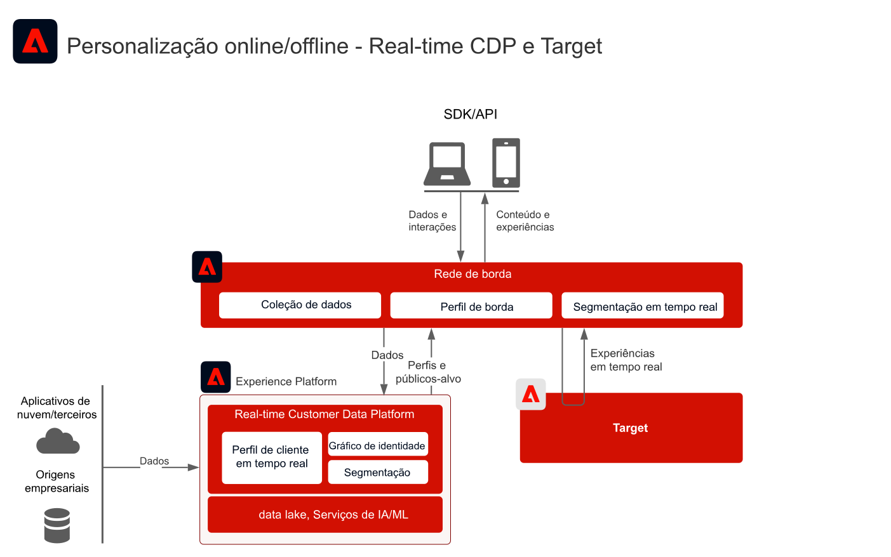
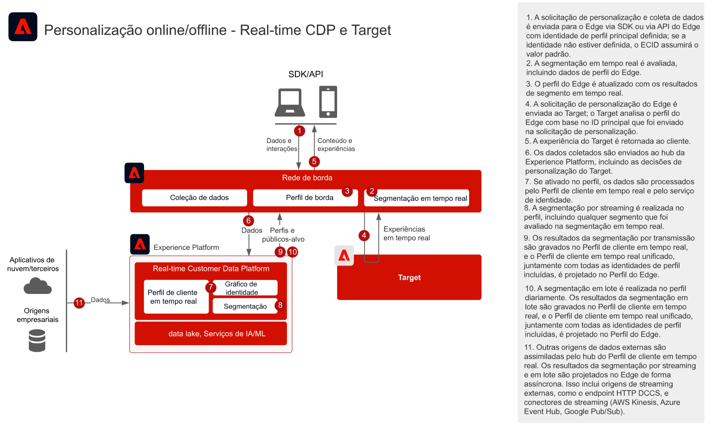
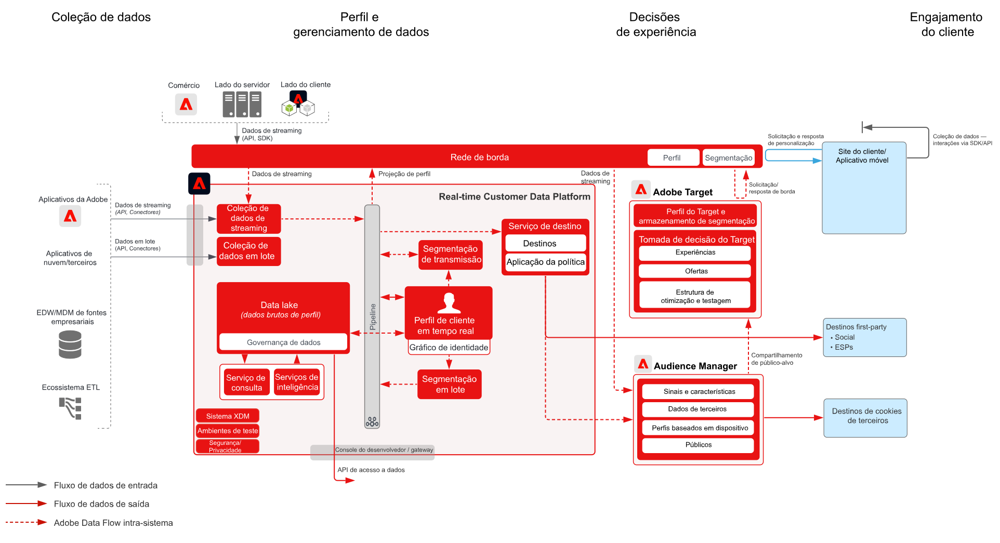

# Personalização da Web/Mobile com dados de clientes conhecidos

## Casos de uso

* Personalização online com dados de clientes conhecidos
* Aprimoramento da página de aterrissagem
* Personalização com base em visualizações anteriores de produtos/conteúdos, afinidade com produtos/conteúdos, atributos ambientais e dados demográficos, além de dados offline, como transações, insights de fidelização e de CRM e modelos de insights
* Compartilhe e direcione públicos-alvo definidos na Real-time Customer Data Platform em sites e aplicativos móveis usando o Adobe Target.

## Aplicativos

* [!UICONTROL Real-time Customer Data Platform]
* Adobe Target
* Adobe Audience Manager (opcional): adiciona dados de público-alvo de terceiros
* Adobe Analytics ou Customer Journey Analytics (opcional): adiciona a capacidade de criar segmentos com base em dados históricos de clientes e dados comportamentais com segmentação detalhada

## Padrões de integração

| Padrão de integração | Recurso | Pré-requisitos |
|---|---|---|
| Avaliação de segmentos em tempo real na borda compartilhada da Real-time Customer Data Platform com o Target | <ul><li>Avalie públicos em tempo real personalização da mesma página ou próxima página no Edge.</li><li>Além disso, todos os segmentos avaliados por streaming ou em lote também serão projetados para a rede de borda para serem incluídos na avaliação e personalização do segmento de borda.</li></ul> | <ul><li>O SDK da Web/móvel deve ser implementado ou a API de servidor da rede de borda</li><li>A sequência de dados precisa ser configurada no Experience Edge com a extensão Target e Experience Platform ativada</li><li>O destino do Target precisa ser configurado nos Destinos da Real-time Customer Data Platform.</li><li>A integração com o Target requer uma organização IMS igual à da instância da Experience Platform.</li></ul> |
| Compartilhamento de públicos-alvo por streaming e em lote da Real-time Customer Data Platform com o Target por meio da abordagem de borda | <ul><li>Compartilhe públicos de transmissão e em lote da Real-time Customer Data Platform com o Target por meio da rede de borda. A avaliação em tempo real de públicos-alvo exige implementação do WebSDK e rede de borda.</li></ul> | <ul><li>A implementação do SDK da Web/Mobile ou da API de borda do Target não é necessária para compartilhar públicos de streaming e RTCDP em lote com o Target, embora seja necessária para habilitar a avaliação de segmento de borda em tempo real descrita acima.</li><li>Se estiver usando a AT.js, somente a integração de perfil em relação ao namespace de identidade ECID será permitida.</li><li>Para pesquisas de namespace de identidade personalizadas no Edge, a implantação de API do WebSDK/Edge é necessária, e cada identidade precisa ser definida como uma identidade no mapa de identidade.</li><li>O destino do destino deve ser configurado nos Destinos do Real-time Customer Data Platform, somente a sandbox de produção padrão no RTCDP é compatível.</li><li>A integração com o Target requer uma organização IMS igual à da instância da Experience Platform.</li></ul> |
| Compartilhamento de públicos-alvo por streaming e em lote da Real-time Customer Data Platform com o Target e o Audience Manager por meio da abordagem do serviço de compartilhamento de público-alvo | <ul><li>Esse padrão de integração pode ser utilizado quando o enriquecimento adicional de dados de terceiros e públicos-alvo é desejado no Audience Manager.</li></ul> | <ul><li>O SDK da Web/Mobile não é necessário para compartilhar públicos-alvo por streaming e em lote com o Target, embora seja para habilitar a avaliação de segmentos de borda em tempo real.</li><li>Se estiver usando a AT.js, somente a integração de perfil em relação ao namespace de identidade ECID será permitida.</li><li>Para pesquisas de namespace de identidade personalizadas no Edge, a implantação de API do WebSDK/Edge é necessária, e cada identidade precisa ser definida como uma identidade no mapa de identidade.</li><li>A projeção de público-alvo por meio do serviço de compartilhamento de público-alvo precisa ser provisionada.</li><li>A integração com o Target requer uma organização IMS igual à da instância da Experience Platform.</li><li>Somente os públicos-alvo da sandbox de produção padrão são compatíveis com o serviço principal de compartilhamento de público-alvo.</li></ul> |

## Compartilhamento de público-alvo em tempo real, por streaming e em lote com o Adobe Target

Arquitetura

Detalhes da sequência

Visão geral da arquitetura

## Padrões de implementação

A personalização de cliente conhecido é permitida por várias abordagens de implementação.

### Padrão de implementação 1 – Rede de borda com SDK da Web/móvel ou API da rede de borda (abordagem recomendada)

* Usar a rede de borda com o SDK da Web/Mobile. A segmentação de borda em tempo real exige a abordagem de implementação do SDK da Web/Mobile ou da API de borda.
* [Consulte o blueprint do SDK da Web e Mobile da Experience Platform](../data-ingestion/websdk.md)  para uma implementação baseada em SDK.
* Para uso no SDK móvel, a [Adobe Journey Optimizer – Extensão de decisão](https://aep-sdks.gitbook.io/docs/using-mobile-extensions/adobe-journey-optimizer-decisioning) deve ser instalada no SDK móvel.
* [Consulte a API de servidor da rede de borda](https://experienceleague.adobe.com/docs/experience-platform/edge-network-server-api/overview.html?lang=pt-BR) para uma implementação baseada em API do Adobe Target com o perfil de borda.

### Padrão de implementação 2 – SDKs específicos ao aplicativo

Usar SDKs tradicionais específicos para aplicativos (por exemplo, AT.js e AppMeasurement.js). A avaliação de segmento de borda em tempo real não é compatível com essa abordagem de implementação. No entanto, o compartilhamento de público-alvo de lote e streaming do hub da Experience Platform são compatíveis com essa abordagem de implementação.

[Consulte o Blueprint do SDK específico do aplicativo](../data-ingestion/appsdk.md)

### Etapas de implementação

1. [Implemente o Adobe Target](https://experienceleague.adobe.com/docs/target/using/implement-target/implementing-target.html?lang=pt-BR) para seus aplicativos da Web ou seus aplicativos para dispositivos móveis
1. [Implemente a Experience Platform e o [!UICONTROL Perfil de cliente em tempo real]](https://experienceleague.adobe.com/docs/platform-learn/getting-started-for-data-architects-and-data-engineers/overview.html?lang=pt-BR); certifique-se de que os públicos-alvo criados sejam ativados na borda, configurando a [política de mesclagem](https://experienceleague.adobe.com/docs/experience-platform/profile/merge-policies/ui-guide.html?lang=pt-BR#create-a-merge-policy) como ativa na borda.
1. Implemente o [SDK da Web da Experience Platform](https://experienceleague.adobe.com/docs/experience-platform/edge/home.html?lang=pt-BR) ou o [SDK móvel da Experience Platform](https://aep-sdks.gitbook.io/docs/) com a extensão correta (Target ou Adobe Journey Optimizer – Decisão) instalada. O SDK da Web/móvel ou a API Edge da Experience Platform são necessários para a segmentação do Edge em tempo real, mas não são necessários para compartilhar públicos de transmissão e em lote da Real-time Customer Data Platform com o Target.
1. [Configure a rede de borda com uma sequência de dados de borda](https://experienceleague.adobe.com/docs/experience-platform/edge/fundamentals/datastreams.html?lang=pt-BR)
1. [Habilite o Adobe Target como um destino na Real-time Customer Data Platform](https://experienceleague.adobe.com/docs/experience-platform/destinations/catalog/personalization/adobe-target-connection.html?lang=pt-BR)
1. (Opcional) [Implemente o Adobe Audience Manager](https://experienceleague.adobe.com/docs/audience-manager/user-guide/implementation-integration-guides/implement-audience-manager.html?lang=pt-BR).
1. (Opcional) [Solicite o provisionamento do compartilhamento de público-alvo entre a Experience Platform e o Adobe Target (públicos-alvo compartilhados)](https://www.adobe.com/go/audiences) para compartilhar públicos-alvo da Experience Platform com o Target.

## Medidas de proteção

[Consulte as medidas de proteção na página de Visão geral dos Blueprints de personalização móvel e da Web.](overview.md)

* Os perfis de borda só são criados quando um usuário está ativo no Edge, o que significa que seu perfil tem eventos de streaming sendo enviados ao Edge por meio do SDK Web/Mobile ou da API do servidor de borda. Isso geralmente corresponde ao usuário que está ativo em um site ou aplicativo móvel.
* Os perfis de borda têm um tempo padrão de vida de 14 dias. Se o usuário não tiver coletado eventos de borda ativos, o perfil expirará na borda após 14 dias de inatividade. O perfil permanecerá válido no hub e será sincronizado com a borda depois que o usuário se tornar ativo na borda novamente.
* Quando um novo perfil é criado na borda, uma chamada de sincronização é feita de forma assíncrona no hub para buscar quaisquer públicos-alvo e atributos configurados para projeção de borda por meio de um destino. Como é um processo assíncrono, pode levar de 1 segundo a vários minutos para que o perfil do hub seja sincronizado com a borda. Dessa forma, os novos perfis não podem ter o contexto do perfil do hub para as experiências da primeira página. Isso também se aplica aos dados coletados recentemente no hub. Esses dados são projetados para a borda de forma assíncrona e, portanto, o momento em que os dados chegam à borda apropriada será separado da atividade da borda. Somente os perfis ativos na borda persistirão os atributos e os públicos-alvo projetados a partir do hub.

## Considerações de implementação

Pré-requisitos de identidade

* Qualquer identidade principal pode ser aproveitada quando se utiliza o padrão de implementação 1 descrito acima com a rede de borda e o WebSDK. A primeira personalização de logon requer que a identidade principal do conjunto de solicitações de personalização corresponda à identidade principal do perfil do Real-time Customer Data Platform. A associação de identidades de dispositivos anônimos a clientes conhecidos é processada no hub e, em uma etapa posterior, projetada para a borda.
* Observe que os dados carregados no hub antes de um consumidor visitar ou fazer logon em um site não estarão disponíveis imediatamente para personalização. Primeiro, deve existir um perfil de borda ativo para que os dados do hub sejam sincronizados. Depois de criado, o perfil de borda será sincronizado com o perfil de hub de forma assíncrona, resultando na próxima personalização da página.
* O compartilhamento de públicos do Adobe Experience Platform para a Adobe Target requer o uso da ECID como uma identidade ao usar o serviço de compartilhamento de público-alvo, conforme descrito nos padrões de integração 2 e 3 acima.
* Identidades alternativas também podem ser usadas para compartilhar públicos-alvo da Experience Platform com o Adobe Target por meio do Audience Manager. A Experience Platform ativa públicos-alvo para o Audience Manager por meio dos seguintes namespaces compatíveis: IDFA, GAID, AdCloud, Google, ECID, EMAIL_LC_SHA256. Observe que o Audience Manager e o Target resolvem associações de público-alvo por meio da identidade da ECID, portanto, a ECID ainda precisa estar no gráfico de identidade do consumidor para o compartilhamento de público-alvo final com o Adobe Target.

## Documentação relacionada

### Documentação do SDK

* [Documentação do SDK da Web da Experience Platform](https://experienceleague.adobe.com/docs/experience-platform/edge/home.html)
* [Documentação de tags da Experience Platform](https://experienceleague.adobe.com/docs/experience-platform/tags/home.html?lang=pt-BR)
* [Documentação do serviço da Experience Cloud ID](https://experienceleague.adobe.com/docs/id-service/using/home.html?lang=pt-BR)

### Documentação de conexão

* [Conexão do Adobe Target com a Real-time Customer Data Platform](https://experienceleague.adobe.com/docs/experience-platform/destinations/catalog/personalization/adobe-target-connection.html?lang=en)
* [Configuração da sequência de dados de borda](https://experienceleague.adobe.com/docs/experience-platform/edge/fundamentals/datastreams.html)
* [Compartilhamento de segmentos da Experience Platform com o Audience Manager e outras soluções da Experience Cloud](https://experienceleague.adobe.com/docs/audience-manager/user-guide/implementation-integration-guides/integration-experience-platform/aam-aep-audience-sharing.html?lang=pt-BR)

### Documentação de segmentação

* [Visão geral da Segmentação da Experience Platform](https://experienceleague.adobe.com/docs/experience-platform/segmentation/home.html?lang=pt-BR)
* [Segmentação em tempo real](https://experienceleague.adobe.com/docs/experience-platform/segmentation/ui/edge-segmentation.html?lang=pt-BR)
* [Segmentação de transmissão](https://experienceleague.adobe.com/docs/experience-platform/segmentation/api/streaming-segmentation.html?lang=pt-BR)
* [Compartilhamento de segmentos do Adobe Analytics por meio do Adobe Audience Manager](https://experienceleague.adobe.com/docs/analytics/components/segmentation/segmentation-workflow/seg-publish.html?lang=pt-BR)
* [Configuração da política de mesclagem](https://experienceleague.adobe.com/docs/experience-platform/profile/merge-policies/ui-guide.html?lang=en#create-a-merge-policy)

### Tutoriais

* [Personalização de próxima ocorrência com Real-Time CDP e Adobe Target](https://experienceleague.adobe.com/docs/platform-learn/tutorials/experience-cloud/next-hit-personalization.html?lang=pt-BR)

### Publicações do blog relacionadas

* [Adobe anuncia a mesma personalização aprimorada de página com o Adobe Target e a Real-time Customer Data Platform](https://blog.adobe.com/en/publish/2021/10/05/adobe-announces-same-page-enhanced-personalization-with-adobe-target-real-time-customer-data-platform)
* [[!DNL Blueprint for Web Personalization using Adobe Experience Platform Real-Time Customer Profile]](https://medium.com/adobetech/blueprint-for-web-personalization-using-adobe-experience-platform-real-time-customer-profile-fef2ce7a4b2f)
* [[!DNL Adobe Experience Platform’s Identity Service — How to Solve the Customer Identity Conundrum]](https://medium.com/adobetech/adobe-experience-platforms-identity-service-how-to-solve-the-customer-identity-conundrum-f95e22d16ea9)
* [[!DNL Adobe Experience Platform Web SDK for Audience Management]](https://medium.com/adobetech/adobe-experience-platform-web-sdk-for-audience-management-751fa6d063bc)
* [[!DNL Implementing Adobe Experience Platform Real-Time Customer Profile through our “Customer Zero” Program]](https://medium.com/adobetech/implementing-adobe-experience-platform-real-time-customer-profile-through-our-customer-zero-32e7cd952896)
* [[!DNL Segmentation in Seconds: How Adobe Experience Platform Made Real-time Customer Profiles a Reality]](https://medium.com/adobetech/segmentation-in-seconds-how-adobe-experience-platform-made-real-time-customer-profiles-a-reality-a7a8552b0847)
