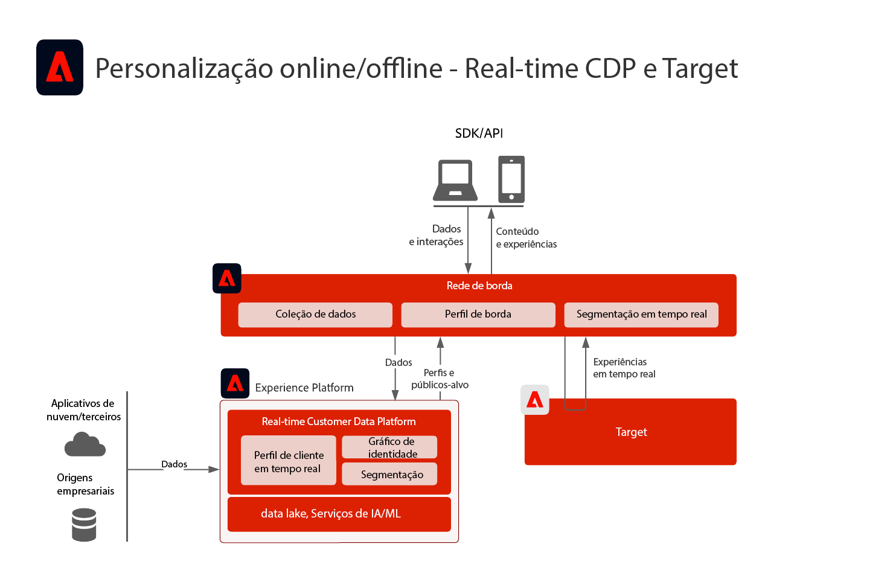
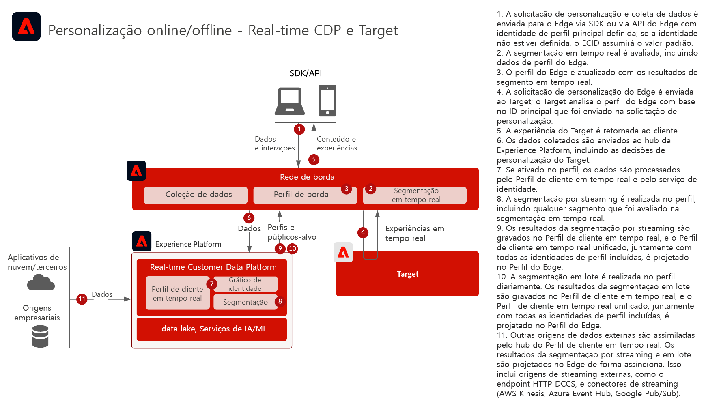
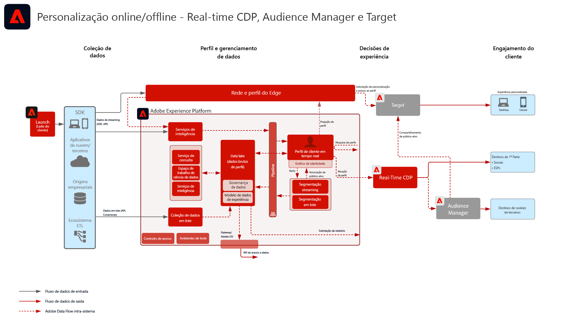

# Web/Mobile Personalization com dados conhecidos do cliente

## Casos de uso

* Personalização online com dados conhecidos do cliente
* Aprimoramento da página de aterrissagem
* Personalização com base em visualizações anteriores de produtos/conteúdos, afinidade com produtos/conteúdos, atributos ambientais e dados demográficos, além de dados offline, como transações, insights de fidelização e de CRM e modelos de insights
* Compartilhe e direcione públicos-alvo definidos na Real-time Customer Data Platform em sites e aplicativos móveis usando o Adobe Target.

## Aplicativos

* [!UICONTROL Real-time Customer Data Platform]
* Adobe Target
* Adobe Audience Manager (opcional): Adiciona dados de público-alvo de terceiros, gráfico de dispositivos baseado em cooperação
* Adobe Analytics (opcional): adiciona a capacidade de criar segmentos com base em dados comportamentais históricos e criar segmentação detalhada a partir dos dados do Adobe Analytics

## Padrões de integração

| Nº | Padrão de integração | Recurso | Pré-requisitos |
|---|---|---|---|
| 1 | Avaliação de segmentos em tempo real na borda compartilhada da Real-time Customer Data Platform com o Target | <ul><li>Avalie públicos em tempo real para a mesma ou próxima personalização de página no Edge.</li><li>Além disso, quaisquer segmentos avaliados por streaming ou em lote também serão projetados para a rede de borda para serem incluídos na avaliação e personalização do segmento de borda.</li></ul> | <ul><li>O SDK da Web/móvel deve ser implementado.</li><li>O fluxo de dados deve ser configurado no Experience Edge com a extensão Target e Experience Platform ativada</li><li>O destino do Target deve ser configurado nos Destinos da Real-time Customer Data Platform.</li><li>A integração com o Target requer uma organização IMS igual à da instância da Experience Platform.</li></ul> |
| 2 | Compartilhamento de públicos-alvo por streaming e em lote da Real-time Customer Data Platform com o Target por meio da abordagem de borda | <ul><li>Compartilhe públicos de transmissão e em lote da Real-time Customer Data Platform com o Target por meio do Edge Network. Os públicos-alvo avaliados em tempo real exigem a implementação do WebSDK e da Edge Network.</li></ul> | <ul><li>O SDK da Web/Mobile não é necessário para compartilhar públicos de streaming e lote no Target, embora seja necessário para habilitar a avaliação de segmentos de borda em tempo real.</li><li>Se estiver usando a AT.js, somente a integração de perfil em relação ao namespace de identidade ECID será suportada.</li><li>Para pesquisas de namespace de identidade personalizadas no Edge, a implantação do WebSDK é necessária, e cada identidade deve ser definida como uma identidade no mapa de identidade.</li><li>O destino do Target deve ser configurado nos Destinos da Real-time Customer Data Platform.</li><li>A integração com o Target requer uma organização IMS igual à da instância da Experience Platform.</li></ul> |
| 3 | Compartilhamento de públicos-alvo por streaming e em lote da Real-time Customer Data Platform com o Target e o Audience Manager por meio da abordagem do serviço de compartilhamento de público-alvo | <ul><li>Esse padrão de integração pode ser aproveitado quando o enriquecimento adicional de dados de terceiros e públicos-alvo no Audience Manager é desejado.</li></ul> | <ul><li>O SDK da Web/Mobile não é necessário para compartilhar públicos de streaming e lote no Target, embora seja necessário para habilitar a avaliação de segmentos de borda em tempo real.</li><li>Se estiver usando a AT.js, somente a integração de perfil em relação ao namespace de identidade ECID será suportada.</li><li>Para pesquisas de namespace de identidade personalizadas no Edge, a implantação do WebSDK é necessária, e cada identidade deve ser definida como uma identidade no mapa de identidade.</li><li>A projeção de público-alvo por meio do serviço de compartilhamento de público-alvo deve ser provisionada.</li><li>O destino do Target deve ser configurado nos Destinos da Real-time Customer Data Platform.</li><li>A integração com o Target requer uma organização IMS igual à da instância da Experience Platform.</li></ul> |

## Tempo real, streaming e compartilhamento em lote de público-alvo na Adobe Target

Arquitetura

Detalhes da sequência

Visão geral da arquitetura

## Padrões de implementação

O conhecido Customer Personalization é compatível com várias abordagens de implementação.

### Padrão de implementação 1 - Rede de borda com SDK da Web/Mobile (abordagem recomendada)

Usar a rede de borda com o SDK da Web/móvel. A segmentação de borda em tempo real exige a abordagem de implementação do SDK da Web/Mobile ou da API de borda.

[Consulte o blueprint do SDK da Web e móvel da Experience Platform](../data-ingestion/websdk.md)

### Padrão de implementação 2 - SDKs específicos do aplicativo

Usar SDKs tradicionais específicos para aplicativos (por exemplo, AT.js e AppMeasurement.js). A avaliação de segmento do Edge em tempo real não é compatível com essa abordagem de implementação. No entanto, streaming e compartilhamento em lote de público-alvo a partir do hub Experience Platform são compatíveis com essa abordagem de implementação.

[Consulte o Esquema do SDK específico do aplicativo](../data-ingestion/appsdk.md)

### Etapas de implementação

1. [Implemente o Adobe Target](https://experienceleague.adobe.com/docs/target/using/implement-target/implementing-target.html?lang=pt-BR) para seus aplicativos da Web ou seus aplicativos para dispositivos móveis
1. [Implemente a Experience Platform e o [!UICONTROL Real-time Customer Profile]](https://experienceleague.adobe.com/docs/platform-learn/getting-started-for-data-architects-and-data-engineers/overview.html?lang=pt-BR); certifique-se de que os públicos-alvo criados sejam ativados na borda, configurando a [política de mesclagem](https://experienceleague.adobe.com/docs/experience-platform/profile/merge-policies/ui-guide.html?lang=pt-BR#create-a-merge-policy) como ativa na borda.
1. Implemente o [SDK da Web da Experience Platform](https://experienceleague.adobe.com/docs/experience-platform/edge/home.html?lang=pt-BR). O SDK da Web da Experience Platform é necessário para a segmentação do Edge em tempo real, mas não é necessário para compartilhar públicos de transmissão e em lote da Real-time Customer Data Platform com o Target. Observe que o suporte para segmentação em tempo real por meio do SDK móvel e da API não está disponível no momento.
1. [Configure a rede de borda com uma sequência de dados de borda](https://experienceleague.adobe.com/docs/experience-platform/edge/fundamentals/datastreams.html?lang=pt-BR)
1. [Habilite o Adobe Target como um destino na Real-time Customer Data Platform](https://experienceleague.adobe.com/docs/experience-platform/destinations/catalog/personalization/adobe-target-connection.html?lang=pt-BR)
1. (Opcional) [Implementar o Adobe Audience Manager](https://experienceleague.adobe.com/docs/audience-manager/user-guide/implementation-integration-guides/implement-audience-manager.html?lang=pt-BR) (opcional)
1. (Opcional) [Solicitar provisionamento para o compartilhamento de público-alvo entre o Experience Platform e a Adobe Target (públicos compartilhados)](https://www.adobe.com/go/audiences) para compartilhar públicos do Experience Platform com o Target.

## Medidas de proteção

[Consulte as medidas de proteção na página de Visão geral dos Blueprints de personalização móvel e da Web.](overview.md)

## Considerações de implementação

Pré-requisitos de identidade

* Qualquer identidade principal pode ser aproveitada quando se utiliza o padrão de implementação 1 descrito acima com a rede de borda e o WebSDK. A primeira personalização de logon requer que a identidade principal do conjunto de solicitações de personalização corresponda à identidade principal do perfil do Real-time Customer Data Platform. A associação de identidades de dispositivos anônimos a clientes conhecidos é processada no hub e, em uma etapa posterior, projetada para a borda.
* O compartilhamento de públicos-alvo da Adobe Experience Platform com o Adobe Target requer o uso da ECID como identidade quando se usa o serviço de compartilhamento de públicos-alvo, conforme descrito no cenário de caso de uso 3 acima.
* Identidades alternativas também podem ser usadas para compartilhar públicos-alvo da Experience Platform com o Adobe Target por meio do Audience Manager. A Experience Platform ativa públicos-alvo para o Audience Manager por meio dos seguintes namespaces compatíveis: IDFA, GAID, AdCloud, Google, ECID, EMAIL_LC_SHA256. Observe que o Audience Manager e o Target resolvem as associações de público-alvo por meio da identidade da ECID; portanto, a ECID ainda é necessária para o compartilhamento do público-alvo final com o Adobe Target.

## Documentação relacionada

### Documentação do SDK

* [Documentação do SDK da Web da Experience Platform](https://experienceleague.adobe.com/docs/experience-platform/edge/home.html)
* [Documentação de tags da Experience Platform](https://experienceleague.adobe.com/docs/experience-platform/tags/home.html?lang=pt-BR)
* [Documentação do serviço da Experience Cloud ID](https://experienceleague.adobe.com/docs/id-service/using/home.html?lang=pt-BR)

### Documentação de conexão

* [Conexão do Adobe Target com a Real-time Customer Data Platform](https://experienceleague.adobe.com/docs/experience-platform/destinations/catalog/personalization/adobe-target-connection.html?lang=en)
* [Configuração da sequência de dados de borda](https://experienceleague.adobe.com/docs/experience-platform/edge/fundamentals/datastreams.html)
* [Compartilhamento de segmentos da Experience Platform com o Audience Manager e outras soluções da Experience Cloud](https://experienceleague.adobe.com/docs/audience-manager/user-guide/implementation-integration-guides/integration-experience-platform/aam-aep-audience-sharing.html?lang=pt-BR)

### Documentação de segmentação

* [Visão geral da Segmentação da Experience Platform](https://experienceleague.adobe.com/docs/experience-platform/segmentation/home.html?lang=pt-BR)
* [Segmentação em tempo real](https://experienceleague.adobe.com/docs/experience-platform/segmentation/ui/edge-segmentation.html?lang=pt-BR)
* [Segmentação de transmissão](https://experienceleague.adobe.com/docs/experience-platform/segmentation/api/streaming-segmentation.html?lang=pt-BR)
* [Compartilhamento de segmentos do Adobe Analytics por meio do Adobe Audience Manager](https://experienceleague.adobe.com/docs/analytics/components/segmentation/segmentation-workflow/seg-publish.html?lang=pt-BR)
* [Configuração da política de mesclagem](https://experienceleague.adobe.com/docs/experience-platform/profile/merge-policies/ui-guide.html?lang=en#create-a-merge-policy)

### Tutoriais

* [Personalização de próxima ocorrência com Real-Time CDP e Adobe Target](https://experienceleague.adobe.com/docs/platform-learn/tutorials/experience-cloud/next-hit-personalization.html?lang=pt-BR)

### Publicações do blog relacionadas

* [Adobe anuncia a mesma personalização aprimorada de página com o Adobe Target e a Real-time Customer Data Platform](https://blog.adobe.com/en/publish/2021/10/05/adobe-announces-same-page-enhanced-personalization-with-adobe-target-real-time-customer-data-platform)
* [[!DNL Blueprint for Web Personalization using Adobe Experience Platform Real-Time Customer Profile]](https://medium.com/adobetech/blueprint-for-web-personalization-using-adobe-experience-platform-real-time-customer-profile-fef2ce7a4b2f)
* [[!DNL Adobe Experience Platform’s Identity Service — How to Solve the Customer Identity Conundrum]](https://medium.com/adobetech/adobe-experience-platforms-identity-service-how-to-solve-the-customer-identity-conundrum-f95e22d16ea9)
* [[!DNL Adobe Experience Platform Web SDK for Audience Management]](https://medium.com/adobetech/adobe-experience-platform-web-sdk-for-audience-management-751fa6d063bc)
* [[!DNL Implementing Adobe Experience Platform Real-Time Customer Profile through our “Customer Zero” Program]](https://medium.com/adobetech/implementing-adobe-experience-platform-real-time-customer-profile-through-our-customer-zero-32e7cd952896)
* [[!DNL Segmentation in Seconds: How Adobe Experience Platform Made Real-time Customer Profiles a Reality]](https://medium.com/adobetech/segmentation-in-seconds-how-adobe-experience-platform-made-real-time-customer-profiles-a-reality-a7a8552b0847)
