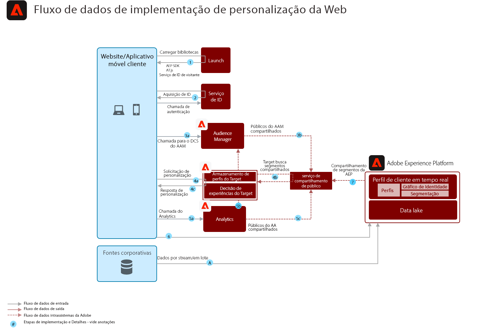

# Blueprint de personalização online/offline da Web

Sincronize a personalização da Web com o email e outras personalizações de canal conhecidas e anônimas.

## Casos de uso

* Otimização da página de aterrissagem
* Definição de metas de perfil comportamental e offline
* Personalização com base em visualizações anteriores de produto/conteúdo, afinidade de produto/conteúdo, atributos ambientais, dados de público-alvo de terceiros e demografia, além de insights offline como transações, dados de fidelidade e CRM e insights modelados

## Aplicativos

* [!UICONTROL Plataforma de dados do cliente em tempo real]
* Adobe Target
* Adobe Audience Manager (opcional): Adiciona dados de público-alvo de terceiros, gráfico de dispositivos baseado em cooperação, a capacidade de exibir segmentos da plataforma no Adobe Analytics e a capacidade de exibir segmentos da Adobe Analytics na plataforma
* Adobe Analytics (opcional): Adiciona a capacidade de criar segmentos com base em dados comportamentais históricos e na segmentação detalhada dos dados do Adobe Analytics

## Arquitetura

## Medidas de proteção

* Os segmentos compartilhados de Experience Platform para Audience Manager são compartilhados em minutos de realização do segmento, seja por meio do streaming ou método de avaliação em lote. Há uma sincronização de configuração de segmento inicial entre o Experience Platform e o Audience Manager de aproximadamente 4 horas para que as associações de segmento do Experience Platform comecem a ser realizadas em perfis do Audience Manager. Uma vez nos perfis do Audience Manager, as associações de segmento do Experience Platform estão disponíveis para a mesma personalização de página por meio do Adobe Target.
* Observe que, para realizações de segmentos que ocorrem dentro de 4 horas de sincronização de configuração de segmento entre o Experience Platform e o Audience Manager, essas realizações de segmento serão realizadas no Audience Manager no trabalho subsequente de segmento de lote como segmentos &quot;existentes&quot;.
* Compartilhamento de segmentos em lote a partir do Experience Platform - uma vez por dia ou iniciado manualmente por meio da API. Depois que essas associações de segmento forem realizadas, elas serão compartilhadas com o Audience Manager em minutos e estarão disponíveis para a mesma/próxima personalização de página no Target.
* A segmentação de transmissão é realizada em aproximadamente 5 minutos. Depois que essas realizações de segmento ocorrem, elas são compartilhadas no Audience Manager em minutos e disponibilizadas para a mesma/próxima personalização de página no Target.
* Por padrão, o serviço de compartilhamento de segmentos permite que no máximo 75 públicos sejam compartilhados para cada conjunto de relatórios do Adobe Analytics. Se o cliente tiver uma licença do Audience Manager, não há limite para o número de públicos-alvo que podem ser compartilhados entre o Adobe Analytics e o Adobe Target ou Audience Manager e o Adobe Target.

## Padrões de implementação

O blueprint de personalização Web/Mobile pode ser implementado por meio das seguintes abordagens, conforme descrito abaixo.

1. Uso do SDK da Web da plataforma/SDK móvel e da rede de borda.
1. Uso de SDKs tradicionais específicos do aplicativo (por exemplo, AppMeasurement.js)

### 1. Plataforma Web/Mobile SDK e Abordagem de borda

### 2. Abordagem do SDK específica do aplicativo

## Pré-requisitos de implementação

| Aplicativo/Serviço | Biblioteca obrigatória | Notas |
|---|---|---|
| Adobe Target | Plataforma Web SDK*, at.js 0.9.1+ ou mbox.js 61+ | A at.js é preferida, pois a mbox.js não está mais sendo desenvolvida. |
| Adobe Audience Manager (opcional) | Plataforma Web SDK* ou dil.js 5.0+ |  |
| Adobe Analytics (opcional) | Plataforma Web SDK* ou AppMeasurement.js 1.6.4+ | O rastreamento do Adobe Analytics deve usar a Coleta de dados regionais (RDC). |
| Serviço de Experience Cloud ID | Plataforma Web SDK* ou VisitorAPI.js 2.0+ | (Recomendado) Use o Experience Platform Launch para implantar o serviço de ID para garantir que a ID seja definida antes de qualquer chamada de aplicativo |
| SDK do Experience Platform Mobile (opcional) | 4.11 ou superior para iOS e Android™ |  |
| Experience Platform Web SDK | 1.0, a versão atual do SDK do Experience Platform tem [vários casos de uso ainda não suportados nos aplicativos do Experience Cloud](https://github.com/adobe/alloy/projects/5) |  |

## Etapas da implementação

1. [Implementar o Adobe ](https://experienceleague.adobe.com/docs/target/using/implement-target/implementing-target.html) Target para aplicativos móveis ou da Web
1. [Implementar o Adobe Audience Manager](https://experienceleague.adobe.com/docs/audience-manager/user-guide/implementation-integration-guides/implement-audience-manager.html)  (opcional)
1. [Implementar o Adobe Analytics](https://experienceleague.adobe.com/docs/analytics/implementation/home.html)   (opcional)
1. [Implementar o Experience Platform e o perfil do cliente em tempo  [!UICONTROL real]](https://experienceleague.adobe.com/docs/platform-learn/getting-started-for-data-architects-and-data-engineers/overview.html)
1. Implementar [Experience Cloud Identity Service](https://experienceleague.adobe.com/docs/id-service/using/implementation/implementation-guides.html) ou [Experience Platform Web SDK](https://experienceleague.adobe.com/docs/experience-platform/edge/home.html)
   >[!NOTE]
   >
   >Cada aplicativo deve usar a ID do Experience Cloud e fazer parte da mesma Org do Experience Cloud para permitir o compartilhamento de público-alvo entre aplicativos.
1. [Solicitar provisionamento para o compartilhamento de público-alvo entre o Experience Platform e a Adobe Target (públicos compartilhados)](https://www.adobe.com/go/audiences)

## Documentação relacionada

* [Compartilhamento de segmento do Experience Platform com o Audience Manager e outras soluções do Experience Cloud](https://experienceleague.adobe.com/docs/audience-manager/user-guide/implementation-integration-guides/integration-experience-platform/aam-aep-audience-sharing.html)
* [Visão geral da segmentação de Experience Platform](https://experienceleague.adobe.com/docs/experience-platform/segmentation/home.html)
* [Segmentação de fluxo](https://experienceleague.adobe.com/docs/experience-platform/segmentation/api/streaming-segmentation.html)
* [Visão geral do construtor de segmentos de Experience Platform](https://experienceleague.adobe.com/docs/experience-platform/segmentation/ui/overview.html)
* [Conector de origem Audience Manager](https://experienceleague.adobe.com/docs/experience-platform/sources/connectors/adobe-applications/audience-manager.html)
* [Compartilhamento de segmentos do Adobe Analytics por meio da Adobe Audience Manager](https://experienceleague.adobe.com/docs/analytics/components/segmentation/segmentation-workflow/seg-publish.html)
* [Documentação do SDK da Web do Experience Platform](https://experienceleague.adobe.com/docs/experience-platform/edge/home.html)
* [Documentação do serviço de ID do Experience Cloud](https://experienceleague.adobe.com/docs/id-service/using/home.html)
* [Documentação do Experience Platform Launch](https://experienceleague.adobe.com/docs/launch/using/home.html)

## Publicações de blog relacionadas

* [[!DNL Blueprint for Web Personalization using Adobe Experience Platform Real-Time Customer Profile]](https://medium.com/adobetech/blueprint-for-web-personalization-using-adobe-experience-platform-real-time-customer-profile-fef2ce7a4b2f)
* [[!DNL Build an Optimal Online Experience: Enrich Unified Profile with Query Service]](https://medium.com/adobetech/build-an-optimal-online-experience-enrich-unified-profile-with-query-service-8027c196ab33)
* [[!DNL Integrating Adobe Experience Platform Decisioning Engine with AEM Websites]](https://jaeness.medium.com/integrating-adobe-experience-platform-decisioning-engine-with-aem-websites-9c222acd12e2)
* [[!DNL Adobe Experience Platform’s Identity Service — How to Solve the Customer Identity Conundrum]](https://medium.com/adobetech/adobe-experience-platforms-identity-service-how-to-solve-the-customer-identity-conundrum-f95e22d16ea9)
* [[!DNL How Adobe Experience Platform Predictive Audiences improves Personalized Experiences]](https://medium.com/adobetech/how-adobe-experience-platform-predictive-audiences-improves-personalized-experiences-1f75a60cb7a3)
* [[!DNL Adobe Experience Platform Web SDK for Audience Management]](https://medium.com/adobetech/adobe-experience-platform-web-sdk-for-audience-management-751fa6d063bc)
* [[!DNL Implementing Adobe Experience Platform Real-Time Customer Profile through our “Customer Zero” Program]](https://medium.com/adobetech/implementing-adobe-experience-platform-real-time-customer-profile-through-our-customer-zero-32e7cd952896)
* [[!DNL How Adobe Experience Platform Can Help Customers Personalize Their Mobile Messaging in Real-Time with Journey Orchestration Service and a Mobile Messaging Vendor]](https://medium.com/adobetech/how-adobe-experience-platform-helped-a-client-personalize-their-mobile-messaging-in-real-time-with-7d634aefa098)
* [[!DNL Segmentation in Seconds: How Adobe Experience Platform Made Real-time Customer Profiles a Reality]](https://medium.com/adobetech/segmentation-in-seconds-how-adobe-experience-platform-made-real-time-customer-profiles-a-reality-a7a8552b0847)
* [[!DNL Build an Optimal Online Experience: Enrich Unified Profile with Query Service]](https://medium.com/adobetech/build-an-optimal-online-experience-enrich-unified-profile-with-query-service-8027c196ab33)
