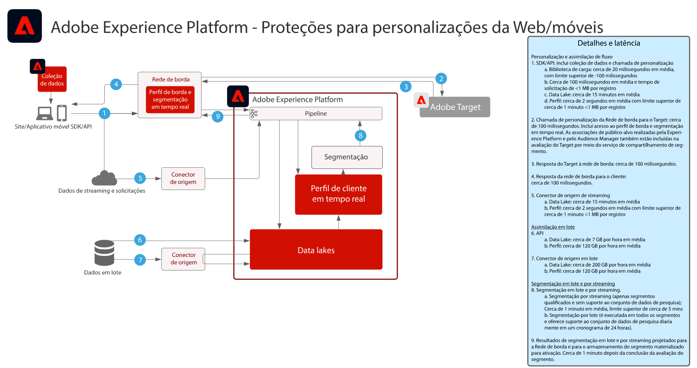

# Personalização da Web e móvel   blueprints

Personalização da Web e móvel aborda a capacidade de utilizar a segmentação de perfil e público-alvo em vários aplicativos para personalizar e aprimorar as experiências do cliente. Os comportamentos do cliente, os dados demográficos, o nível de fidelização e as transações anteriores podem ser aproveitados para personalizar layouts, call-to-actions e conteúdo.

 

| Blueprint | Descrição | Aplicativos da Experience Cloud |
|---|---|---|
| **[Personalização da Web/móvel com base comportamental](behavioral.md)** | <ul><li>Personalize com base em comportamentos online e nos dados do público</li></ul> | <ul><li>Adobe Target</li><li>Adobe Real-time Customer Data Platform *(opcional)*</li><li>Adobe Analytics *(opcional)*</li><li>Adobe Audience Manager *(opcional)*</li></ul> |
| **[Personalização da Web/Mobile com dados de clientes conhecidos](known-personalization.md)** | <ul><li>Os perfis completos do cliente e a segmentação aprimorada proporcionam experiências mais personalizadas.</li><li>Personalize com atributos e eventos offline (transações, reservas, CRM e dados de fidelização).</li><li>Sincronize a personalização na Web, nos emails e em outros canais conhecidos.</li></ul> | <ul><li>Adobe Target</li><li>[!UICONTROL Real-time Customer Data Platform]</li><li>Adobe Analytics ou Customer Journey Analytics *(opcional)*</li><li>Adobe Audience Manager *(opcional)*</li></ul> |

 

## Medidas de proteção para personalização da Web e móvel

[Para medidas de proteção relacionados à ativação de públicos-alvo e perfis, consulte a documentação sobre medidas de proteção para perfis e segmentação.](https://experienceleague.adobe.com/docs/experience-platform/profile/guardrails.html?lang=pt-BR)

 

### Diagrama das medidas de proteção de personalização de cliente conhecido

## Publicações do blog relacionadas

* [[!DNL Blueprint for Web Personalization using Adobe Experience Platform Real-Time Customer Profile]](https://medium.com/adobetech/blueprint-for-web-personalization-using-adobe-experience-platform-real-time-customer-profile-fef2ce7a4b2f)
* [[!DNL Integrating Adobe Experience Platform Decisioning Engine with AEM Websites]](https://jaeness.medium.com/integrating-adobe-experience-platform-decisioning-engine-with-aem-websites-9c222acd12e2)
* [[!DNL Content and Commerce AI: Personalizing Your Interactions with Customers Through Content Intelligence]](https://medium.com/adobetech/content-and-commerce-ai-personalizing-your-interactions-with-customers-through-content-intelligence-dc182601deab)
* [[!DNL Implementing Adobe Experience Platform Real-Time Customer Profile through our "Customer Zero" Program]](https://medium.com/adobetech/implementing-adobe-experience-platform-real-time-customer-profile-through-our-customer-zero-32e7cd952896)
* [[!DNL Segmentation in Seconds: How Adobe Experience Platform Made Real-time Customer Profiles a Reality]](https://medium.com/adobetech/segmentation-in-seconds-how-adobe-experience-platform-made-real-time-customer-profiles-a-reality-a7a8552b0847)
* [[!DNL Build an Optimal Online Experience: Enrich Unified Profile with Query Service]](https://medium.com/adobetech/build-an-optimal-online-experience-enrich-unified-profile-with-query-service-8027c196ab33)
